# Oneapp — Architecture

Multi-tenant inventory, purchasing, and sales platform built with Laravel 13, PostgreSQL, Redis, Laravel Passport, and Livewire.

---

## 1. System overview

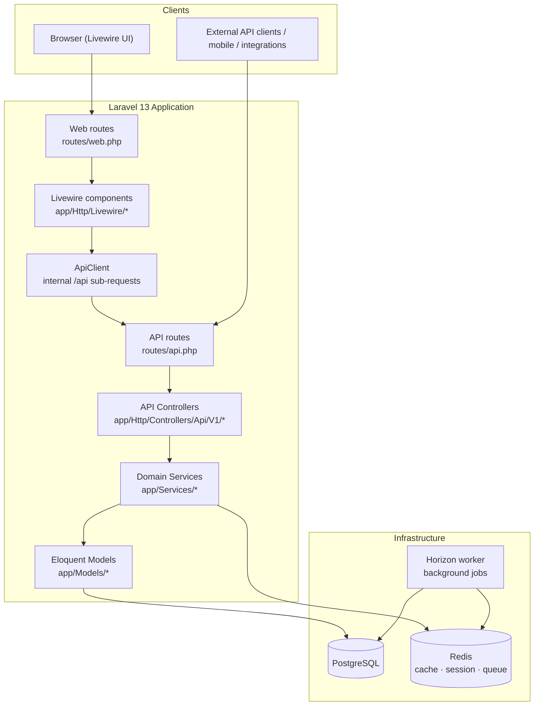

| Layer | Technology |
|-------|------------|
| Backend | PHP 8.3, Laravel 13 |
| Web UI | Livewire 4, Alpine.js, Tailwind, Vite |
| API auth | Laravel Passport (password grant) |
| Database | PostgreSQL 16 |
| Cache / queues | Redis 7 + Laravel Horizon |
| Permissions | Spatie Permission (per-organization teams) |
| API docs | Scramble OpenAPI at `/docs/api` |

---

## 2. Multi-tenancy

Every business customer is an **Organization**. All inventory data belongs to one org.

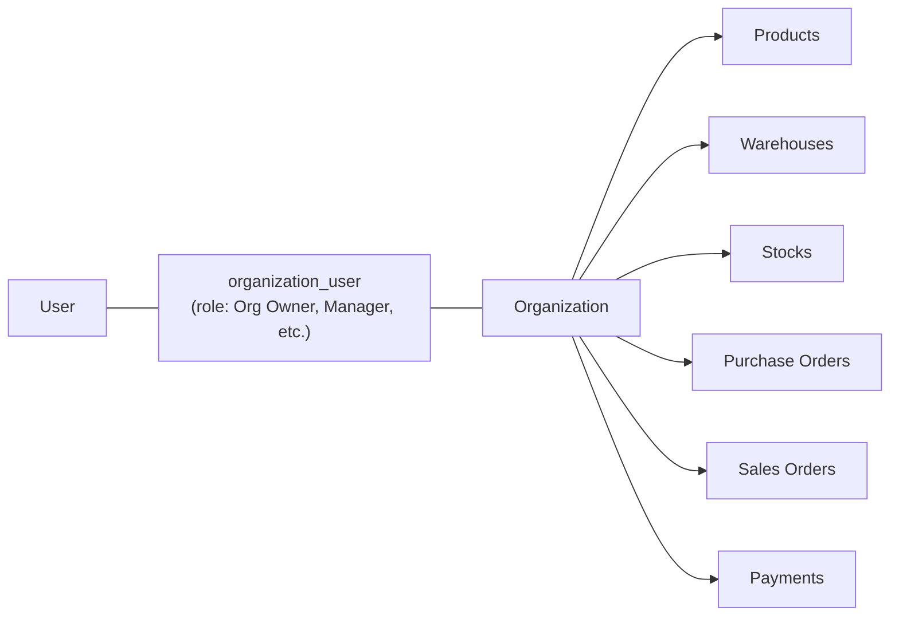

### How tenant context is set

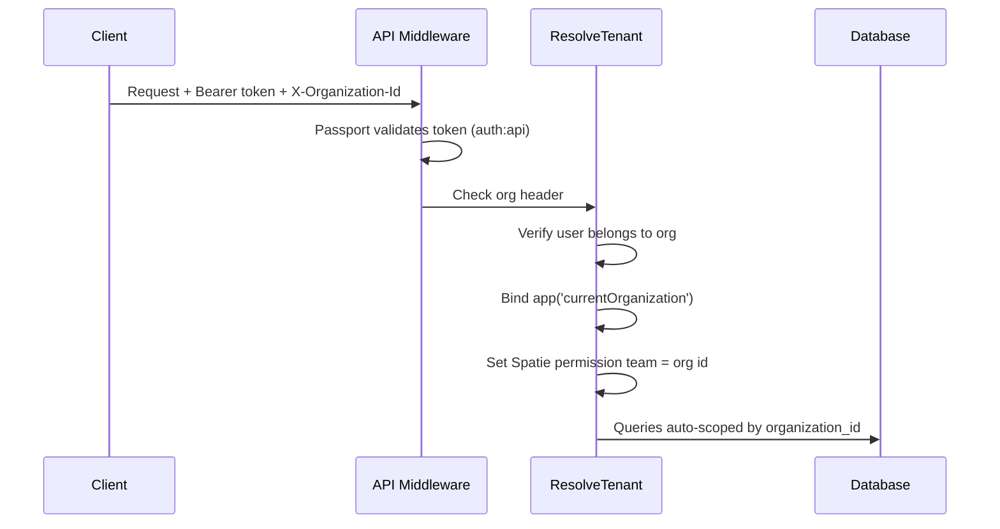

**Rules:**

- Header required on all tenant API routes: `X-Organization-Id: <id>`
- Models use `BelongsToOrganization` + `OrganizationScope` — queries without tenant context return **nothing** (fail-closed)
- Rate limit: per org + per user (`throttle:api-tenant`)

**Key files:** `app/Http/Middleware/ResolveTenant.php`, `app/Traits/BelongsToOrganization.php`, `app/Models/Scopes/OrganizationScope.php`, `app/Permission/OrganizationTeamResolver.php`

---

## 3. Authentication

Web UI and external API share the **same Passport OAuth tokens**.

### API auth (direct)

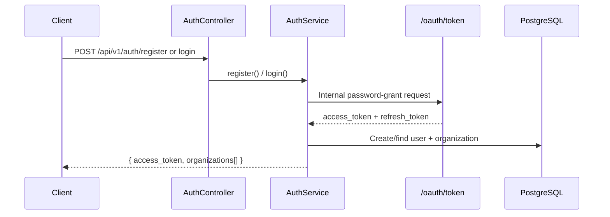

### Web auth (session wrapper)

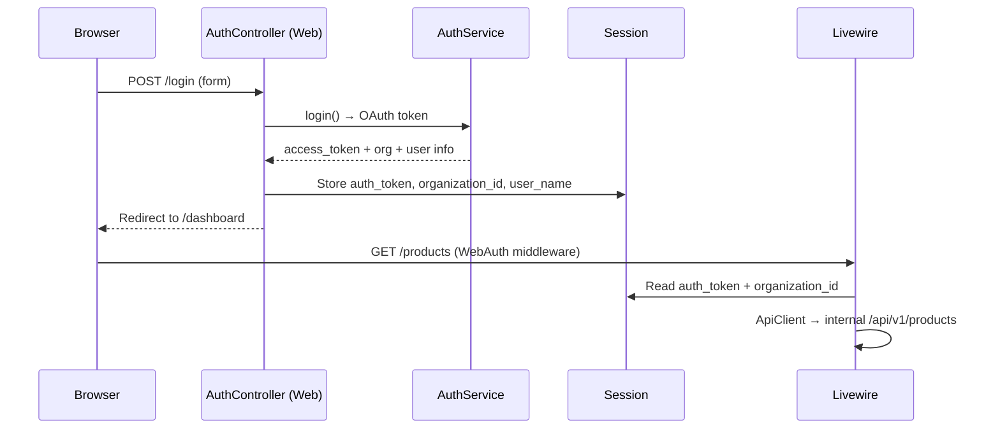

**Session keys:** `auth_token`, `organization_id`, `user_name`, `user_email`, `organizations`

**Bootstrap:** `php artisan app:setup --write-env` creates Passport keys + password-grant client.

**Key files:** `app/Services/AuthService.php`, `app/Http/Controllers/Web/AuthController.php`, `app/Http/Middleware/WebAuth.php`, `app/Console/Commands/SetupApplication.php`

---

## 4. Web UI architecture

The web UI does **not** talk to the database directly. Every page is a thin Livewire client over the REST API.

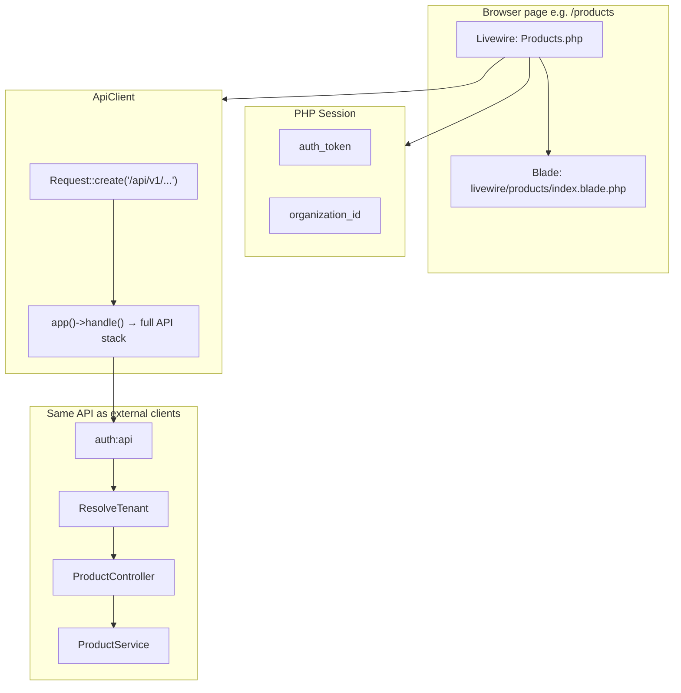

### User action example — Add Product

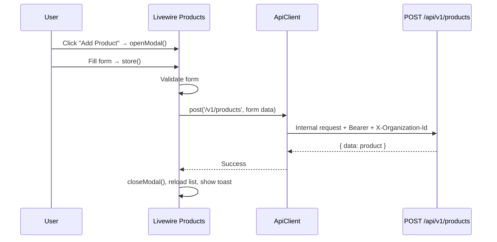

**Livewire pages:** Dashboard, Products, Categories, Units, Warehouses, Suppliers, Customers, Purchase Orders, Sales Orders, Stocks, Stock Movements, Payments, Reports.

**Key files:** `routes/web.php`, `app/Http/Livewire/*`, `app/Services/Web/ApiClient.php`, `resources/views/layouts/app.blade.php`

> **Note:** `ApiClient` and `AuthService` both use `app()->handle()` for internal sub-requests. The original HTTP request must be restored afterward so Livewire, URL generation, and redirects keep the correct web path.

---

## 5. API request pipeline

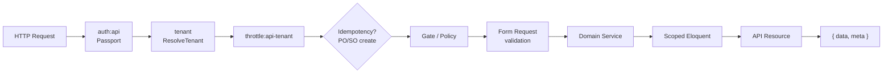

**Response envelope:**

- Success: `{ "data": ..., "meta": { "pagination": ... } }`
- Error: `{ "message": "...", "errors": { ... } }`

**Required headers for tenant routes:**

```
Authorization: Bearer <access_token>
X-Organization-Id: <organization_id>
Idempotency-Key: <uuid>   # required for POST purchase-orders / sales-orders
```

**Key files:** `routes/api.php`, `app/Http/Controllers/Api/V1/*`, `app/Http/Resources/*`, `app/Http/Middleware/EnforceIdempotency.php`

---

## 6. Domain model

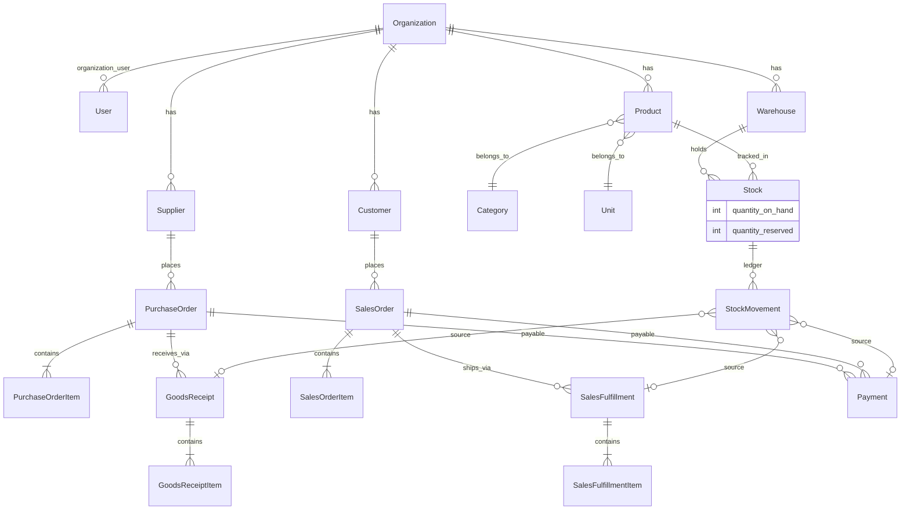

**Scoped models:** Product, Category, Unit, Warehouse, Supplier, Customer, Stock, StockMovement, PurchaseOrder, SalesOrder, Payment, GoodsReceipt, SalesFulfillment, IdempotencyKey.

---

## 7. Purchase order lifecycle

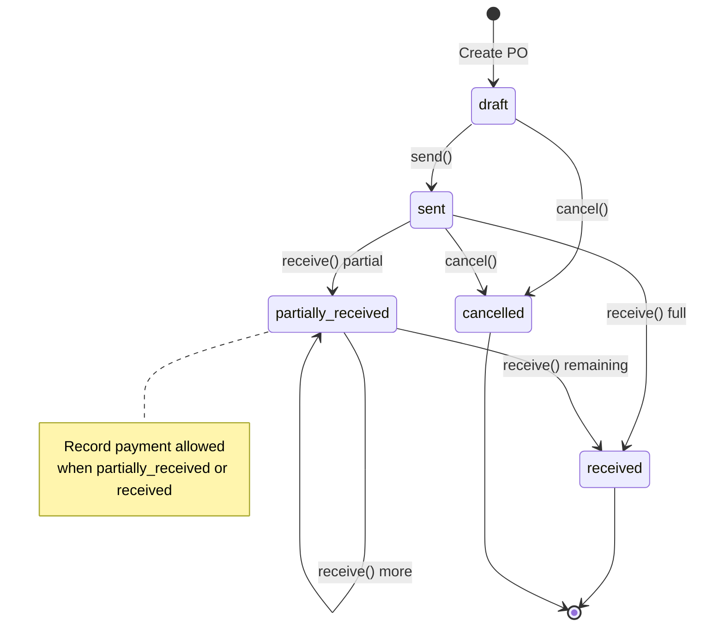

| Step | Service | Stock impact |
|------|---------|--------------|
| Create / edit / delete | `PurchaseOrderService` | None |
| **Send** | `PurchaseOrderService::send()` | None (order sent to supplier) |
| **Receive goods** | `GoodsReceiptService::receive()` | `purchase_in` stock movements |
| **Pay** | `PaymentService::recordPurchasePayment()` | None (financial record) |

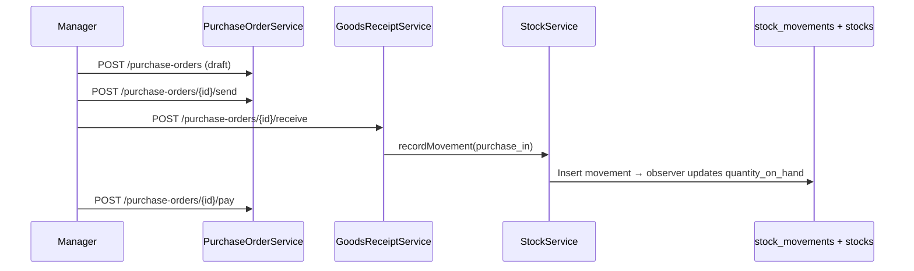

**Key files:** `app/Enums/PurchaseOrderStatus.php`, `app/Services/PurchaseOrderService.php`, `app/Services/GoodsReceiptService.php`

---

## 8. Sales order lifecycle

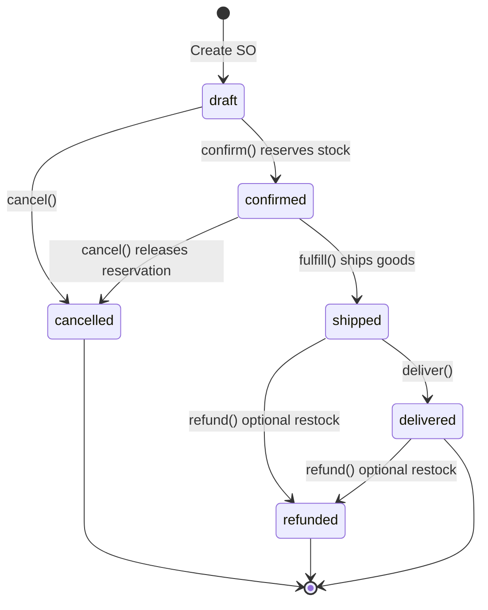

| Step | Service | Stock impact |
|------|---------|--------------|
| **Confirm** | `SalesOrderService::confirm()` | `quantity_reserved` ↑ |
| **Fulfill / ship** | `SalesOrderFulfillmentService::fulfill()` | Reservation consumed → `sale_out` movement |
| **Cancel** (confirmed) | `SalesOrderService::cancel()` | Reservation released |
| **Deliver** | `SalesOrderService::deliver()` | None (status only) |
| **Pay** | `PaymentService::recordSalesPayment()` | None |
| **Refund** | `PaymentService::recordSalesRefund()` | Optional `return_in` restock |

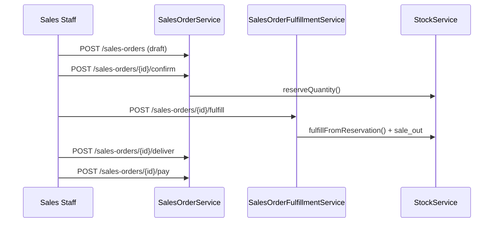

**Key files:** `app/Enums/SalesOrderStatus.php`, `app/Services/SalesOrderService.php`, `app/Services/SalesOrderFulfillmentService.php`, `app/Services/PaymentService.php`

---

## 9. Stock ledger

**All** changes to `quantity_on_hand` go through one path:

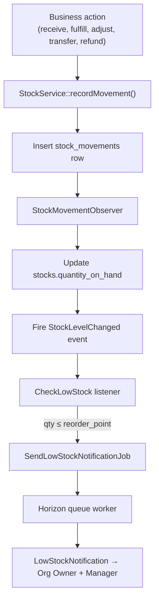

### Movement types

| Type | Direction | Typical source |
|------|-----------|----------------|
| `purchase_in` | In | Goods receipt |
| `sale_out` | Out | Sales fulfillment |
| `adjustment_in/out` | In/Out | Manual adjustment API |
| `transfer_in/out` | In/Out | Warehouse transfer |
| `return_in/out` | In/Out | Sales refund restock |

**Concurrency:** row locks + canonical product lock ordering prevent race conditions on stock updates.

**Key files:** `app/Services/StockService.php`, `app/Observers/StockMovementObserver.php`, `app/Enums/StockMovementType.php`, `app/Listeners/CheckLowStock.php`, `app/Jobs/SendLowStockNotificationJob.php`

---

## 10. Reports and audit

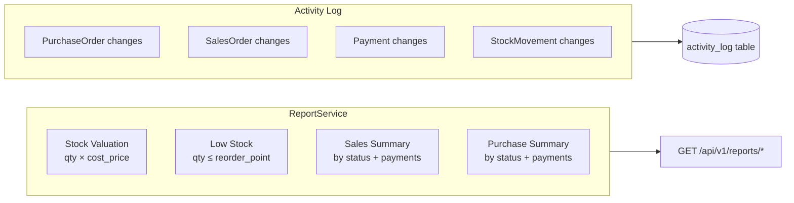

**Key files:** `app/Services/ReportService.php`, `app/Http/Controllers/Api/V1/ReportController.php`, `app/Traits/LogsModelActivity.php`

---

## 11. Deployment

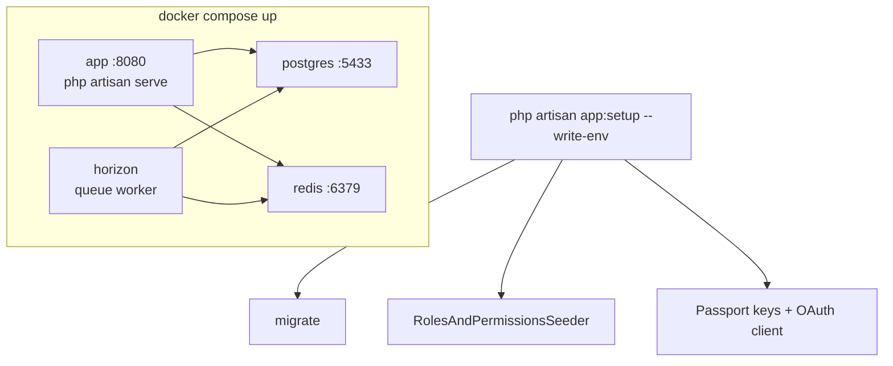

### URLs

| What | URL |
|------|-----|
| Web UI (local dev) | `http://localhost:8000` |
| API (Docker) | `http://localhost:8080/api/v1` |
| API docs | `/docs/api` |
| Horizon | `/horizon` |

### Bootstrap

```bash
# Docker
docker compose up -d --build
docker compose exec app php artisan app:setup --write-env

# Local (no Docker)
composer install && cp .env.example .env
php artisan app:setup --write-env
php artisan serve --host=localhost --port=8000
php artisan horizon
```

---

## 12. End-to-end user journey

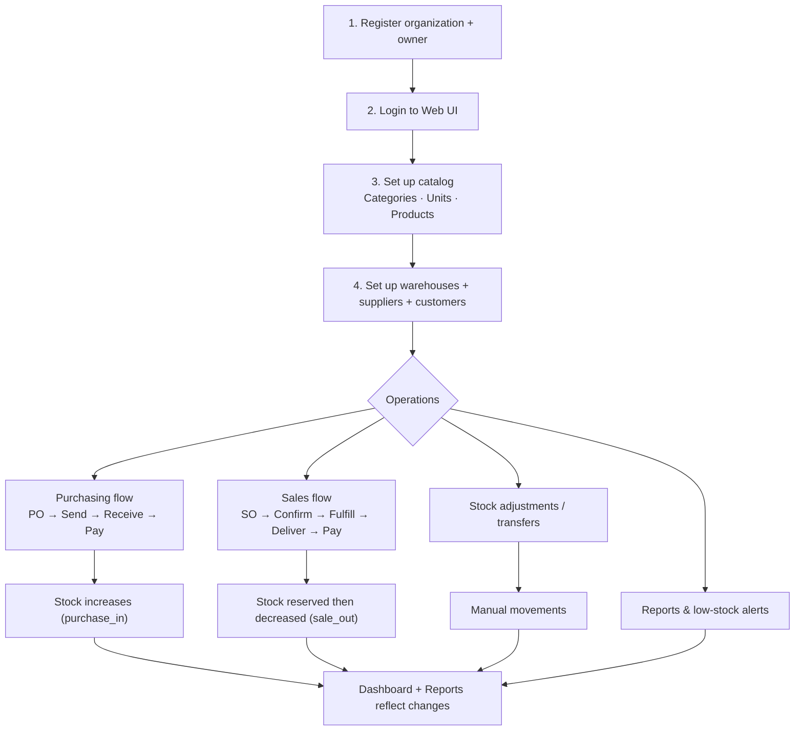

---

## 13. Roles and permissions

Seeded roles (per organization via Spatie teams):

| Role | Typical access |
|------|----------------|
| Org Owner | Full access |
| Manager | Manage catalog, orders, reports |
| Warehouse Staff | Stock, receipts, fulfillments |
| Sales Staff | Customers, sales orders |
| Viewer | Read-only |

**Key file:** `database/seeders/RolesAndPermissionsSeeder.php`

---

## 14. Key files quick reference

| Area | Path |
|------|------|
| Web routes | `routes/web.php` |
| API routes | `routes/api.php` |
| Livewire UI | `app/Http/Livewire/*` |
| API bridge | `app/Services/Web/ApiClient.php` |
| Auth | `app/Services/AuthService.php`, `app/Http/Controllers/Web/AuthController.php` |
| Tenant middleware | `app/Http/Middleware/ResolveTenant.php` |
| Stock core | `app/Services/StockService.php`, `app/Observers/StockMovementObserver.php` |
| Purchase orders | `app/Services/PurchaseOrderService.php`, `app/Services/GoodsReceiptService.php` |
| Sales orders | `app/Services/SalesOrderService.php`, `app/Services/SalesOrderFulfillmentService.php` |
| Payments | `app/Services/PaymentService.php` |
| Reports | `app/Services/ReportService.php` |
| Docker | `docker-compose.yml`, `Dockerfile`, `docker/entrypoint.sh` |
| Setup command | `app/Console/Commands/SetupApplication.php` |
| Web session / token refresh | `app/Services/Web/WebSessionService.php`, `app/Http/Middleware/WebAuth.php` |

---

## 15. Web UI ↔ API coverage

The Livewire frontend consumes the REST API through `ApiClient` (internal sub-requests with Bearer token + `X-Organization-Id`).

| API area | Web coverage |
|----------|--------------|
| Auth register/login | Yes — `AuthController` → `AuthService` (session stores tokens) |
| Auth refresh | Yes — `WebSessionService::refreshIfNeeded()` in `WebAuth` + `ApiClient` |
| Auth logout | Yes — `POST /api/v1/auth/logout` + web session clear |
| Auth me | Covered via session user data at login |
| Organization switch | Yes — `POST /organization/switch` updates session `organization_id` |
| Team members (`/api/v1/users`) | Yes — `/users` Livewire page (invite, role update, remove) |
| Products, categories, units, warehouses, suppliers, customers | Full CRUD |
| Purchase orders | Full lifecycle + detail page at `/purchase-orders/{id}` |
| Sales orders | Full lifecycle + detail page at `/sales-orders/{id}` |
| Stocks | Index only (matches API) |
| Stock movements | Index + create |
| Payments | Index + detail page at `/payments/{id}` |
| Reports | All report endpoints + dashboard aggregates + CSV export queue |
| Platform admin API | `/api/platform/v1/*` — separate `platform` guard (not wired to web UI) |
| `POST products/authorization-probe` | API/test only — not used in web UI |

**Idempotency:** `ApiClient` automatically sends `Idempotency-Key` for `POST /v1/purchase-orders` and `POST /v1/sales-orders`.

---

## Summary

InvenTrack is a **multi-tenant Laravel SaaS** where the **Livewire web UI** calls the same **Passport-protected REST API** that external clients use. All data is scoped per **Organization**, and **stock is always changed through a movement ledger** that drives reservations, purchase receipts, sales fulfillments, and low-stock notifications.
