# Oneapp — Architecture

Multi-tenant inventory, purchasing, and sales platform built with Laravel 13, PostgreSQL, Redis, Laravel Passport, and Livewire.

> **Detailed guide:** See [SYSTEM-ARCHITECTURE-AND-WORKFLOWS.md](./SYSTEM-ARCHITECTURE-AND-WORKFLOWS.md) for the full system architecture, layer breakdown, and end-to-end workflows.
>
> **Run the project:** See [GETTING-STARTED.md](./GETTING-STARTED.md) for Docker/local setup, Horizon, scheduler, Stripe, and troubleshooting.
>
> **Platform admin:** See [PLATFORM-ADMIN.md](./PLATFORM-ADMIN.md) for the super-admin portal and cross-tenant operations.
>
> **Subscriptions:** See [SUBSCRIPTIONS-AND-PLANS.md](./SUBSCRIPTIONS-AND-PLANS.md) for plans, limits, and enforcement.
>
> **Pre-launch:** See [PRELAUNCH_READINESS.MD](../PRELAUNCH_READINESS.MD) for password reset, auth hardening, email, webhooks, GDPR, sessions, health, and CI.

---

## 1. System overview

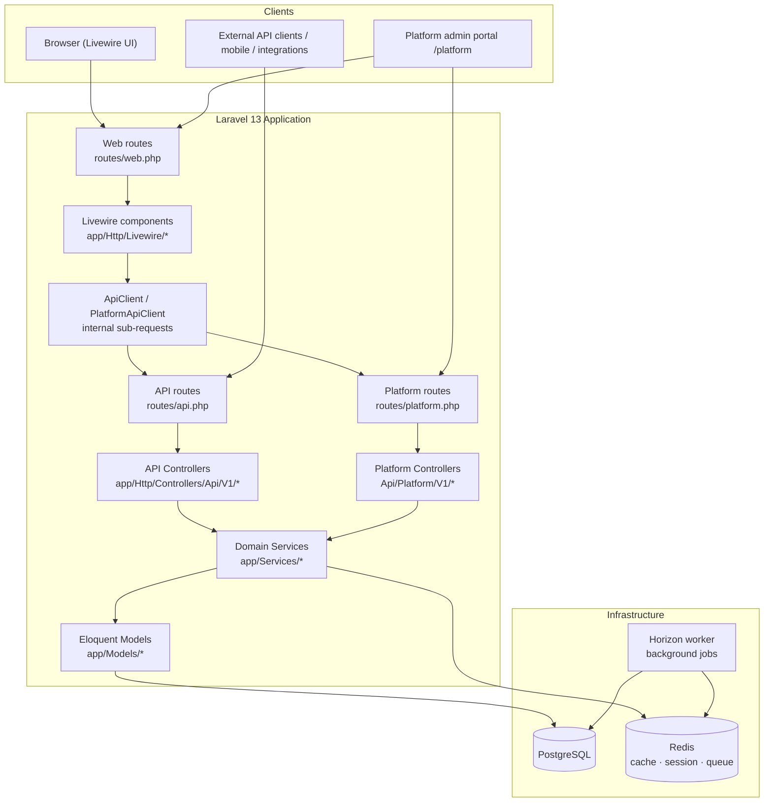

| Layer | Technology |
|-------|------------|
| Backend | PHP 8.3, Laravel 13 |
| Web UI | Livewire 4, Alpine.js, Tailwind, Vite |
| API auth | Laravel Passport (password grant) |
| Database | PostgreSQL 16 |
| Cache / queues | Redis 7 + Laravel Horizon |
| Permissions | Spatie Permission (per-organization teams) |
| API docs | Scramble OpenAPI at `/docs/api` |

---

## 2. Multi-tenancy

Every business customer is an **Organization**. All inventory data belongs to one org.

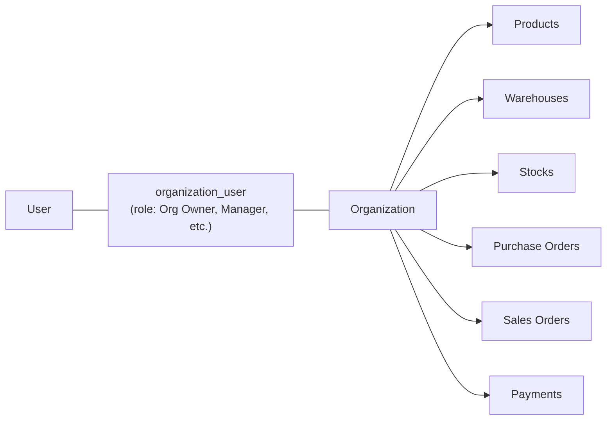

### How tenant context is set

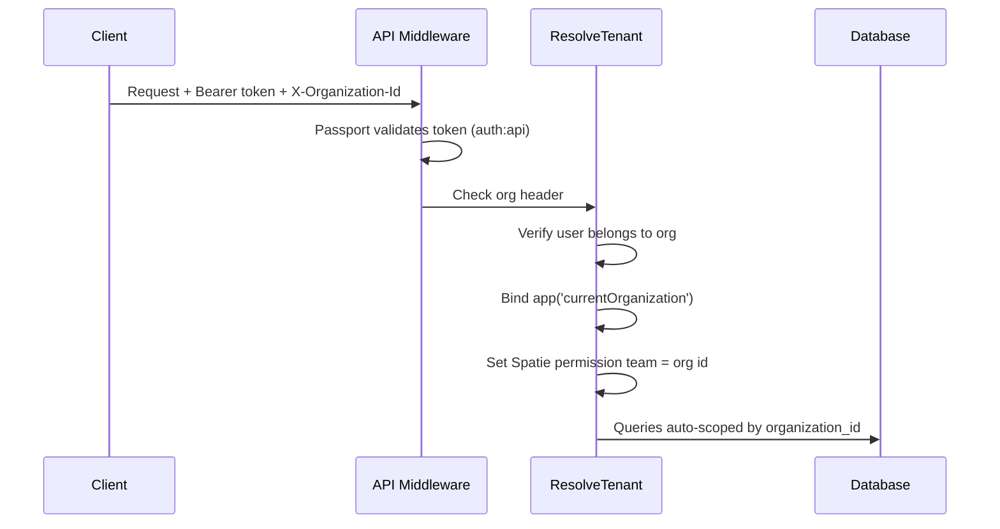

**Rules:**

- Header required on all tenant API routes: `X-Organization-Id: <id>`
- Models use `BelongsToOrganization` + `OrganizationScope` — queries without tenant context return **nothing** (fail-closed)
- **Suspended organizations** are rejected by `ResolveTenant` (403) and blocked on the web portal (`WebAuth`)
- **Plan limits** enforced on warehouse, product, team member, and order creation via `PlanLimitService` — graduated response with 90% warning, 10% grace buffer, then 422
- **Expired trials** allow read-only access (GET); writes return **402 Payment Required**
- **Past due / cancelled** subscriptions: reads allowed; writes blocked with **402** (past due allows writes during configurable grace)
- Rate limit: per org + per user (`throttle:api-tenant`); auth routes have separate IP+email limiters

**Key files:** `app/Http/Middleware/ResolveTenant.php`, `app/Traits/BelongsToOrganization.php`, `app/Models/Scopes/OrganizationScope.php`, `app/Permission/OrganizationTeamResolver.php`, `app/Services/PlanLimitService.php`

---

## 3. Authentication

Web UI and external API share the **same Passport OAuth tokens**.

### API auth (direct)

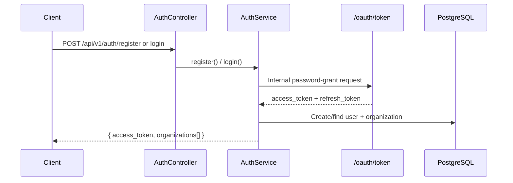

### Web auth (session wrapper)

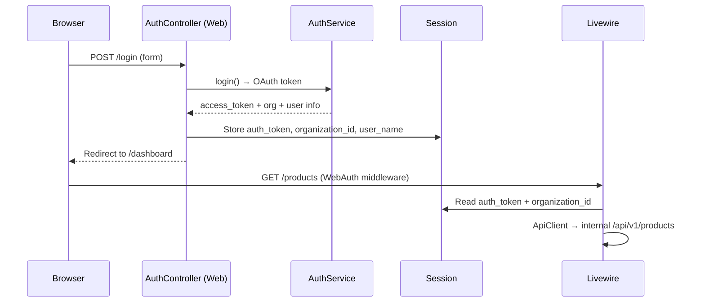

**Session keys:** `auth_token`, `organization_id`, `user_name`, `user_email`, `organizations`

**Bootstrap:** `php artisan app:setup --write-env` creates Passport keys + password-grant client.

### Auth endpoints (API)

| Method | Path | Notes |
|--------|------|-------|
| POST | `/api/v1/auth/register` | Creates org + owner + trial subscription |
| POST | `/api/v1/auth/login` | Rate limited (IP + email) |
| POST | `/api/v1/auth/refresh` | Refresh token exchange |
| POST | `/api/v1/auth/forgot-password` | Generic success; queues reset email |
| POST | `/api/v1/auth/reset-password` | Revokes all existing tokens |
| GET | `/api/v1/auth/me` | Includes impersonation metadata when active |
| POST | `/api/v1/auth/logout` | Revokes current token only |
| GET | `/api/v1/auth/sessions` | List active Passport sessions |
| DELETE | `/api/v1/auth/sessions/{tokenId}` | Revoke one session |

**Key files:** `app/Services/AuthService.php`, `app/Services/PasswordResetService.php`, `app/Services/SessionService.php`, `app/Http/Controllers/Web/AuthController.php`, `app/Http/Middleware/WebAuth.php`, `app/Console/Commands/SetupApplication.php`

---

## 4. Web UI architecture

The web UI does **not** talk to the database directly. Every page is a thin Livewire client over the REST API.

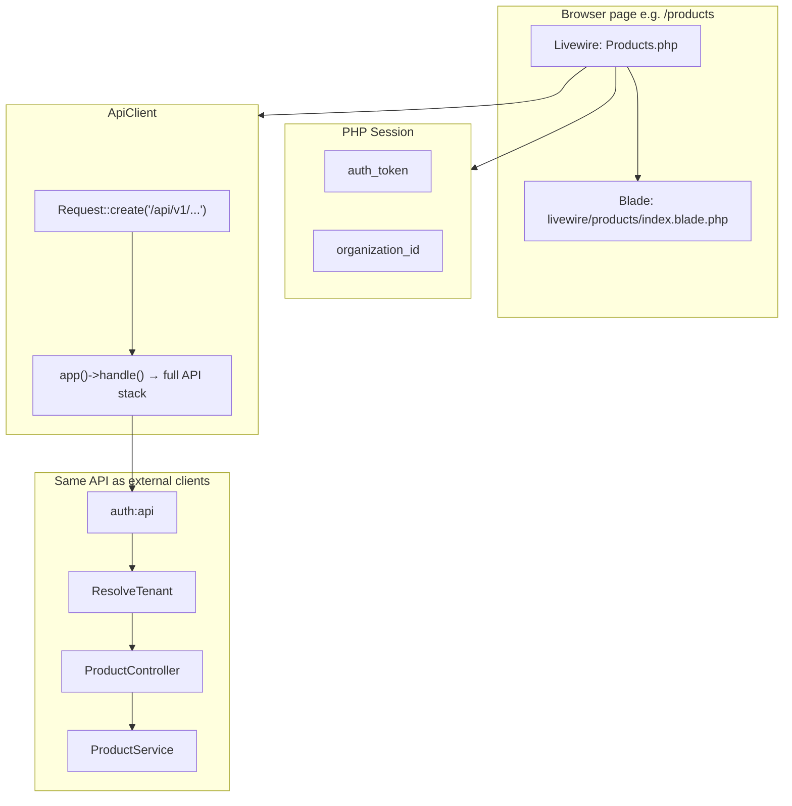

### User action example — Add Product

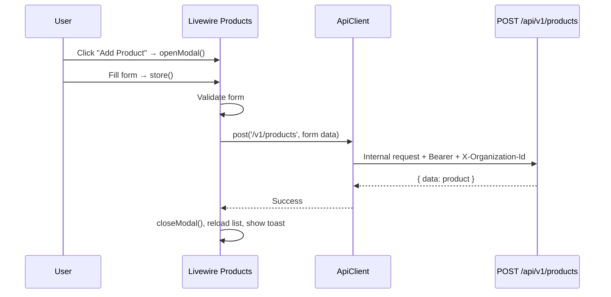

**Livewire pages:** Dashboard, Products, Categories, Units, Warehouses, Suppliers, Customers, Purchase Orders, Sales Orders, Stocks, Stock Movements, Payments, Reports.

**Key files:** `routes/web.php`, `app/Http/Livewire/*`, `app/Services/Web/ApiClient.php`, `resources/views/layouts/app.blade.php`

> **Note:** `ApiClient` and `AuthService` both use `app()->handle()` for internal sub-requests. The original HTTP request must be restored afterward so Livewire, URL generation, and redirects keep the correct web path.

---

## 5. API request pipeline

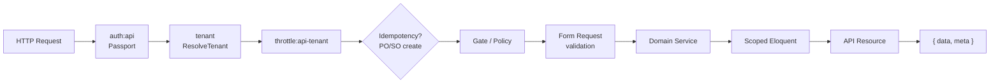

**Response envelope:**

- Success: `{ "data": ..., "meta": { "pagination": ... } }`
- Error: `{ "message": "...", "errors": { ... } }`

**Required headers for tenant routes:**

```
Authorization: Bearer <access_token>
X-Organization-Id: <organization_id>
Idempotency-Key: <uuid>   # required for POST purchase-orders / sales-orders
```

**Key files:** `routes/api.php`, `app/Http/Controllers/Api/V1/*`, `app/Http/Resources/*`, `app/Http/Middleware/EnforceIdempotency.php`

---

## 6. Domain model

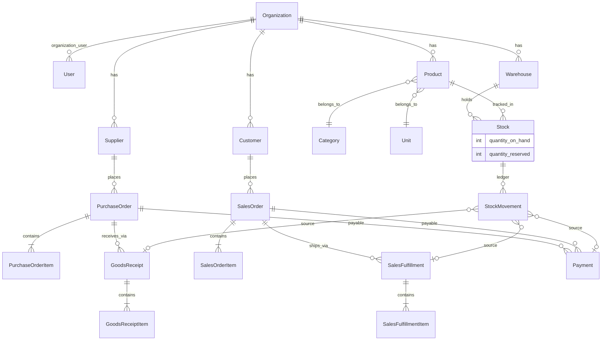

**Scoped models:** Product, Category, Unit, Warehouse, Supplier, Customer, Stock, StockMovement, PurchaseOrder, SalesOrder, Payment, GoodsReceipt, SalesFulfillment, IdempotencyKey.

---

## 7. Purchase order lifecycle

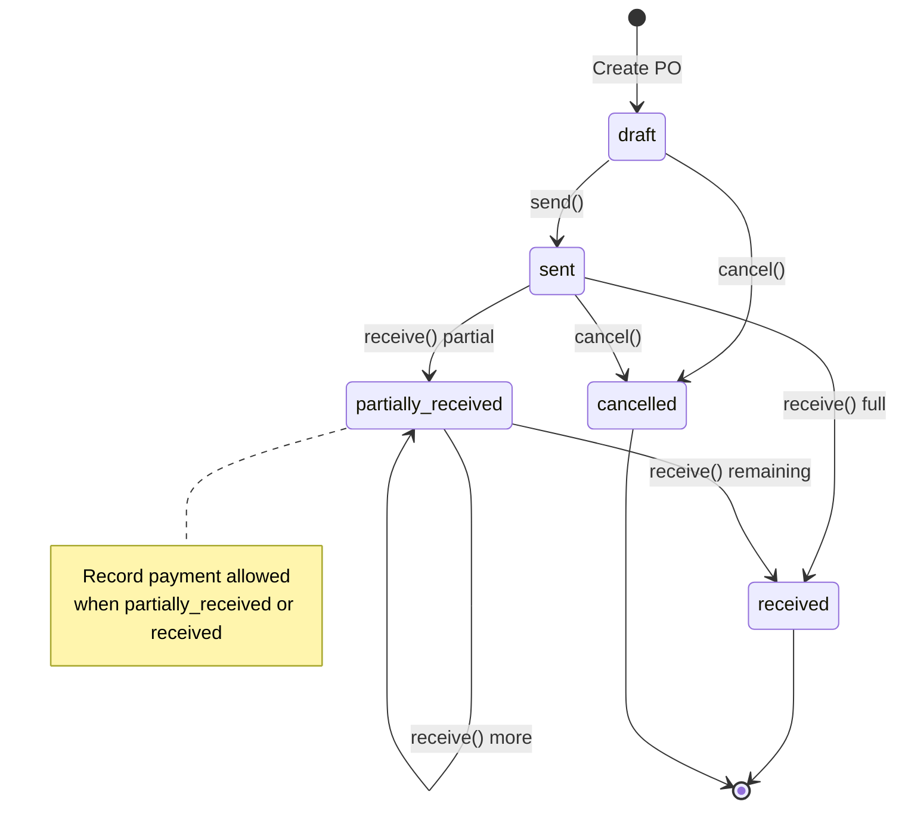

| Step | Service | Stock impact |
|------|---------|--------------|
| Create / edit / delete | `PurchaseOrderService` | None |
| **Send** | `PurchaseOrderService::send()` | None (order sent to supplier) |
| **Receive goods** | `GoodsReceiptService::receive()` | `purchase_in` stock movements |
| **Pay** | `PaymentService::recordPurchasePayment()` | None (financial record) |

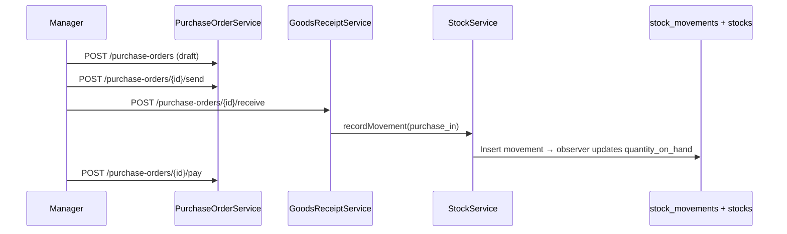

**Key files:** `app/Enums/PurchaseOrderStatus.php`, `app/Services/PurchaseOrderService.php`, `app/Services/GoodsReceiptService.php`

---

## 8. Sales order lifecycle

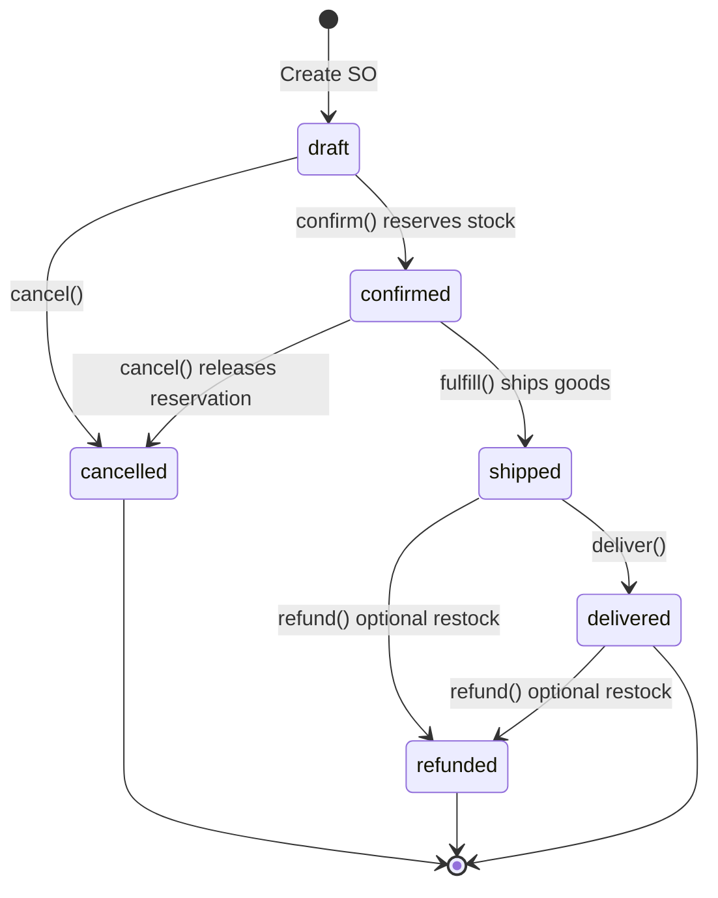

| Step | Service | Stock impact |
|------|---------|--------------|
| **Confirm** | `SalesOrderService::confirm()` | `quantity_reserved` ↑ |
| **Fulfill / ship** | `SalesOrderFulfillmentService::fulfill()` | Reservation consumed → `sale_out` movement |
| **Cancel** (confirmed) | `SalesOrderService::cancel()` | Reservation released |
| **Deliver** | `SalesOrderService::deliver()` | None (status only) |
| **Pay** | `PaymentService::recordSalesPayment()` | None |
| **Refund** | `PaymentService::recordSalesRefund()` | Optional `return_in` restock |

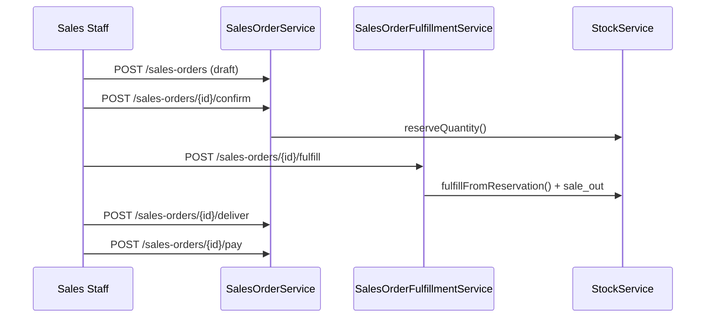

**Key files:** `app/Enums/SalesOrderStatus.php`, `app/Services/SalesOrderService.php`, `app/Services/SalesOrderFulfillmentService.php`, `app/Services/PaymentService.php`

---

## 9. Stock ledger

**All** changes to `quantity_on_hand` go through one path:

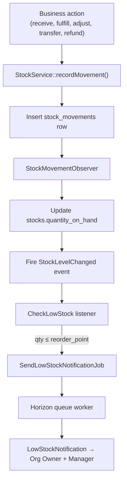

### Movement types

| Type | Direction | Typical source |
|------|-----------|----------------|
| `purchase_in` | In | Goods receipt |
| `sale_out` | Out | Sales fulfillment |
| `adjustment_in/out` | In/Out | Manual adjustment API |
| `transfer_in/out` | In/Out | Warehouse transfer |
| `return_in/out` | In/Out | Sales refund restock |

**Concurrency:** row locks + canonical product lock ordering prevent race conditions on stock updates.

**Key files:** `app/Services/StockService.php`, `app/Observers/StockMovementObserver.php`, `app/Enums/StockMovementType.php`, `app/Listeners/CheckLowStock.php`, `app/Jobs/SendLowStockNotificationJob.php`

---

## 10. Reports and audit

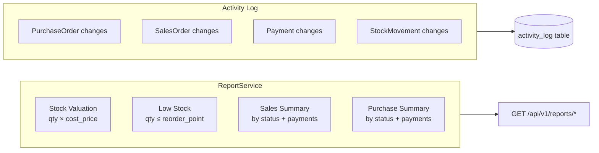

**Key files:** `app/Services/ReportService.php`, `app/Http/Controllers/Api/V1/ReportController.php`, `app/Traits/LogsModelActivity.php`

---

## 11. Deployment

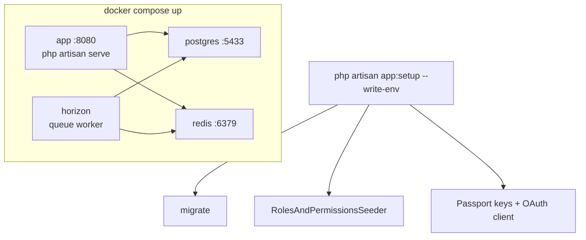

### URLs

| What | URL |
|------|-----|
| Web UI (local dev) | `http://localhost:8000` |
| API (Docker) | `http://localhost:8080/api/v1` |
| API docs | `/docs/api` |
| Horizon | `/horizon` |

### Bootstrap

```bash
# Docker
docker compose up -d --build
docker compose exec app php artisan app:setup --write-env

# Local (no Docker)
composer install && cp .env.example .env
php artisan app:setup --write-env
php artisan serve --host=localhost --port=8000
php artisan horizon
```

---

## 12. End-to-end user journey

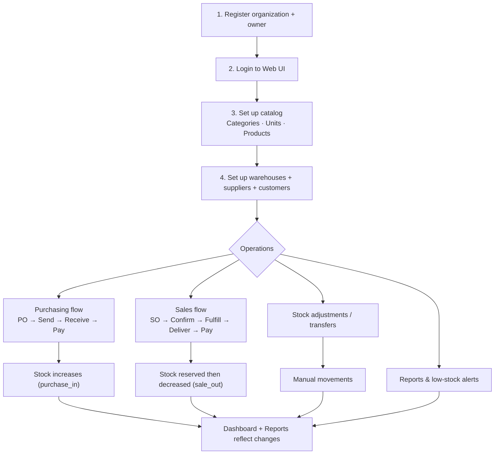

---

## 13. Roles and permissions (RBAC)

Multi-tenant RBAC uses [Spatie Laravel Permission](https://github.com/spatie/laravel-permission) with **teams** (`organization_id`). Each organization has isolated roles and permission assignments.

### Schema

| Table | Purpose |
|-------|---------|
| `roles` | Per-org roles (`organization_id`, `description`, `is_protected`, `is_system`) |
| `permissions` | Global permission catalog (guard: `api`) |
| `role_has_permissions` | Role ↔ permission pivot |
| `model_has_roles` | User ↔ role pivot (scoped by `organization_id`) |
| `model_has_permissions` | Direct user permissions (rare; team-scoped) |

### Permission catalog

Single source of truth: `app/Permission/PermissionCatalog.php` — permissions grouped by module (Inventory, Orders, Customers, Suppliers, Payments, Reports, Settings).

### Default roles (seeded per organization)

| Role | Notes |
|------|-------|
| **System Owner** | Protected (`is_protected=true`); always has full access; cannot be edited or deleted |
| **Org Owner** | Shop owner; **configurable** permissions (not hard-coded super-admin) |
| Admin | Full operational access by default; customizable |
| Manager | Day-to-day inventory and orders |
| Warehouse Staff | Receipts and fulfillments |
| Sales Staff | Customers and sales orders |
| Viewer | Read-only |

Registration assigns **Org Owner** to the registering user. **System Owner** is seeded but not auto-assigned.

### Authorization layers

| Layer | Implementation |
|-------|------------------|
| API | Spatie `permission` middleware + resource **policies**; `Gate::before` bypass for System Owner |
| Web session | `PermissionAuthorizationService` resolves permissions (30-min cache); stored in session as `permissions[]` |
| Livewire pages | `EnsuresPermission` trait — aborts 403 on direct URL access |
| Blade UI | `@canaccess('permission.name')` directive via `OrganizationSession::can()` |

### Role management

- **API:** `GET/POST/PATCH/DELETE /api/v1/roles`, `GET /api/v1/roles/permissions`
- **Service:** `app/Services/RoleManagementService.php` — CRUD, safety checks (protected roles, users assigned)
- **Web UI:** `/settings/roles` (requires `settings.manage_roles`)
- **Migrate existing orgs:** `php artisan rbac:migrate-organizations`

**Key files:** `app/Permission/PermissionCatalog.php`, `database/seeders/RolesAndPermissionsSeeder.php`, `app/Services/PermissionAuthorizationService.php`, `app/Services/RoleManagementService.php`, `app/Policies/RolePolicy.php`, `app/Support/OrganizationSession.php`

See **[RBAC-PERMISSIONS.md](./RBAC-PERMISSIONS.md)** for how the permission list is generated and how to add new permissions.

> **Note:** Platform operators (`platform_admins`) use a separate Passport guard — not Spatie roles. See **[PLATFORM-ADMIN.md](./PLATFORM-ADMIN.md)**.

---

## 14. Platform admin layer

Cross-tenant operations for **platform operators** — separate from tenant RBAC.

| Surface | Path | Guard |
|---------|------|-------|
| Platform API | `/api/platform/v1/*` | `auth:platform` |
| Web portal | `/platform/*` | `platform.web.auth` (session `platform_auth_token`) |

### Capabilities

| Feature | Implementation |
|---------|------------------|
| Organization directory | List/search/suspend tenants |
| Subscriptions | `plans` + `organization_subscriptions` — 14-day **Growth** trial on registration; self-serve Stripe checkout (Starter/Growth/Business) |
| Plan limits | Graduated enforcement: warning at 90%, grace buffer, then 422 on warehouse/product/user/order writes |
| Suspension | Blocks all tenant API + web access for suspended orgs |
| Feature flags | Global flags with per-org overrides |
| Support notes | Internal operator notes (never on tenant API) |
| Impersonation | Short-lived tenant token + append-only audit log |
| Platform admin CRUD | No public registration; `platform:admin:create` or `/platform/admins` |
| Stripe webhooks | Idempotent processing via `stripe_events`; signature required |

### Tenant billing & GDPR (API)

| Feature | Path |
|---------|------|
| Billing overview / checkout / portal | `/api/v1/billing/*` |
| Stripe webhook | `POST /api/stripe/webhook` |
| GDPR data export | `POST /api/v1/organization/export` |
| Account deletion request / cancel | `POST /api/v1/organization/request-deletion`, `cancel-deletion` |
| Health check | `GET /api/health` |

### Web portal pages

| URL | Purpose |
|-----|---------|
| `/platform/login` | Sign in |
| `/platform/dashboard` | Metrics overview |
| `/platform/organizations` | Tenant directory |
| `/platform/organizations/{id}` | Status, subscription, flags, notes, impersonation |
| `/platform/admins` | Manage platform admin accounts |

**Key files:** `routes/platform.php`, `app/Http/Livewire/Platform/*`, `app/Services/Web/PlatformApiClient.php`, `app/Services/OrganizationSubscriptionService.php`, `app/Services/ImpersonationService.php`

See **[PLATFORM-ADMIN.md](./PLATFORM-ADMIN.md)** for the full API reference and schema.

See **[SUBSCRIPTIONS-AND-PLANS.md](./SUBSCRIPTIONS-AND-PLANS.md)** for plan tiers, limits, lifecycle, and enforcement detail.

See **[PRICING_PLAN.md](../PRICING_PLAN.md)** for the authoritative pricing spec and seed values.

---

## 15. Key files quick reference

| Area | Path |
|------|------|
| Web routes | `routes/web.php` |
| API routes | `routes/api.php` |
| Platform routes | `routes/platform.php` |
| Livewire UI | `app/Http/Livewire/*` |
| API bridge | `app/Services/Web/ApiClient.php`, `app/Services/Web/PlatformApiClient.php` |
| Auth | `app/Services/AuthService.php`, `app/Services/PasswordResetService.php`, `app/Services/SessionService.php`, `app/Http/Controllers/Web/AuthController.php` |
| Billing / Stripe | `app/Services/StripeBillingService.php`, `app/Http/Controllers/StripeWebhookController.php` |
| GDPR | `app/Services/OrganizationDataExportService.php`, `app/Services/OrganizationDeletionService.php` |
| Health | `app/Http/Controllers/HealthController.php` |
| Platform auth | `app/Http/Controllers/Web/PlatformAuthController.php`, `app/Services/Web/PlatformSessionService.php` |
| Tenant middleware | `app/Http/Middleware/ResolveTenant.php`, `app/Http/Middleware/WebAuth.php` |
| RBAC | `app/Permission/PermissionCatalog.php`, `app/Services/PermissionAuthorizationService.php`, `app/Services/RoleManagementService.php` |
| Subscriptions & limits | `app/Services/OrganizationSubscriptionService.php`, `app/Services/PlanLimitService.php` |
| Platform services | `app/Services/ImpersonationService.php`, `app/Services/FeatureFlagService.php`, `app/Services/SupportNoteService.php` |
| Stock core | `app/Services/StockService.php`, `app/Observers/StockMovementObserver.php` |
| Purchase orders | `app/Services/PurchaseOrderService.php`, `app/Services/GoodsReceiptService.php` |
| Sales orders | `app/Services/SalesOrderService.php`, `app/Services/SalesOrderFulfillmentService.php` |
| Payments | `app/Services/PaymentService.php` |
| Reports | `app/Services/ReportService.php` |
| Docker | `docker-compose.yml`, `Dockerfile`, `docker/entrypoint.sh` |
| Setup command | `app/Console/Commands/SetupApplication.php` |
| Web session / token refresh | `app/Services/Web/WebSessionService.php`, `app/Http/Middleware/WebAuth.php` |

---

## 16. Web UI ↔ API coverage

The Livewire frontend consumes the REST API through `ApiClient` (internal sub-requests with Bearer token + `X-Organization-Id`).

| API area | Web coverage |
|----------|--------------|
| Auth register/login | Yes — `AuthController` → `AuthService` (session stores tokens) |
| Auth refresh | Yes — `WebSessionService::refreshIfNeeded()` in `WebAuth` + `ApiClient` |
| Auth logout | Yes — `POST /api/v1/auth/logout` + web session clear |
| Auth forgot/reset password | API only — web UI can be wired to same endpoints |
| Auth sessions | API only — list/revoke device tokens |
| Auth me | Covered via session user data at login |
| Organization switch | Yes — `POST /organization/switch` updates session `organization_id` |
| Organization settings | Yes — `/settings/organization` (`settings.update`) + `GET/PATCH /api/v1/organization` |
| GDPR export / deletion | API only — `POST /api/v1/organization/export`, `request-deletion`, `cancel-deletion` |
| Billing (Stripe) | Yes — `/settings/billing` + `/api/v1/billing/*` |
| Team members (`/api/v1/users`) | Yes — `/settings/team` (`settings.manage_users`) |
| Roles & permissions | Yes — `/settings/roles` (`settings.manage_roles`) + `GET/POST/PATCH/DELETE /api/v1/roles` |
| Products, categories, units, warehouses, suppliers, customers | Full CRUD |
| Purchase orders | Full lifecycle + detail page at `/purchase-orders/{id}` |
| Sales orders | Full lifecycle + detail page at `/sales-orders/{id}` |
| Stocks | Index only (matches API) |
| Stock movements | Index + create |
| Payments | Index + detail page at `/payments/{id}` |
| Reports | All report endpoints + dashboard aggregates + CSV export queue |
| Platform admin API | `/api/platform/v1/*` — plans, subscriptions, flags, notes, impersonation, admin CRUD |
| Platform admin portal | **`/platform/*`** — dashboard, org directory, org detail, platform admins |
| `POST products/authorization-probe` | API/test only — not used in web UI |

**Idempotency:** `ApiClient` automatically sends `Idempotency-Key` for `POST /v1/purchase-orders` and `POST /v1/sales-orders`.

---

## Summary

Oneapp is a **multi-tenant Laravel SaaS** where the **Livewire web UI** calls the same **Passport-protected REST API** that external clients use. All data is scoped per **Organization**, and **stock is always changed through a movement ledger** that drives reservations, purchase receipts, sales fulfillments, and low-stock notifications. A **platform admin layer** (`/platform/*`, `/api/platform/v1`) manages subscriptions, enforcement, and cross-tenant operations separately from tenant RBAC.
