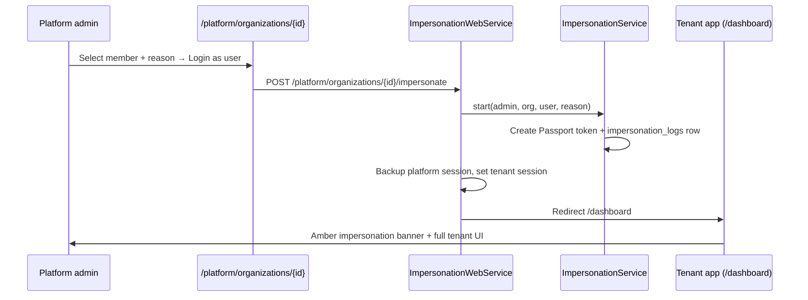

# Tenant Impersonation (Login-as) for Support Debugging

Platform operators can sign into the **tenant web app** as a specific team member to reproduce issues, verify permissions, or walk through workflows — without knowing the user's password. Every session is audited.

| Document | Purpose |
|----------|---------|
| **[PLATFORM-ADMIN.md](./PLATFORM-ADMIN.md)** | Full platform portal & API reference |
| **This file** | Impersonation operator guide, flows, and troubleshooting |
| [PROJECT_BRIEF_FOR_SUPERADMIN.md](../PROJECT_BRIEF_FOR_SUPERADMIN.md) | Product requirements checklist |

---

## Overview

| Layer | Entry point | Result |
|-------|-------------|--------|
| **Web portal (recommended)** | `/platform/organizations/{id}` → **Login as user** | Browser session in tenant app at `/dashboard` with visible banner |
| **Platform API** | `POST /api/platform/v1/organizations/{id}/impersonate` | JSON response with tenant Bearer token (for mobile tools, scripts) |

Both paths use the same core service (`ImpersonationService`) and write to the same `impersonation_logs` table.



---

## Operator workflow (web)

### 1. Sign in to the platform portal

```
/platform/login
```

Use a platform admin account (e.g. local demo: `platform@demo.test` / `password123`).

### 2. Open the target organization

```
/platform/organizations/{id}
```

Scroll to the **Login as tenant** card.

### 3. Start impersonation

| Field | Rules |
|-------|-------|
| **Team member** | Required — must belong to this organization |
| **Reason** | Required — min 10, max 500 characters (e.g. `Support ticket #123 — dashboard sync issue`) |

Click **Login as user**. You are redirected to `/dashboard` as that member.

### 4. While impersonating

- An **amber banner** appears at the top of the main content area showing organization, user, and reason.
- The **organization switcher is hidden** (single-org context).
- You have the impersonated user's **RBAC permissions** for the target organization.
- Platform session is temporarily cleared; a backup is stored server-side.

### 5. End impersonation

Use either:

| Action | Result |
|--------|--------|
| **Exit impersonation** (banner button) | `POST /impersonation/exit` → returns to organization detail in platform portal |
| **Sign out** (tenant header menu) | Same as exit — restores platform session and revokes impersonation token |

---

## Platform API workflow

For automation, mobile admin tools, or API-only debugging.

**Start**

```http
POST /api/platform/v1/organizations/{id}/impersonate
Authorization: Bearer {platform_token}
Content-Type: application/json

{
  "user_id": 42,
  "reason": "Support ticket #123 — reproducing API error"
}
```

**Response (201)**

```json
{
  "data": {
    "impersonation": {
      "active": true,
      "log_id": 1,
      "platform_admin_id": 1,
      "platform_admin_name": "Platform Admin",
      "organization_id": 1,
      "impersonated_user_id": 42,
      "reason": "Support ticket #123 — reproducing API error",
      "started_at": "2026-07-23T10:00:00.000000Z",
      "ended_at": null
    },
    "token": {
      "access_token": "...",
      "token_type": "Bearer",
      "expires_in": 3600
    },
    "organization_id": 1
  }
}
```

Use the tenant token with `Authorization: Bearer` and `X-Organization-Id: {organization_id}` on `/api/v1/*` routes.

**End**

```http
POST /api/platform/v1/impersonation/end
Authorization: Bearer {platform_token}
```

**Tenant metadata**

```http
GET /api/v1/auth/me
Authorization: Bearer {impersonation_token}
X-Organization-Id: {organization_id}
```

When the token is an active impersonation session, `data.impersonation.active` is `true` and includes `reason`, platform admin name, and timestamps.

---

## Audit trail

All sessions are logged append-only in `impersonation_logs`:

| Column | Description |
|--------|-------------|
| `platform_admin_id` | Who started the session |
| `organization_id` | Target tenant |
| `impersonated_user_id` | Target user |
| `reason` | Operator-provided justification |
| `token_id` | Linked Passport token (revoked on end) |
| `started_at` / `ended_at` | Session window |

Rules:

- Starting a new impersonation **ends any other active session** for the same platform admin.
- Ending revokes the Passport token and sets `ended_at`.
- Only one active log per admin at a time.

---

## Session & security model

| Concern | Behavior |
|---------|----------|
| Guard isolation | Platform tokens never satisfy tenant middleware; tenant tokens never satisfy `auth:platform` |
| Token type | Laravel Passport **personal access token** on the `users` provider |
| Token lifetime | 1 hour (`expires_in: 3600`) |
| Member validation | User must belong to the target organization |
| Reason | Required on every start — validated server-side |
| Visibility | Web: amber banner in tenant layout; API: `impersonation` object on `/auth/me` |
| Mobile app | React Native / other clients **must** show a visible indicator when `impersonation.active` is true |

### Web session swap

`ImpersonationWebService` performs:

1. Call `ImpersonationService::start()` (token + log)
2. Export platform session → `platform_session_backup`
3. Store impersonation metadata → `impersonation` session key
4. Clear platform auth session
5. Store tenant auth session (`auth_token`, user, organizations, permissions)
6. Set `organization_id` to the target org

Exit reverses this: revoke tenant token, end log, clear tenant session, restore platform backup.

---

## Routes & key files

### Web routes

| Method | Path | Name | Middleware |
|--------|------|------|------------|
| POST | `/platform/organizations/{id}/impersonate` | `platform.impersonation.start` | `platform.web.auth` |
| POST | `/impersonation/exit` | `impersonation.exit` | `web.auth` |

Tenant **Sign out** during impersonation calls `ImpersonationWebService::exit()` via `AuthController::logout()`.

### Platform API routes

| Method | Path |
|--------|------|
| POST | `/api/platform/v1/organizations/{organizationId}/impersonate` |
| POST | `/api/platform/v1/impersonation/end` |

### Code map

| Area | Path |
|------|------|
| Core logic | `app/Services/ImpersonationService.php` |
| Web session bridge | `app/Services/Web/ImpersonationWebService.php` |
| Web start controller | `app/Http/Controllers/Web/PlatformImpersonationController.php` |
| Web exit controller | `app/Http/Controllers/Web/ImpersonationExitController.php` |
| API controller | `app/Http/Controllers/Api/Platform/V1/PlatformImpersonationController.php` |
| Validation | `app/Http/Requests/Platform/StartImpersonationRequest.php` |
| Tenant banner UI | `resources/views/components/impersonation-banner.blade.php` |
| Platform UI form | `resources/views/livewire/platform/organization-show.blade.php` |
| Passport client helper | `app/Support/PassportPersonalAccessClients.php` |
| Model | `app/Models/ImpersonationLog.php` |

### Tests

| File | Coverage |
|------|----------|
| `tests/Feature/Web/PlatformPortalTest.php` | Web login-as + exit + banner |
| `tests/Feature/PlatformLayerTest.php` | API impersonation + `/auth/me` metadata |
| `tests/Feature/PassportPersonalAccessClientTest.php` | Passport client auto-provisioning |

---

## Setup & troubleshooting

Impersonation requires a Passport **personal access client** for the `users` provider (separate from the password-grant client used for normal login).

### Automatic provisioning

`ImpersonationService` calls `PassportPersonalAccessClients::ensure('users')` before creating a token. Fresh installs and `php artisan app:setup` also run:

```bash
php artisan passport:ensure-personal-access-clients
```

### Common errors

| Error | Cause | Fix |
|-------|-------|-----|
| `Personal access client not found for 'users' user provider` | Missing Passport personal access client | Run `php artisan passport:ensure-personal-access-clients` |
| Validation error on `user_id` | Selected user is not a member of the organization | Pick a member from the org's team list |
| Validation error on `reason` | Fewer than 10 characters | Provide a meaningful support reason |
| Redirect to login after impersonate | Session / middleware issue | Confirm target org is not `suspended` |

### Manual verification

```bash
# Ensure clients exist
php artisan passport:ensure-personal-access-clients

# Run impersonation tests
php artisan test --filter=PlatformPortalTest
php artisan test --filter=PlatformLayerTest
```

---

## Best practices for operators

1. **Always enter a ticket-linked reason** — audits are permanent.
2. **Use the lowest-privilege user** that can reproduce the issue (e.g. Viewer vs Org Owner).
3. **Exit when finished** — do not leave impersonation sessions open.
4. **Do not perform destructive actions** unless explicitly required for the investigation; prefer read-only reproduction.
5. **Coordinate with mobile team** — API clients must surface the impersonation flag to end users where applicable.
