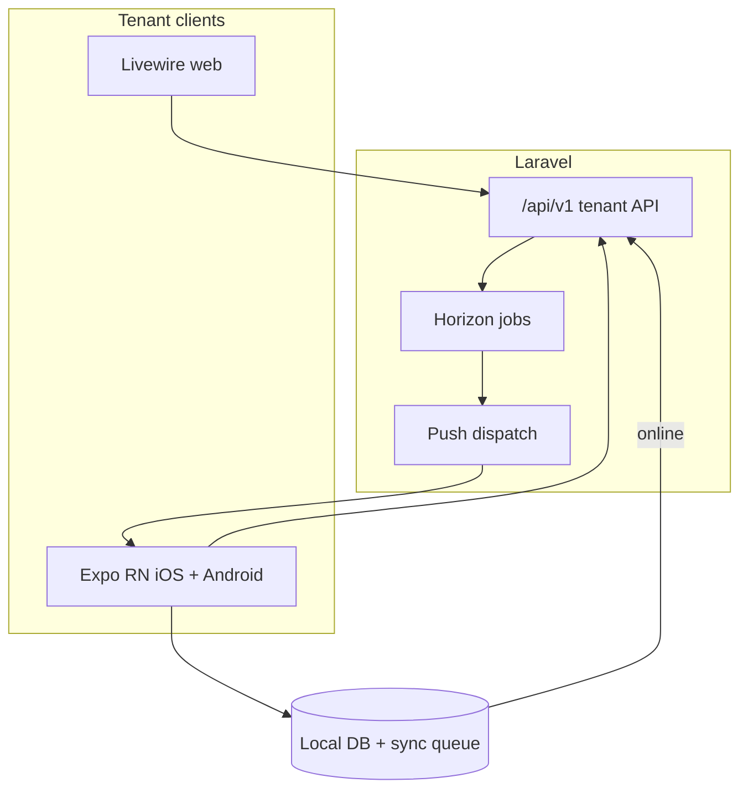
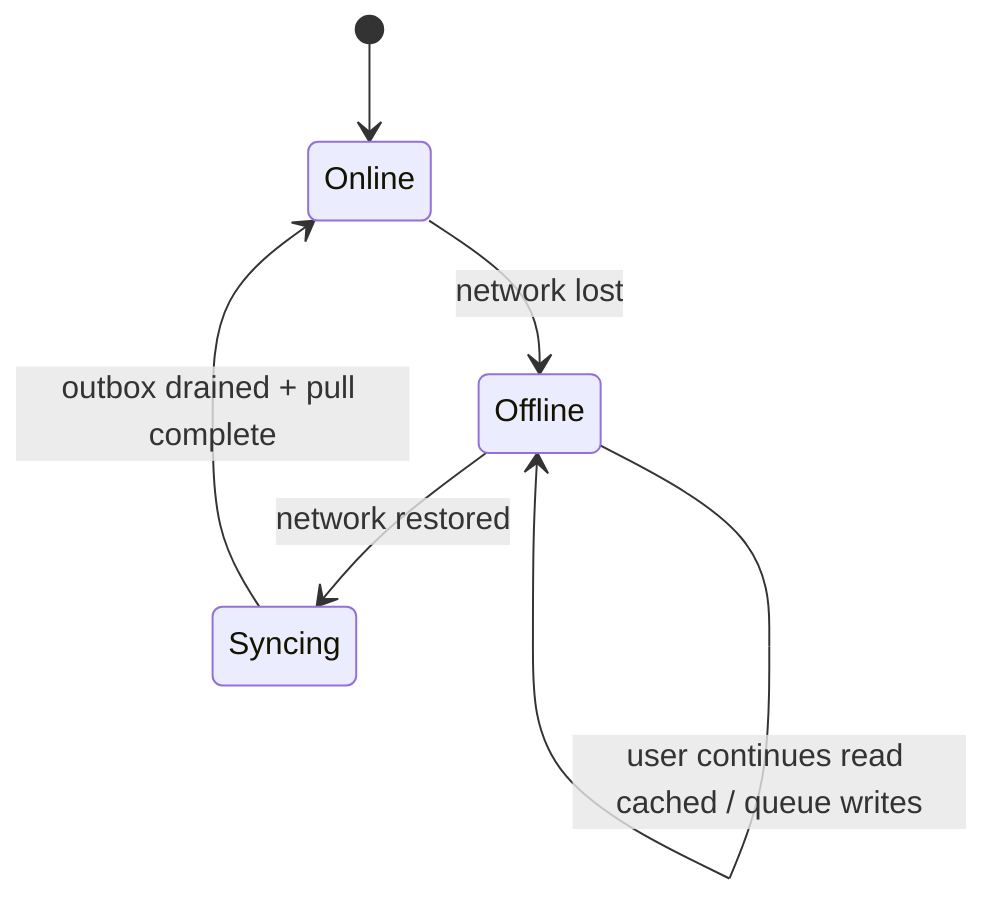

# Mobile App (React Native / Expo) — Future Planning Document

**Status:** Phase 0 in progress — Expo foundation + auth.  
**Purpose:** Specification for a **complete tenant mobile app** with **full web parity** (excluding platform super-admin), using **Expo** for **iOS and Android**, with **offline support**, **push notifications in v1**, and **Stripe billing via in-app browser**.

| Document | Purpose |
|----------|---------|
| **[ARCHITECTURE.md](./ARCHITECTURE.md)** | Current system architecture |
| **[RBAC-PERMISSIONS.md](./RBAC-PERMISSIONS.md)** | Tenant permission catalog |
| **[IMPERSONATION.md](./IMPERSONATION.md)** | Impersonation metadata on `/auth/me` |
| **This file** | Mobile app planning — scope, stack, API changes, offline, push |

---

## Locked product decisions

These choices are **fixed** for this plan. Do not revisit unless product direction changes.

| Decision | Choice |
|----------|--------|
| Scope | **Full tenant web parity** — all tenant Livewire features, mobile-appropriate UX |
| Super-admin / platform portal | **Excluded** — web-only (`/platform/*`, `/api/platform/v1`) |
| Framework | **React Native via Expo** (managed workflow) |
| Platforms | **iOS + Android together** — single codebase, shared release train |
| Auth API | Extend **`GET /api/v1/auth/me`** with **permissions** for active org |
| Push notifications | **Required in v1** |
| Offline | **Required in v1** — read cache + queued writes with sync |
| Billing / Stripe | **In-app browser** (`expo-web-browser`) opening Checkout / Portal URLs from API |
| API strategy | Consume existing **`/api/v1/*`** — extend backend only where gaps exist |

---

## Table of contents

1. [Executive summary](#1-executive-summary)
2. [Scope: full web parity matrix](#2-scope-full-web-parity-matrix)
3. [Out of scope](#3-out-of-scope)
4. [Architecture overview](#4-architecture-overview)
5. [React Native / Expo stack](#5-react-native--expo-stack)
6. [Authentication & session](#6-authentication--session)
7. [Extended `/auth/me` specification](#7-extended-authme-specification)
8. [API client conventions](#8-api-client-conventions)
9. [Offline architecture (v1)](#9-offline-architecture-v1)
10. [Push notifications (v1)](#10-push-notifications-v1)
11. [Billing & Stripe (in-app browser)](#11-billing--stripe-in-app-browser)
12. [Impersonation handling](#12-impersonation-handling)
13. [Navigation & screen map](#13-navigation--screen-map)
14. [Backend changes required](#14-backend-changes-required)
15. [Mobile repository structure](#15-mobile-repository-structure)
16. [Phased implementation roadmap](#16-phased-implementation-roadmap)
17. [Testing & release](#17-testing--release)
18. [Security checklist](#18-security-checklist)
19. [Risks & mitigations](#19-risks--mitigations)
20. [Open follow-ups](#20-open-follow-ups)

---

## 1. Executive summary

The Laravel backend is **API-first**. The Livewire web app is already a client of `/api/v1/*` via `App\Services\Web\ApiClient`. The mobile app is **another client** of the same API — no parallel business logic on the device except offline queue orchestration and UI state.



**Platform admin** remains web-only by design.

**Effort estimate (full parity + offline + push v1):** roughly **9–14 months** for a small team (2 mobile + 1 backend), depending on offline complexity and polish. Parallel backend work on `/auth/me`, push, and sync endpoints can start immediately.

---

## 2. Scope: full web parity matrix

Every **tenant** web area maps to a mobile feature. UX adapts to mobile (lists, bottom tabs, modals) but **capabilities match**.

| Web area | Livewire / route | API coverage today | Mobile v1 |
|----------|------------------|-------------------|-----------|
| **Auth** | `/login`, `/register` | `/auth/login`, `/register`, `/refresh`, forgot/reset | ✅ Full |
| **Dashboard** | `/dashboard` | `GET /reports/dashboard` | ✅ Full |
| **Products** | `/products` CRUD | `/products` resource | ✅ Full |
| **Categories** | `/categories` CRUD | `/categories` resource | ✅ Full |
| **Units** | `/units` CRUD | `/units` resource | ✅ Full |
| **Warehouses** | `/warehouses` CRUD | `/warehouses` resource | ✅ Full |
| **Stock levels** | `/stocks` | `GET /stocks` | ✅ Full |
| **Stock movements** | `/stock-movements` list + create | `GET/POST /stock-movements` | ✅ Full |
| **Suppliers** | `/suppliers` CRUD | `/suppliers` resource | ✅ Full |
| **Purchase orders** | `/purchase-orders` full lifecycle | `/purchase-orders` + send/receive/pay/cancel | ✅ Full |
| **Customers** | `/customers` CRUD | `/customers` resource | ✅ Full |
| **Sales orders** | `/sales-orders` full lifecycle | `/sales-orders` + confirm/fulfill/deliver/pay/refund | ✅ Full |
| **Payments** | `/payments` list/detail | `GET /payments`, `GET /payments/{id}` | ✅ Full |
| **Reports** | `/reports` + sub-reports | `/reports/*` | ✅ Full |
| **Report exports** | export from reports UI | `POST/GET /reports/exports` | ✅ Full (download via share sheet) |
| **Settings — Organization** | `/settings/organization` | `GET/PATCH /organization` | ✅ Full |
| **Settings — Billing** | `/settings/billing` | `GET /billing`, checkout/portal URLs | ✅ Via in-app browser |
| **Settings — Team** | `/settings/team` | `/users` resource | ✅ Full |
| **Settings — Roles** | `/settings/roles` | `/roles`, `/roles/permissions` | ✅ Full |
| **Org export (GDPR)** | from settings | `POST /organization/export` | ✅ Full |
| **Org deletion request** | from settings | `POST /organization/request-deletion`, cancel | ✅ Full |
| **CSV import** | products/customers/suppliers | `POST */import` | ✅ Document picker + upload |
| **Print SO/PO** | `/sales-orders/{id}/print` | Web-only route today | ⚠️ See [§3](#3-out-of-scope) — mobile uses share/PDF |
| **Session management** | web session | `GET/DELETE /auth/sessions` | ✅ Full |
| **Org switcher** | header | `X-Organization-Id` header | ✅ Full |
| **Impersonation banner** | web banner | `auth/me` → `impersonation` | ✅ Required banner |
| **Platform admin** | `/platform/*` | `/api/platform/v1/*` | ❌ Excluded |

### Permission-gated navigation

Mirror web `sidebar-nav.blade.php` rules using `permissions` from `/auth/me`:

- Dashboard: any of `reports.view_*` or `inventory.view`
- Catalog: `inventory.view`
- Purchasing: `suppliers.view`, `orders.purchase.view`
- Sales: `customers.view`, `orders.sales.view`, `payments.view`
- Reports: `reports.view_sales|inventory|purchases`
- Settings: `canAccessSettings()` equivalent — org owner / `settings.*` permissions

---

## 3. Out of scope

| Item | Handling |
|------|----------|
| Platform super-admin portal | Web-only — do not ship `/api/platform/v1` in tenant app |
| Platform impersonation **start** | Web-only; app only **displays** impersonation when active |
| Livewire-specific UI | N/A — native/mobile patterns instead |
| `/platform/*`, Horizon, OpenAPI docs UI | Not in app |
| **Print routes** (`/sales-orders/{id}/print`) | **Mobile alternative:** authenticated PDF/HTML via new `GET /api/v1/sales-orders/{id}/print` or open signed URL in WebView / system share |
| POS register mode | Separate future retail POS module (not part of this tenant ERP mobile app) |

---

## 4. Architecture overview

### 4.1 Layered mobile architecture

```
┌──────────────────────────────────────────────┐
│  Screens (Expo Router file-based routes)      │
├──────────────────────────────────────────────┤
│  Feature modules (products, orders, …)        │
│  - UI components                              │
│  - React Query hooks (online reads)           │
│  - Offline repository (local reads + queue)   │
├──────────────────────────────────────────────┤
│  Sync engine                                  │
│  - Connectivity listener                      │
│  - Mutation queue processor                   │
│  - Conflict handler                           │
├──────────────────────────────────────────────┤
│  API client (axios/fetch)                     │
│  - Bearer token                               │
│  - X-Organization-Id                          │
│  - Idempotency-Key                            │
│  - 401 → refresh → retry                      │
├──────────────────────────────────────────────┤
│  Local persistence                            │
│  - SecureStore (tokens)                         │
│  - SQLite (Expo SQLite / Drizzle) — offline   │
│  - AsyncStorage (preferences, sync cursor)      │
└──────────────────────────────────────────────┘
```

### 4.2 Single codebase, dual platform

- **Expo EAS Build** for iOS App Store + Google Play
- **EAS Update** for OTA JS bundle fixes (not native module changes)
- Shared navigation, API, offline layer; platform-specific code only where needed (push, file picker, biometrics)

---

## 5. React Native / Expo stack

| Layer | Choice | Notes |
|-------|--------|-------|
| Runtime | **Expo SDK 52+** (track latest stable at implementation) | Managed workflow |
| Routing | **Expo Router** | File-based, deep links |
| Language | **TypeScript** | Strict mode |
| Server state | **TanStack Query v5** | Online fetch, cache invalidation |
| Offline DB | **Expo SQLite + Drizzle ORM** | Relational local cache + outbox |
| Persisted query cache | **@tanstack/react-query-persist-client** + AsyncStorage | Secondary to SQLite for structured offline |
| Auth storage | **expo-secure-store** | Access + refresh tokens |
| HTTP | **Axios** | Interceptors |
| Forms | **React Hook Form + Zod** | Align validation with API |
| UI | **React Native Paper** or **NativeWind** | Match brand; support dark mode |
| i18n | **i18next** | Parity with web strings over time |
| Barcode (stock ops) | **expo-camera** | Optional v1.1 if not day-one |
| Push | **expo-notifications** + FCM/APNs via EAS | v1 required |
| Billing browser | **expo-web-browser** | Stripe Checkout / Portal |
| API types | **Orval** or **openapi-typescript** from `/docs/api` | CI codegen |
| E2E | **Maestro** | Cross-platform flows |

---

## 6. Authentication & session

### 6.1 Login flow (unchanged API)

Mobile sends **email + password only** to `POST /api/v1/auth/login`. The server issues Passport tokens internally (`AuthService::issuePasswordGrantToken`) — **no OAuth client secret in the app**.

```
1. POST /auth/login
2. Store access_token + refresh_token in SecureStore
3. Store organizations[] from response
4. Set active organization_id (default: user.default_organization_id)
5. GET /auth/me with X-Organization-Id → permissions + impersonation
6. Register push token (POST /devices — new endpoint)
7. Initial sync / hydrate local SQLite
```

### 6.2 Token refresh

On **401** (except login):

1. `POST /auth/refresh` with `refresh_token`
2. Update SecureStore
3. Retry original request once
4. If refresh fails → logout, clear local DB, navigate to login

### 6.3 Logout

1. `POST /auth/logout` (revoke current token)
2. Unregister push token
3. Clear SecureStore, SQLite, query cache
4. Navigate to login

### 6.4 Organization switch

Same as web:

1. User selects org from list (from login response or `/auth/me`)
2. Update persisted `organization_id`
3. Call `GET /auth/me` with new `X-Organization-Id` → refresh **permissions**
4. Clear React Query cache + re-sync SQLite for new org namespace
5. Push token registration may include `organization_id` for targeted notifications

### 6.5 Register & password reset

- **Register:** full `POST /auth/register` flow (organization + owner)
- **Forgot password:** in-app form → `POST /auth/forgot-password`
- **Reset:** deep link `myapp://reset-password?token=&email=` → `POST /auth/reset-password`

---

## 7. Extended `/auth/me` specification

**Required backend change** before mobile v1 launch.

### 7.1 Request

```http
GET /api/v1/auth/me
Authorization: Bearer {access_token}
X-Organization-Id: {active_organization_id}
Accept: application/json
```

When `X-Organization-Id` is present, response includes permissions for that org. When absent, omit `permissions` or return empty array (document chosen behavior in implementation).

### 7.2 Proposed response

```json
{
  "data": {
    "user": {
      "id": 1,
      "name": "Jane Owner",
      "email": "jane@acme.test",
      "phone": "+15551234567",
      "status": "active",
      "default_organization_id": 1,
      "last_login_at": "2026-07-10T12:00:00.000000Z"
    },
    "organizations": [
      {
        "id": 1,
        "name": "Acme Inventory",
        "slug": "acme-inventory",
        "plan": "growth",
        "status": "active",
        "trial_ends_at": "2026-08-10T00:00:00.000000Z",
        "role": "Org Owner"
      }
    ],
    "active_organization_id": 1,
    "permissions": [
      "inventory.view",
      "inventory.create",
      "orders.sales.view",
      "orders.sales.create",
      "orders.sales.confirm",
      "orders.sales.fulfill",
      "orders.sales.pay",
      "reports.view_sales",
      "settings.view",
      "settings.update"
    ],
    "impersonation": {
      "active": false
    }
  }
}
```

When impersonating (support session):

```json
"impersonation": {
  "active": true,
  "platform_admin_name": "Platform Admin",
  "organization_id": 1,
  "reason": "Support ticket #42",
  "started_at": "2026-07-23T10:00:00.000000Z"
}
```

### 7.3 Implementation notes (backend)

| Item | Detail |
|------|--------|
| Service | `PermissionAuthorizationService::permissionsForUser($user, $organizationId)` — already used by web session |
| Cache | Invalidate when roles change (same as web) |
| Tests | Extend `AuthTest` / new `AuthMePermissionsTest` |
| Web | Optionally consume same field in `WebSessionService` later |

### 7.4 Mobile permission helper

```typescript
// permissions.ts
export function can(permissions: string[], key: string): boolean {
  return permissions.includes(key);
}
export function canAny(permissions: string[], keys: string[]): boolean {
  return keys.some((k) => permissions.includes(k));
}
```

Gate tabs, FABs, and action sheets — server still enforces on every API call.

---

## 8. API client conventions

### 8.1 Required headers

| Header | When |
|--------|------|
| `Authorization: Bearer {token}` | All authenticated routes |
| `X-Organization-Id: {id}` | All tenant routes (`tenant` middleware) |
| `Accept: application/json` | Always |
| `Content-Type: application/json` | JSON bodies |
| `Idempotency-Key: {uuid}` | `POST /purchase-orders`, `POST /sales-orders`, offline replay |

### 8.2 Error handling

| Status | Mobile behavior |
|--------|-----------------|
| **401** | Refresh token or logout |
| **403** | Permission denied toast; optional upgrade prompt |
| **402** | Subscription expired / payment required — link to billing (in-app browser) |
| **422** | Show validation errors on form |
| **429** | Rate limit — backoff + user message (plan `api_rate_limit_per_minute`) |
| **403** (suspended org) | Block app usage, show contact support |

### 8.3 Pagination

All list endpoints paginate — use FlatList + infinite query (`useInfiniteQuery`). Persist last page in SQLite for offline browse.

### 8.4 Idempotency & offline

Every queued **create** for SO/PO must store the same `Idempotency-Key` generated on device at first submit attempt — safe replay after reconnect.

---

## 9. Offline architecture (v1)

Offline is **required in v1**. Scope: **usable warehouse/shop floor when connectivity is poor**, not indefinite fully-autonomous operation.

### 9.1 Offline capabilities matrix

| Capability | Offline read | Offline write | Sync |
|------------|--------------|---------------|------|
| Products, categories, units | ✅ Cached | ❌ Queue optional v1.1 | Pull |
| Customers, suppliers | ✅ Cached | ✅ Queue create/update | Push + pull |
| Stock levels | ✅ Last synced | ❌ | Pull on reconnect |
| Stock movements (adjust) | — | ✅ Queue | Push |
| Sales orders (draft create) | — | ✅ Queue | Push |
| SO confirm/fulfill/pay | — | ✅ Queue (ordered) | Push pipeline |
| Purchase orders | — | ✅ Queue | Push |
| PO receive | — | ✅ Queue | Push |
| Reports | ✅ Last snapshot | ❌ | Pull |
| Settings / billing | ❌ | ❌ | Online only |
| Team / roles | ✅ Cached | Online preferred | — |

**Billing, Stripe, org deletion, exports:** **online only** — show clear offline gate.

### 9.2 Local database (SQLite)

Organize by **organization_id** — wipe and re-sync on org switch.

**Tables (local):**

| Table | Purpose |
|-------|---------|
| `sync_metadata` | Last sync cursor per resource |
| `outbox_mutations` | Pending API calls (method, path, body, headers, idempotency_key, status) |
| `products`, `categories`, `units`, `warehouses` | Catalog cache |
| `customers`, `suppliers` | Partner cache |
| `stocks` | Stock snapshot |
| `sales_orders`, `purchase_orders` | Cached list + detail |
| `payments` | Read cache |

Use **Drizzle ORM** with Expo SQLite for typed schema + migrations on app upgrade.

### 9.3 Sync engine



**On reconnect:**

1. Process **outbox** FIFO (respect dependencies — e.g. create SO before confirm)
2. On success → remove outbox row, update local cache from response
3. On **422** → mark failed, surface to user for fix
4. On **409/conflict** → conflict UI (see §9.4)
5. Run **pull sync** for changed resources since `updated_since` cursor

**Background sync:** `expo-background-fetch` + `expo-task-manager` for periodic pull when app backgrounded (best-effort).

### 9.4 Conflict resolution

| Scenario | Policy |
|----------|--------|
| Stock insufficient on replay | Show error; user adjusts qty |
| SO already confirmed server-side | Treat as success; drop duplicate confirm from queue |
| Product deleted on server | Flag local row stale; refresh |
| Same idempotency key replay | Server returns original — idempotent success |

Backend should support **`GET /sync/changes?since={iso8601}`** (new) or per-resource `filter[updated_after]` — **required backend work** for efficient pull sync.

### 9.5 UI indicators

- Global **offline banner** (amber) when `NetInfo.isConnected === false`
- Pending outbox count badge on sync icon
- Per-row **“Pending sync”** on queued creates
- Manual **“Sync now”** button in settings

### 9.6 Initial sync

After login / org switch:

1. Full pull: products, categories, units, warehouses, customers, suppliers (paginated)
2. Pull recent orders (last 90 days configurable)
3. Pull stock snapshot
4. Store cursors

Show progress modal on first launch.

---

## 10. Push notifications (v1)

### 10.1 Use cases (v1)

| Event | Recipient | Trigger |
|-------|-----------|---------|
| Low stock alert | Users with `inventory.view` + notification pref | Existing low-stock logic / scheduled job |
| Sales order confirmed | Users with `orders.sales.view` | SO status change |
| Purchase order received | Users with `orders.purchase.view` | PO receive |
| Trial ending | Org owner | Existing `subscriptions:notify-trial-ending` |
| Payment past due | Org owner | Stripe webhook / dunning |
| Sync conflict / failed outbox | Device owner | Local + optional push after reconnect |

### 10.2 Backend additions (new)

#### Schema

```sql
-- device_push_tokens
id, user_id, organization_id (nullable), expo_push_token, platform (ios|android),
device_name, last_used_at, created_at

-- notification_preferences (optional v1)
user_id, organization_id, event_key, enabled
```

#### API

| Method | Path | Purpose |
|--------|------|---------|
| POST | `/api/v1/devices/push-token` | Register/update Expo push token |
| DELETE | `/api/v1/devices/push-token` | Unregister on logout |
| GET | `/api/v1/notifications/preferences` | User prefs |
| PATCH | `/api/v1/notifications/preferences` | Update prefs |

#### Delivery

- **Expo Push API** from Laravel job (`SendExpoPushNotificationJob`)
- Store payload: `{ type, organization_id, resource_type, resource_id, title, body }`
- Deep link: `myapp://sales-orders/123`

### 10.3 Mobile setup

1. Request permission on first launch after login (or contextual prompt)
2. `Notifications.getExpoPushTokenAsync()` → `POST /devices/push-token`
3. Handle foreground (`Notifications.addNotificationReceivedListener`) and tap (`addNotificationResponseReceivedListener`) → navigate via Expo Router
4. Unregister on logout

### 10.4 EAS configuration

- `eas.json` profiles for dev/preview/production
- iOS: push entitlement via EAS
- Android: FCM via EAS credentials
- Document in `mobile/README.md` when repo exists

---

## 11. Billing & Stripe (in-app browser)

Web uses `BillingSettings` Livewire → `GET /billing`, `POST /billing/checkout`, `POST /billing/portal`.

### Mobile flow

```typescript
// 1. Fetch billing overview
const { data } = await api.get('/billing');

// 2. Start checkout
const { data: session } = await api.post('/billing/checkout', {
  plan_slug: 'growth',
  interval: 'monthly',
});
await WebBrowser.openBrowserAsync(session.url); // Stripe Checkout

// 3. Customer portal
const { data: portal } = await api.post('/billing/portal');
await WebBrowser.openBrowserAsync(portal.url);
```

### Return handling

- Stripe success/cancel URLs → configure app deep links or universal links (`https://app.example.com/billing/return`)
- On focus return: refresh `GET /billing` and `/auth/me`
- **402** responses elsewhere → prompt user to open billing

**No Stripe SDK in app for v1** — Checkout/Portal URLs only (matches decision).

---

## 12. Impersonation handling

When `impersonation.active === true` on `/auth/me`:

- Show **persistent amber banner** (same intent as web `impersonation-banner.blade.php`)
- Display platform admin name + reason
- **No** “exit impersonation” in tenant app (exit is platform web/session flow) — or deep link to web if required later
- Block sensitive actions if product decides (optional)

Cross-team requirement from [IMPERSONATION.md](./IMPERSONATION.md).

---

## 13. Navigation & screen map

### 13.1 Tab structure (permission-filtered)

| Tab | Screens |
|-----|---------|
| **Home** | Dashboard |
| **Inventory** | Products, Categories, Units, Warehouses, Stock, Movements |
| **Purchasing** | Suppliers, Purchase orders (+ detail/actions) |
| **Sales** | Customers, Sales orders, Payments |
| **More** | Reports, Settings, Sync status, Logout |

Settings sub-stack: Organization, Billing, Team, Roles, Sessions, Notification prefs.

### 13.2 Order detail actions (parity with web modals)

**Sales order:** Edit (draft), Confirm, Fulfill, Deliver, Pay, Refund, Cancel, Print/Share  
**Purchase order:** Edit (draft), Send, Receive, Pay, Cancel, Print/Share  

Each action = API POST + offline queue when disconnected.

### 13.3 Reports

| Report | API |
|--------|-----|
| Dashboard | `GET /reports/dashboard` |
| Stock valuation | `GET /reports/stock-valuation` |
| Low stock | `GET /reports/low-stock` |
| Sales summary | `GET /reports/sales-summary` |
| Purchase summary | `GET /reports/purchase-summary` |
| Export | `POST /reports/exports` → poll → download → share |

### 13.4 Print parity

Add backend (future):

```http
GET /api/v1/sales-orders/{id}/print
GET /api/v1/purchase-orders/{id}/print
```

Returns HTML or PDF with same content as web print views. Mobile opens in WebView or shares PDF via `expo-sharing`.

---

## 14. Backend changes required

Summary of **Laravel work** needed beyond consuming existing API.

| Priority | Change | Owner |
|----------|--------|-------|
| **P0** | Extend `/auth/me` with `permissions` (+ `active_organization_id`) | Backend |
| **P0** | `POST/DELETE /devices/push-token` + Expo push job | Backend |
| **P0** | `GET /sync/changes` or `updated_after` filters on key resources | Backend |
| **P1** | `GET /sales-orders/{id}/print`, `GET /purchase-orders/{id}/print` (API) | Backend |
| **P1** | Notification preferences API | Backend |
| **P1** | CORS / deep link URLs for Stripe return (config) | DevOps |
| **P2** | Barcode quick lookup `GET /products/lookup?barcode=` | Backend |
| **P2** | Mobile-specific error codes for offline conflict | Backend |
| **P2** | Plan limit: ensure Starter tier API access documented for mobile | Product |

**No change needed:** login (mobile-friendly), refresh, tenant middleware, idempotency middleware, most CRUD.

---

## 15. Mobile repository structure

Recommended **separate repository** `inventory-mobile` (or monorepo `apps/mobile`):

```
inventory-mobile/
├── app/                    # Expo Router screens
│   ├── (auth)/
│   ├── (tabs)/
│   └── _layout.tsx
├── src/
│   ├── api/
│   │   ├── client.ts
│   │   ├── generated/      # OpenAPI types
│   │   └── hooks/
│   ├── auth/
│   ├── db/
│   │   ├── schema.ts       # Drizzle
│   │   └── migrations/
│   ├── sync/
│   │   ├── outbox.ts
│   │   └── pull.ts
│   ├── permissions/
│   ├── features/
│   │   ├── products/
│   │   ├── sales-orders/
│   │   └── ...
│   └── components/
├── assets/
├── app.json
├── eas.json
├── package.json
└── README.md
```

**CI:**

- Lint + typecheck + Jest on PR
- Maestro smoke on staging API
- EAS Build on `main` → TestFlight + Play internal testing
- Regenerate API types when backend OpenAPI changes

**Environment:**

```
EXPO_PUBLIC_API_URL=https://api.example.com/api
EXPO_PUBLIC_APP_SCHEME=oneapp
```

---

## 16. Phased implementation roadmap

Full parity + offline + push is large — phases keep releases testable.

### Phase 0 — Foundation (4–6 weeks)

- [ ] Expo project, EAS, iOS + Android dev clients
- [ ] Auth (login, register, refresh, logout)
- [ ] API client + org header + SecureStore
- [ ] Backend: `/auth/me` permissions
- [ ] Permission-gated tab shell
- [ ] Org switcher
- [ ] Impersonation banner

### Phase 1 — Core inventory & sync scaffold (5–7 weeks)

- [ ] SQLite + Drizzle schema
- [ ] Pull sync products, categories, units, warehouses
- [ ] Products CRUD screens (online + cache)
- [ ] Stock list + stock movements (queue adjustments offline)
- [ ] Offline banner + outbox processor (basic)
- [ ] Backend: sync cursors / `updated_after`

### Phase 2 — Purchasing & sales (6–8 weeks)

- [ ] Suppliers, customers CRUD
- [ ] Purchase orders full lifecycle
- [ ] Sales orders full lifecycle
- [ ] Payments list/detail
- [ ] Idempotency in outbox for SO/PO create
- [ ] Push: register token endpoint + low-stock notification

### Phase 3 — Reports, settings, billing (4–5 weeks)

- [ ] Dashboard + all report screens
- [ ] Report export download + share
- [ ] Organization settings, team, roles
- [ ] Billing in-app browser
- [ ] GDPR export / deletion request
- [ ] CSV import (document picker)

### Phase 4 — Offline hardening + push complete (4–6 weeks)

- [ ] Full outbox dependency ordering (SO pipeline)
- [ ] Conflict UI
- [ ] Background fetch sync
- [ ] All v1 push event types
- [ ] Notification preferences
- [ ] API print/share for orders

### Phase 5 — Polish & store release (3–4 weeks)

- [ ] Maestro E2E suite
- [ ] App Store / Play Store assets, privacy policy
- [ ] Performance (FlatList tuning, image lazy load)
- [ ] Accessibility
- [ ] Beta → production rollout

**Total:** ~26–36 weeks depending on team size and parallel backend capacity.

---

## 17. Testing & release

| Layer | Tooling |
|-------|---------|
| Unit | Jest — permissions, outbox ordering, tax/format helpers |
| Component | React Native Testing Library |
| E2E | Maestro — login, create SO offline, sync, push tap |
| API contract | OpenAPI diff in CI |
| Staging | Same demo orgs as [GETTING-STARTED.md](./GETTING-STARTED.md) |
| Distribution | EAS Build → TestFlight + Play Internal → production |

**Release cadence:** mobile releases decoupled from Laravel deploys; coordinate when `/auth/me` or sync API changes — maintain **min app version** header optional for breaking API changes.

---

## 18. Security checklist

- [ ] Tokens only in **SecureStore**
- [ ] Certificate transparency / HTTPS only
- [ ] No platform API URLs or credentials in tenant app
- [ ] Jailbreak detection — only if compliance requires
- [ ] Screenshot blocking on sensitive screens — optional
- [ ] Session list + remote revoke (`/auth/sessions`)
- [ ] Push payloads — no PII in notification body; details in-app after auth
- [ ] Offline outbox encrypted at rest (SQLCipher optional enhancement)
- [ ] Org switch wipes previous org local data

---

## 19. Risks & mitigations

| Risk | Mitigation |
|------|------------|
| Offline + full SO lifecycle complexity | Strict outbox ordering; idempotency keys; phased offline (Phase 1 read-only → Phase 4 full writes) |
| Full web parity scope creep | Feature matrix checklist; parity sign-off per module |
| Plan API rate limits block mobile | Document Starter limitations; show upgrade in app |
| Push delivery failures | Expo receipts + retry job; fallback in-app notification center |
| Stripe return URL confusion | Universal links + clear copy after browser closes |
| Large SQLite DB on low-end Android | Pagination; prune old orders from cache; configurable retention |
| Backend/API breaking changes | OpenAPI codegen + contract tests |

---

## 20. Open follow-ups

Record decisions when implementation starts:

| # | Topic | Notes |
|---|-------|-------|
| 1 | Separate repo vs monorepo | This plan assumes separate `inventory-mobile` |
| 2 | UI kit | Paper vs NativeWind — pick one for design consistency with web |
| 3 | i18n v1 | Match web en/bn or English-only MVP |
| 4 | Biometric unlock | Face ID / fingerprint after first login |
| 5 | Tablet layout | Split view for iPad — v1 phone-first or simultaneous |
| 6 | Min OS versions | iOS 15+, Android API 24+ typical for Expo |
| 7 | App naming & store listings | Brand separate from “Oneapp” web |
| 8 | Sync API shape | Single `/sync/changes` vs per-resource deltas |

---

## Document history

| Date | Change |
|------|--------|
| 2026-07-23 | Initial planning document — locked decisions: Expo, full parity, offline v1, push v1, permissions on `/auth/me`, billing in-app browser, no platform admin |

---

*When implementation begins, add **`mobile/README.md`** in the mobile repository and update this file with actual repo URLs, EAS project IDs, and deep link schemes.*
