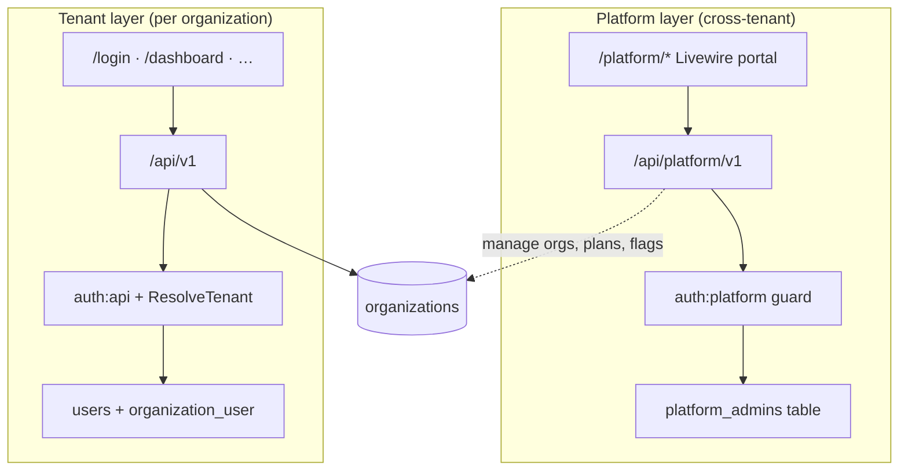

# Platform Admin (Super Admin) Guide

Platform operators manage **all tenants** from a layer that sits above organization-scoped RBAC. This is separate from tenant **Org Owner / Admin** roles — different guard, different tables, no `X-Organization-Id` on platform routes.

| Document | Purpose |
|----------|---------|
| **This file** | Platform API, portal, subscriptions, enforcement, impersonation |
| [PROJECT_BRIEF_FOR_SUPERADMIN.md](../PROJECT_BRIEF_FOR_SUPERADMIN.md) | Product requirements & implementation checklist |
| [ARCHITECTURE.md §14](./ARCHITECTURE.md#14-platform-admin-layer) | Condensed platform overview |
| [SYSTEM-ARCHITECTURE-AND-WORKFLOWS.md §17](./SYSTEM-ARCHITECTURE-AND-WORKFLOWS.md#17-platform-admin-api--portal) | End-to-end platform workflows |
| [RBAC-PERMISSIONS.md](./RBAC-PERMISSIONS.md) | Tenant RBAC only (not platform auth) |

---

## Architecture overview



**Guard isolation:** Platform tokens must never satisfy tenant middleware, and tenant tokens must never satisfy `auth:platform`. Covered by `tests/Feature/PlatformLayerTest.php`.

---

## Authentication

| Item | Detail |
|------|--------|
| Guard | `platform` (Passport personal access tokens) |
| Model | `App\Models\PlatformAdmin` |
| API login | `POST /api/platform/v1/auth/login` |
| Web login | `/platform/login` → separate session key `platform_auth_token` |
| Public registration | **None** — bootstrap via seeder or Artisan |

### Bootstrap a platform admin

```bash
# Local demo (DemoSeeder)
platform@demo.test / password123

# Manual
php artisan platform:admin:create platform@example.com "Platform Admin" --password=your-secure-password
```

Existing platform admins can create others via `POST /api/platform/v1/platform-admins` or the web UI at `/platform/admins`.

---

## Web portal routes

| URL | Purpose |
|-----|---------|
| `/platform/login` | Sign in |
| `/platform/dashboard` | Tenant counts, recent organizations |
| `/platform/organizations` | Search, filter, paginate all tenants |
| `/platform/organizations/{id}` | Status, subscription, feature flags, support notes, impersonation |
| `/platform/admins` | Create / remove platform admin accounts |

Portal UI matches tenant styling (sidebar, cards, toasts, confirm dialogs). Internal API calls use `PlatformApiClient` with the platform session token.

---

## Platform API reference

Base path: `/api/platform/v1` · Middleware: `auth:platform`

### Auth

| Method | Path | Purpose |
|--------|------|---------|
| POST | `/auth/login` | Issue platform access token |
| POST | `/auth/logout` | Revoke current token |
| GET | `/auth/me` | Current platform admin profile |

### Plans & subscriptions

| Method | Path | Purpose |
|--------|------|---------|
| GET | `/plans` | List active plans and limit JSON |
| GET | `/organizations/{id}/subscription` | Current subscription for tenant |
| PATCH | `/organizations/{id}/subscription` | Assign plan, set subscription status |

**Plans (seeded):** `trial`, `starter`, `pro`, `enterprise`

**Limit keys** in `plans.limits` JSON:

| Key | Enforced on |
|-----|-------------|
| `max_warehouses` | `POST /warehouses` |
| `max_users` | `POST /users` (invite member) |
| `max_products` | `POST /products` |
| `max_orders_per_month` | `POST /purchase-orders`, `POST /sales-orders` (combined count) |
| `api_rate_limit` | Reserved for future plan-based throttling |

`organizations.plan` is a **denormalized cache** synced from `organization_subscriptions`.

### Organizations

| Method | Path | Purpose |
|--------|------|---------|
| GET | `/organizations` | Paginated tenant directory |
| GET | `/organizations/{id}` | Detail + subscription + members |
| PATCH | `/organizations/{id}` | Update `status`, legacy `plan` string |

**Organization status:** `trial`, `active`, `suspended`

### Support notes (internal)

| Method | Path | Purpose |
|--------|------|---------|
| GET | `/organizations/{id}/support-notes` | List internal operator notes |
| POST | `/organizations/{id}/support-notes` | Add note (`note` required) |

Never exposed on tenant-facing `/api/v1`.

### Feature flags

| Method | Path | Purpose |
|--------|------|---------|
| GET | `/organizations/{id}/feature-flags` | Global flags + per-org overrides |
| PATCH | `/organizations/{id}/feature-flags/{flagId}` | Set `{ "enabled": true/false }` |

**Seeded flags:** `advanced_reporting`, `multi_warehouse_transfers`, `api_integrations`

### Impersonation

| Method | Path | Purpose |
|--------|------|---------|
| POST | `/organizations/{id}/impersonate` | `{ user_id, reason }` — issue short-lived tenant token |
| POST | `/impersonation/end` | End active impersonation session |

- `reason` is required (min 10 chars)
- Logged append-only in `impersonation_logs`
- Tenant `GET /api/v1/auth/me` includes `impersonation` object when active
- **React Native / mobile:** show visible impersonation indicator (cross-team coordination)

### Platform admin management

| Method | Path | Purpose |
|--------|------|---------|
| GET | `/platform-admins` | List operators |
| POST | `/platform-admins` | Create `{ name, email, password }` |
| DELETE | `/platform-admins/{id}` | Remove (cannot delete last admin) |

---

## Database schema

| Table | Purpose |
|-------|---------|
| `platform_admins` | Super-admin identities |
| `plans` | Plan name, price, limits JSON |
| `organization_subscriptions` | Source of truth: org ↔ plan, status, trial/period dates |
| `feature_flags` | Global flag definitions |
| `organization_feature_flags` | Per-org enabled/disabled override |
| `support_notes` | Internal operator notes |
| `impersonation_logs` | Audit trail: admin, org, user, reason, token, start/end |

Registration automatically creates a **trial** subscription via `OrganizationSubscriptionService::assignTrialPlan()`.

---

## Tenant enforcement

Platform actions affect tenant access through middleware and services — not UI-only checks.

### Suspension

When `organizations.status = suspended`:

| Layer | Behavior |
|-------|----------|
| API | `ResolveTenant` returns **403** — *"This organization has been suspended."* |
| Web | `WebAuth` clears session and redirects to `/login` with error |

### Subscription status & trial expiry

| Condition | Behavior |
|-----------|----------|
| `subscription.status = cancelled` | **403** on all tenant API + web access |
| `subscription.status = past_due` | **403** — payment/trial ended message |
| Trial `trial_ends_at` in the past | Auto-marked `past_due`, then blocked |
| Missing subscription row | **403** — run `platform:subscriptions:backfill` for legacy orgs |

### Plan limits

`PlanLimitService` throws `PlanLimitExceededException` → **422** JSON response before the write proceeds.

**Key files:** `app/Services/PlanLimitService.php`, `app/Services/OrganizationSubscriptionService.php`, `app/Http/Middleware/ResolveTenant.php`

---

## Key files

| Area | Path |
|------|------|
| Platform API routes | `routes/platform.php` |
| Web portal routes | `routes/web.php` (`/platform/*`) |
| API controllers | `app/Http/Controllers/Api/Platform/V1/*` |
| Livewire pages | `app/Http/Livewire/Platform/*` |
| Session bridge | `app/Services/Web/PlatformApiClient.php`, `PlatformSessionService.php` |
| Web auth | `app/Http/Controllers/Web/PlatformAuthController.php` |
| Middleware | `app/Http/Middleware/PlatformWebAuth.php` |
| Subscription | `app/Services/OrganizationSubscriptionService.php` |
| Plan limits | `app/Services/PlanLimitService.php` |
| Impersonation | `app/Services/ImpersonationService.php` |
| Support notes | `app/Services/SupportNoteService.php` |
| Feature flags | `app/Services/FeatureFlagService.php` |
| Platform admins | `app/Services/PlatformAdminService.php` |
| Bootstrap command | `app/Console/Commands/CreatePlatformAdminCommand.php` |
| Plan seeder | `database/seeders/PlanSeeder.php` |
| Tests | `tests/Feature/PlatformLayerTest.php`, `PlatformAdminTest.php`, `Web/PlatformPortalTest.php` |

---

## Operations

```bash
# Migrations (includes platform tables)
php artisan migrate

# Seed plans + feature flags
php artisan db:seed --class=PlanSeeder

# Create platform admin
php artisan platform:admin:create platform@demo.test "Platform Admin" --password=password123

# Legacy orgs created before subscriptions existed
php artisan platform:subscriptions:backfill

# Full bootstrap (includes PlanSeeder via DatabaseSeeder)
php artisan app:setup --write-env
```

### Demo credentials (local)

| Account | Password | Access |
|---------|----------|--------|
| `platform@demo.test` | `password123` | `/platform/login` + `/api/platform/v1` |

---

## Out of scope (documented deferrals)

| Item | Status |
|------|--------|
| Stripe / payment collection | Not implemented — subscription status set manually |
| Plan-based API rate limiting | `api_rate_limit` field exists; throttle still org+user keyed |
| Tenant-visible support notes | Internal only by design |
