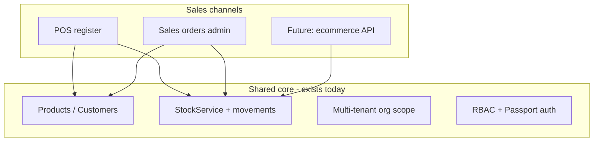
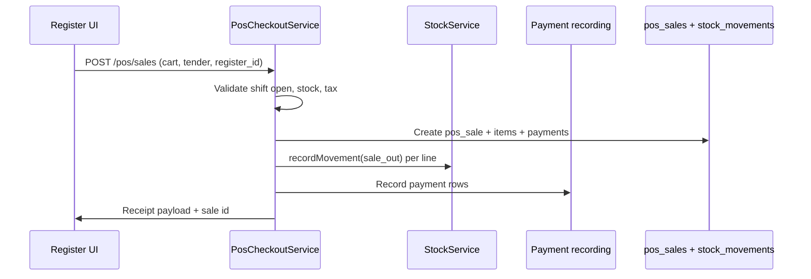
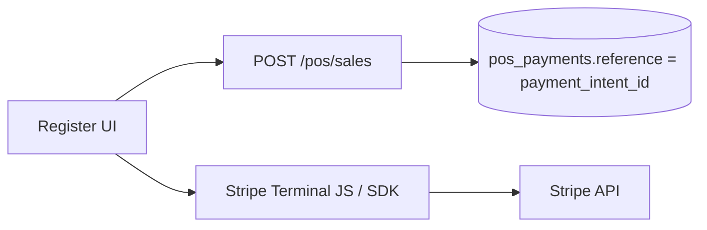

# Point of Sale (POS) — Future Planning Document

**Status:** Planning only — not implemented.  
**Purpose:** Capture requirements, architecture options, and scope for a **complete** POS module integrated with this Inventory Management SaaS. Use this document when prioritizing and implementing POS in the future.

| Document | Purpose |
|----------|---------|
| **[ARCHITECTURE.md](./ARCHITECTURE.md)** | Current system architecture |
| **[SYSTEM-ARCHITECTURE-AND-WORKFLOWS.md](./SYSTEM-ARCHITECTURE-AND-WORKFLOWS.md)** | Sales order & stock workflows today |
| **[RBAC-PERMISSIONS.md](./RBAC-PERMISSIONS.md)** | Current tenant permissions |
| **[SUBSCRIPTIONS-AND-PLANS.md](./SUBSCRIPTIONS-AND-PLANS.md)** | Plan limits & enforcement |
| **This file** | Complete POS planning & phased roadmap |

---

## Table of contents

1. [Executive summary](#1-executive-summary)
2. [Current system baseline](#2-current-system-baseline)
3. [What “complete POS” means](#3-what-complete-pos-means)
4. [Architecture options](#4-architecture-options)
5. [Proposed domain model](#5-proposed-domain-model)
6. [Backend services & API](#6-backend-services--api)
7. [Catalog & pricing extensions](#7-catalog--pricing-extensions)
8. [Tax engine](#8-tax-engine)
9. [Payments & card terminals](#9-payments--card-terminals)
10. [Stock & inventory integration](#10-stock--inventory-integration)
11. [Register UI & clients](#11-register-ui--clients)
12. [Hardware integrations](#12-hardware-integrations)
13. [RBAC, shifts & audit](#13-rbac-shifts--audit)
14. [Reporting & analytics](#14-reporting--analytics)
15. [Multi-tenant & platform layer](#15-multi-tenant--platform-layer)
16. [Receipts & compliance](#16-receipts--compliance)
17. [Offline mode](#17-offline-mode)
18. [Testing strategy](#18-testing-strategy)
19. [Phased implementation roadmap](#19-phased-implementation-roadmap)
20. [Open decisions](#20-open-decisions)
21. [Key file index (current codebase)](#21-key-file-index-current-codebase)
22. [Out of scope / deferrals](#22-out-of-scope--deferrals)

---

## 1. Executive summary

This project is a **multi-tenant inventory, purchasing, and sales ERP** (Laravel 13, PostgreSQL, Passport, Livewire). It has strong foundations for catalog, multi-warehouse stock, sales orders, and manual payment recording — but **no POS module exists today**.

A **complete POS system** is not a small feature on the sales order screen. It is a **second product surface**:

- **Register-centric** (touch-first, scanner-first, sub-second checkout)
- **Shift-centric** (open float, cash drawer, Z-report, variance)
- **Lane payments** (cash change, split tender, card terminals)
- **Optional offline** (local queue, sync when online)

The inventory core (`StockService`, movement ledger, concurrency locks) should be **reused**. The admin sales order workflow should **remain** for wholesale, phone orders, and back-office — POS adds a **parallel retail channel**.



**Recommendation for future implementation:** Introduce a dedicated **POS domain** (`pos_sales`, registers, shifts) that delegates stock and payment logic to existing services, rather than forcing retail through the multi-step sales order lifecycle.

---

## 2. Current system baseline

### 2.1 Sales order lifecycle (today)

| Step | Service | API | Stock effect |
|------|---------|-----|--------------|
| Create draft | `SalesOrderService::create()` | `POST /api/v1/sales-orders` | None |
| Confirm | `SalesOrderService::confirm()` | `POST .../confirm` | `quantity_reserved` ↑ |
| Fulfill | `SalesOrderFulfillmentService::fulfill()` | `POST .../fulfill` | Reservation → `sale_out` movement |
| Record payment | `PaymentService::recordSalesPayment()` | `POST .../pay` | None |
| Deliver | `SalesOrderService::deliver()` | `POST .../deliver` | Status only |
| Refund | `PaymentService::recordSalesRefund()` | `POST .../refund` | Optional `return_in` restock |

Statuses (`App\Enums\SalesOrderStatus`): `draft` → `confirmed` → `shipped` → `delivered` (also `cancelled`, `refunded`).

**POS mismatch:** Retail needs **one atomic checkout** (scan → pay → stock out → receipt). Today that requires **four or more API calls** and separate UI modals.

### 2.2 Product catalog (today)

| Field | Location | POS relevance |
|-------|----------|---------------|
| `sku` | `products.sku` | Required, unique per org |
| `barcode` | `products.barcode` | Optional, unique per org when set |
| `selling_price`, `cost_price` | Product model | Line price can override on SO |
| `tax_rate` | Product model | **Stored but not applied** in sales order totals |
| `is_active` | Product model | Filter inactive at scan time |
| Line discount | `sales_order_items.discount` | Supported on SO lines |

No product variants, modifiers, store-specific pricing, or dedicated barcode lookup endpoint.

### 2.3 Payments (today)

- Methods (`App\Enums\PaymentMethod`): `cash`, `card`, `bank_transfer`, `other`
- Recorded manually via `PaymentService`; **no in-store card processor**
- Stripe integration exists for **SaaS subscription billing only** (`StripeBillingService`)
- Partial payments supported; overpay blocked
- Payments list is read-only (`GET /api/v1/payments`)

### 2.4 Stock (today)

- Per `(organization, warehouse, product)`: `quantity_on_hand`, `quantity_reserved`
- All changes via `StockService::recordMovement()` → `StockMovementObserver`
- Movement types include `sale_out`, `return_in`
- Row locking + canonical lock order for concurrency (PostgreSQL-tested)

### 2.5 Web & API (today)

```
Browser → Livewire → ApiClient → /api/v1/* → Services → DB
External clients → /api/v1/* directly (Passport + X-Organization-Id)
```

Sales UI: `app/Http/Livewire/SalesOrders.php` — admin tables, modals, step-by-step actions.  
Print: `OrderPrintController` + `resources/views/print/sales-order.blade.php` (full-page, not thermal receipt).

### 2.6 RBAC (today)

Sales permissions in `app/Permission/PermissionCatalog.php`:

| Permission | Typical role |
|------------|--------------|
| `orders.sales.create/update/confirm/pay` | Sales Staff |
| `orders.sales.fulfill/deliver` | Warehouse Staff |
| `orders.sales.refund` | Manager+ |
| `payments.view` | Read-only |

No POS-specific permissions or Cashier role.

### 2.7 What can be reused without change

| Capability | Status |
|------------|--------|
| Multi-tenant isolation | ✅ |
| Passport auth + org header | ✅ |
| Product catalog with SKU/barcode | ✅ Partial |
| Multi-warehouse stock ledger | ✅ |
| Line-item discounts | ✅ |
| Refund + optional restock pattern | ✅ (needs POS UX) |
| Idempotency middleware on SO create | ✅ Pattern to copy |
| Activity / audit logging | ✅ Extend for POS events |
| Plan limit enforcement | ✅ Extend metrics |

---

## 3. What “complete POS” means

This document targets a **full retail POS product**, not a minimal “quick checkout” button.

### 3.1 Core register operations

| Feature | Description |
|---------|-------------|
| Register / lane | Named checkout point bound to a warehouse/store |
| Shift management | Open with float, close with cash count, Z-report |
| Scan / search | Barcode scanner + product search grid |
| Cart | Add, qty change, line delete, line/cart discounts |
| Park / recall | Hold sale mid-transaction, serve next customer |
| Checkout | Atomic complete: stock + payment + receipt |
| Cash | Tender amount, change due, drawer events |
| Card | Terminal integration (auth/capture/refund) |
| Split tender | Multiple payment methods on one sale |
| Void | Cancel before shift close (policy + audit) |
| Return / refund | At register with receipt lookup, partial qty, restock |
| Receipt | Thermal print, reprint audit, optional email/SMS |

### 3.2 Back office (POS admin)

| Feature | Description |
|---------|-------------|
| Register setup | CRUD registers, warehouse binding, receipt prefix |
| Cashier PIN | Fast user switch on shared register |
| Manager override | Approve voids, large discounts, price overrides |
| Quick keys | Favorite products per register/category |
| POS settings | Tax mode, rounding, receipt footer, walk-in customer |
| Reports | X/Z, daily sales, variance, payment mix |

### 3.3 Advanced (included in “complete” scope)

| Feature | Description |
|---------|-------------|
| Tax engine | Line/cart tax, inclusive/exclusive, exempt customers |
| Store-specific pricing | Price per warehouse/register |
| Product variants | Size/color SKUs or modifier groups (retail vs restaurant) |
| Weighted items | Decimal qty from scale |
| Gift cards / store credit | Balance ledger |
| Loyalty | Points earn/redeem (optional phase) |
| Offline mode | Local queue + sync |
| Hardware | Receipt printer, cash drawer, customer display |
| Multi-register | Several lanes per store, concurrent sales |

### 3.4 Explicitly different from current sales orders

| Aspect | Sales orders (today) | Complete POS |
|--------|------------------------|--------------|
| UX | Admin tables, modals | Full-screen touch register |
| Flow | Multi-step over minutes | Single checkout in seconds |
| Customer | Required `customer_id` | Walk-in default + optional attach |
| Deliver step | Separate shipped → delivered | In-store sale complete at checkout |
| Payment | Record after fulfillment | Payment is part of checkout |
| Shift / drawer | None | Core concept |
| Receipt | A4 print view | Thermal ESC/POS |

---

## 4. Architecture options

### Option A — POS as shortcut over sales orders

Every POS sale runs: create SO → confirm → fulfill all lines → pay → skip deliver (or auto-deliver).

| Pros | Cons |
|------|------|
| Single sales ledger | Awkward status semantics for retail |
| Reuses all reports immediately | Hard to attach register/shift/cash drawer |
| Less new schema | Park/void/split payment don’t map cleanly |
| Faster initial MVP | Becomes a constraint as POS grows |

**Verdict:** Acceptable for a **prototype only**. Not recommended for a **complete** POS described in this document.

### Option B — Dedicated POS domain (recommended)

New tables: `pos_registers`, `pos_shifts`, `pos_sales`, `pos_sale_items`, `pos_payments`, etc.

| Pros | Cons |
|------|------|
| Clean retail model | More schema and code |
| Register/shift first-class | Must integrate carefully with stock |
| Easier reporting for Z/X | Possible duplication if not delegating to services |
| Wholesale SO unchanged | Unified revenue reports need a view layer |

**Integration rule:** POS checkout **must** call existing `StockService` and share payment patterns — never duplicate stock math.

### Option C — Hybrid ledger

POS domain is source of truth for in-store; optional `sales_order_id` link or nightly sync for unified ERP view.

**Verdict:** Good for enterprises that want both channels in one export; adds complexity. Consider in Phase 5+.

### Recommended target architecture



---

## 5. Proposed domain model

### 5.1 New tables (illustrative)

#### `pos_registers`

| Column | Type | Notes |
|--------|------|-------|
| `id` | bigint | PK |
| `organization_id` | FK | Tenant scope |
| `warehouse_id` | FK | Stock source for this lane |
| `name` | string | e.g. "Front Counter 1" |
| `code` | string | Short code, unique per org |
| `receipt_prefix` | string | e.g. `R1-` |
| `is_active` | boolean | |
| `settings` | json | Printer, default tender, quick keys |

#### `pos_shifts`

| Column | Type | Notes |
|--------|------|-------|
| `id` | bigint | PK |
| `organization_id` | FK | |
| `register_id` | FK | |
| `opened_by` | FK users | Cashier |
| `closed_by` | FK users nullable | |
| `opening_float` | decimal | Starting cash |
| `expected_cash` | decimal nullable | Computed on close |
| `counted_cash` | decimal nullable | Actual count |
| `cash_variance` | decimal nullable | |
| `opened_at` / `closed_at` | timestamp | |
| `status` | enum | `open`, `closed` |

#### `pos_sales`

| Column | Type | Notes |
|--------|------|-------|
| `id` | bigint | PK |
| `organization_id` | FK | |
| `register_id` | FK | |
| `shift_id` | FK | |
| `cashier_id` | FK users | |
| `customer_id` | FK nullable | Walk-in if null |
| `receipt_number` | string | Unique per org |
| `status` | enum | `parked`, `completed`, `voided`, `refunded` |
| `subtotal` | decimal | |
| `discount_total` | decimal | |
| `tax_total` | decimal | |
| `total` | decimal | |
| `notes` | text nullable | |
| `completed_at` | timestamp nullable | |
| `voided_at` / `void_reason` | nullable | Audit |
| `sales_order_id` | FK nullable | Optional link to SO |

#### `pos_sale_items`

| Column | Type | Notes |
|--------|------|-------|
| `id` | bigint | PK |
| `pos_sale_id` | FK | |
| `product_id` | FK | |
| `product_name` | string | Snapshot at sale time |
| `sku` / `barcode` | string nullable | Snapshot |
| `quantity` | decimal | Support weighted |
| `unit_price` | decimal | |
| `discount` | decimal | Line discount |
| `tax_rate` | decimal | Snapshot |
| `tax_amount` | decimal | |
| `line_total` | decimal | |

#### `pos_payments`

| Column | Type | Notes |
|--------|------|-------|
| `id` | bigint | PK |
| `pos_sale_id` | FK | |
| `method` | enum | cash, card, store_credit, … |
| `amount` | decimal | |
| `tendered` | decimal nullable | Cash: amount given |
| `change_due` | decimal nullable | |
| `reference` | string nullable | Card auth id, gift card id |
| `status` | enum | completed, refunded |

#### `pos_cash_movements`

| Column | Type | Notes |
|--------|------|-------|
| `id` | bigint | PK |
| `shift_id` | FK | |
| `type` | enum | paid_in, paid_out, drop, adjustment |
| `amount` | decimal | |
| `reason` | string | |
| `performed_by` | FK users | |

#### Optional future tables

- `product_variants`, `product_modifier_groups`, `product_modifiers`
- `store_product_prices` (org + warehouse + product → price)
- `gift_cards`, `gift_card_transactions`
- `loyalty_accounts`, `loyalty_transactions`
- `pos_offline_sync_queue` (device id, payload, synced_at)

### 5.2 Extensions to existing tables

| Table | Proposed change |
|-------|-----------------|
| `organizations` | `pos_settings` JSON: tax mode, receipt footer, rounding |
| `customers` | `is_walk_in`, `tax_exempt`, loyalty fields |
| `products` | `is_weighted`, variant FK, POS visibility flag |
| `sales_orders` | `source` enum (`admin`, `pos`, `api`), `pos_sale_id` nullable |
| `warehouses` | Store address, timezone (receipt header) |

---

## 6. Backend services & API

### 6.1 Core services (new)

| Service | Responsibility |
|---------|----------------|
| `PosRegisterService` | CRUD registers, bind warehouse |
| `PosShiftService` | Open/close shift, float, variance |
| `PosCheckoutService` | **Atomic** sale completion |
| `PosParkService` | Park/recall sales |
| `PosVoidService` | Void with restock + audit |
| `PosRefundService` | Partial/full return at register |
| `PosTaxService` | Calculate line/cart tax |
| `PosReceiptService` | Build receipt DTO / print payload |
| `PosReportService` | X/Z, daily summaries |
| `PosProductLookupService` | Barcode/SKU/fast search |

All checkout paths run inside **DB transactions** with the same locking discipline as `StockService`.

### 6.2 Proposed API routes (`/api/v1/pos/*`)

Middleware: `auth:api`, `ResolveTenant`, POS feature flag, RBAC.

#### Setup & session

| Method | Path | Purpose |
|--------|------|---------|
| GET | `/pos/registers` | List registers for org |
| POST | `/pos/registers` | Create register (admin) |
| PATCH | `/pos/registers/{id}` | Update register |
| POST | `/pos/shifts/open` | `{ register_id, opening_float }` |
| POST | `/pos/shifts/{id}/close` | `{ counted_cash, notes }` |
| GET | `/pos/shifts/current` | Active shift for register |

#### Catalog (POS-optimized)

| Method | Path | Purpose |
|--------|------|---------|
| GET | `/pos/products/lookup?barcode=` | Single product by barcode |
| GET | `/pos/products/search?q=` | Fast search (name, SKU, barcode) |
| GET | `/pos/products/quick-keys?register_id=` | Favorites for register |

#### Sales

| Method | Path | Purpose |
|--------|------|---------|
| POST | `/pos/sales/validate` | Stock + price check without committing |
| POST | `/pos/sales` | Complete sale (**Idempotency-Key** required) |
| POST | `/pos/sales/{id}/park` | Park current sale |
| POST | `/pos/sales/{id}/resume` | Resume parked sale |
| POST | `/pos/sales/{id}/void` | Void completed sale (policy) |
| POST | `/pos/sales/{id}/refund` | Partial/full refund |
| GET | `/pos/sales/{id}` | Sale detail + receipt data |
| GET | `/pos/sales/{id}/receipt` | Receipt HTML/ESC-POS payload |

#### Cash drawer

| Method | Path | Purpose |
|--------|------|---------|
| POST | `/pos/shifts/{id}/cash-movements` | Paid in/out, drop |

#### Reporting

| Method | Path | Purpose |
|--------|------|---------|
| GET | `/pos/shifts/{id}/x-report` | Mid-shift snapshot |
| GET | `/pos/shifts/{id}/z-report` | Close report |
| GET | `/pos/reports/daily` | Filter by date, register, cashier |

### 6.3 Web routes (Livewire)

| URL | Purpose |
|-----|---------|
| `/pos` | Register UI (full-screen layout) |
| `/pos/shift/open` | Open shift flow |
| `/pos/shift/close` | Close shift + Z-report |
| `/settings/pos` | Registers, quick keys, POS settings |

Register UI may alternatively be a **separate SPA** (`/pos-app`) consuming the same API — see [§11](#11-register-ui--clients).

### 6.4 Idempotency & concurrency

- **`POST /pos/sales`** must require `Idempotency-Key` (same pattern as `POST /sales-orders`)
- Stock checks and decrements use existing `StockService` row locks
- Shift close must reject new sales while closing (register-level lock)
- Receipt numbers: atomic sequence per org or per register

---

## 7. Catalog & pricing extensions

### 7.1 Barcode lookup (Phase 1)

Today: list search includes barcode via `ListSearch`; no dedicated endpoint.

Future:

- `GET /pos/products/lookup?barcode=0123456789012`
- Handle: not found, inactive product, duplicate barcodes (case vs unit — needs **multiple barcodes** table in complete scope)
- Scanner UX: hidden input always focused; keyboard wedge support

### 7.2 Walk-in customer (Phase 1)

Today: `customer_id` is **required** on every sales order.

Future:

- Seed `Walk-in Customer` per organization on register enable
- `POST /pos/sales` allows null customer → defaults to walk-in
- Optional: attach real customer mid-sale (search by phone/email)

### 7.3 Variants & modifiers (Phase 4+)

| Retail | Restaurant/QSR |
|--------|----------------|
| Size/color variants as separate SKUs or variant table | Modifier groups (extra shot, no ice) |
| Parent product + variant picker | Kitchen routing (separate display) |

Decide **retail-first vs restaurant-first** before schema design — modifier model differs significantly.

### 7.4 Store-specific pricing (Phase 4)

`store_product_prices(organization_id, warehouse_id, product_id, price)`  
Override catalog `selling_price` at lookup time based on register’s warehouse.

### 7.5 Weighted products (Phase 4+)

- `products.is_weighted = true`
- Quantity decimal on `pos_sale_items`
- Scale integration or manual weight entry

---

## 8. Tax engine

### 8.1 Current state

- `products.tax_rate` exists (decimal)
- Sales order totals **do not** apply tax today
- No cart-level tax, exempt customers, or inclusive pricing

### 8.2 Complete POS requirements

| Rule | Description |
|------|-------------|
| Line tax | `line_total * tax_rate` or tax table lookup |
| Tax-inclusive vs exclusive | Org setting affects display and calculation |
| Tax-exempt customer | Skip tax when `customers.tax_exempt` |
| Multiple tax jurisdictions | Category-based rates (future) |
| Rounding | Per-line vs per-cart rounding policy |
| Receipt breakdown | Subtotal, tax by rate, total |

**New service:** `PosTaxService` (or shared `TaxService` used by SO and POS later).

**Migration path:** Optionally backfill tax on sales orders once tax engine exists.

---

## 9. Payments & card terminals

### 9.1 Current state

| Method | Implementation |
|--------|----------------|
| `cash` | Manual ledger entry |
| `card` | Label only — no processor |
| `bank_transfer` | Manual |
| Stripe | SaaS subscriptions only |

### 9.2 Complete POS payment features

| Feature | Notes |
|---------|-------|
| Cash tender / change | `tendered`, `change_due` on `pos_payments` |
| Split tender | Multiple `pos_payments` rows per sale |
| Card present | Stripe Terminal, Square, Adyen — auth + capture |
| Card refund | Link to original payment reference |
| Store credit / gift cards | New balance tables |
| Tips | Optional column on payment (restaurant) |
| Reconciliation | Shift card total vs processor batch report |

### 9.3 Integration approach



- Web register: Stripe Terminal JS (Internet-required)
- Native tablet: Stripe Terminal SDK (Bluetooth reader)
- Reconcile on shift close: sum `pos_payments` where `method=card` vs Stripe dashboard

**Do not** reuse `StripeBillingService` directly — wrap a new `PosCardTerminalService` for in-store payments.

---

## 10. Stock & inventory integration

### 10.1 Principles

1. **Single ledger:** All POS deductions go through `StockService::recordMovement()` with type `sale_out`
2. **Register → warehouse:** Each register has exactly one `warehouse_id`; no per-sale warehouse picker
3. **Timing:** Deduct at **checkout complete** (typical retail). Optionally reserve during parked sale (complex — defer)
4. **Insufficient stock:** Block sale or allow manager override (org setting)

### 10.2 Differences from sales order flow

| Sales orders | POS |
|--------------|-----|
| Reserve on confirm | Usually no separate reserve step |
| Fulfill creates `sale_out` | Checkout creates `sale_out` directly |
| Partial fulfill supported | Full line qty at checkout (partial via qty edit pre-pay) |

### 10.3 Returns

- Void (same shift, before policy cutoff): reverse movements, audit reason
- Refund (later): `return_in` movement, link to original `pos_sale_id`
- Reuse patterns from `PaymentService::recordSalesRefund()` where applicable

### 10.4 Multi-store retail

- One org, multiple warehouses = multiple stores
- Registers bound to warehouses
- Stock transfers between stores use existing stock movement / transfer flows (may need UI polish)

---

## 11. Register UI & clients

### 11.1 Why not reuse sales order Livewire pages

Current `SalesOrders` Livewire component:

- Table pagination, filters, modals
- Step-by-step confirm/fulfill/pay
- Desktop admin layout with sidebar

POS requires:

- Full viewport, minimal chrome
- Persistent cart panel
- Large touch targets, keyboard shortcuts
- Scanner input always ready
- Sub-second feedback on scan

### 11.2 Client options

| Option | Stack | Pros | Cons |
|--------|-------|------|------|
| **A. Livewire `/pos`** | Blade + Alpine + existing auth | Fastest; same session | Weak offline; print limitations |
| **B. SPA (Vue/React)** | Vite SPA + Passport API | Touch, offline, Terminal SDK | Separate auth/session handling |
| **C. Hybrid** | Livewire back office + SPA register | Best of both | Two codebases to maintain |
| **D. Native tablet** | React Native / Flutter | Best hardware/offline | Highest effort |

**Recommendation:** **Option C** for a complete product — Livewire for settings/shifts/reports; dedicated SPA or Livewire full-screen layout for register.

### 11.3 Register screen structure

```
┌─────────────────────────────────────────────────────────┐
│ [Shift: Open]  Register 1 · Jane D.          [Park] [≡] │
├──────────────────────────┬──────────────────────────────┤
│  Category tabs / search  │  CART                        │
│  Product grid            │  Line 1  $x.xx  [−] 2 [+]    │
│  or scan buffer          │  Line 2  ...                 │
│                          │  ─────────────────           │
│                          │  Subtotal / Tax / Total      │
│                          │  [Pay] [Park] [Clear]        │
└──────────────────────────┴──────────────────────────────┘
```

Payment screen: numpad, cash/card/split, change display, complete.

### 11.4 Layout

New layout: `layouts/pos.blade.php` — no sidebar, impersonation banner policy TBD, full viewport.

---

## 12. Hardware integrations

Not supported today. Complete POS typically requires:

| Device | Protocol | Notes |
|--------|----------|-------|
| Receipt printer | ESC/POS | USB, Ethernet, Bluetooth |
| Cash drawer | Via printer kick or USB | Open on cash sale complete |
| Barcode scanner | Keyboard wedge | Works in browser with focused input |
| Card reader | Stripe Terminal, Square | SDK + pairing flow |
| Customer pole display | Serial/USB | Optional |
| Scale | Serial/USB | Weighted items |
| Kitchen display | WebSocket / separate screen | Restaurant only |

### Browser limitations

- `window.print()` is unreliable for thermal printers
- Common solutions: **QZ Tray**, **Electron wrapper**, or **local print agent**
- Document supported hardware matrix when implementing

---

## 13. RBAC, shifts & audit

### 13.1 New permissions (proposed)

Add group **`POS`** to `PermissionCatalog`:

| Permission | Description |
|------------|-------------|
| `pos.access` | Open register UI |
| `pos.checkout` | Complete sales |
| `pos.park` | Park/recall sales |
| `pos.void` | Void transactions |
| `pos.refund` | Process returns |
| `pos.discount` | Apply line/cart discounts |
| `pos.discount.override` | Above limit (manager) |
| `pos.price.override` | Change unit price |
| `pos.shift.open` | Open shift |
| `pos.shift.close` | Close shift / Z-report |
| `pos.cash.manage` | Paid in/out, drops |
| `pos.settings` | Manage registers & POS config |
| `pos.reports` | X/Z and POS reports |

### 13.2 Default roles (proposed)

| Role | Permissions |
|------|-------------|
| **Cashier** | `pos.access`, `pos.checkout`, `pos.park`, `pos.discount` (capped) |
| **Shift Supervisor** | Cashier + `pos.void`, `pos.refund`, `pos.discount.override` |
| **Store Manager** | Supervisor + `pos.shift.*`, `pos.cash.manage`, `pos.reports` |

Existing **Sales Staff** / **Warehouse Staff** roles unchanged for admin SO workflow.

### 13.3 Cashier PIN

- Optional 4–6 digit PIN on shared register
- Switches active cashier on shift without full Passport logout
- PIN stored hashed; lockout after failed attempts

### 13.4 Audit events

Log to activity log or dedicated `pos_audit_logs`:

- Sale completed, voided, refunded
- Discount/price override (with approver)
- Shift open/close, cash variance
- Receipt reprint
- No-sale drawer open

---

## 14. Reporting & analytics

### 14.1 POS-specific reports

| Report | Description |
|--------|-------------|
| **X-report** | Mid-shift: sales, payments, voids (shift still open) |
| **Z-report** | End-of-shift final summary |
| Cash variance | Expected vs counted cash |
| Sales by hour | Peak times |
| Sales by cashier | Performance |
| Sales by category/product | Merchandising |
| Payment mix | Cash vs card vs other |
| Tax collected | By rate |
| Voids & refunds | Audit review |

### 14.2 Unified vs channel-specific

Decide reporting UX:

- **Unified:** Revenue dashboard combines POS + sales orders
- **Channel filter:** `source = pos | admin | api`

Implement `PosReportService` + extend existing `ReportService` or add SQL views.

### 14.3 Existing reports impact

`ReportService` sales summaries today are SO-based. Add POS sales or unified view to avoid under-reporting retail revenue.

---

## 15. Multi-tenant & platform layer

### 15.1 Subscription & plan limits

Current limit key: `max_orders_per_month` on combined SO creates.

POS high volume may require:

| New limit key | Example |
|---------------|---------|
| `max_pos_registers` | 1 / 3 / unlimited by plan |
| `max_pos_transactions_per_month` | Separate from wholesale orders |
| `pos_enabled` | Boolean feature gate |

Update: `PlanSeeder`, `PlanLimitService`, platform admin UI, feature flags.

### 15.2 Feature flags (platform)

Seed or add:

- `pos_enabled` — master toggle per org
- `pos_card_terminal` — Stripe Terminal integration
- `pos_offline` — offline queue (premium)

Platform portal: enable POS on organization detail page.

### 15.3 Onboarding

First-time POS setup wizard:

1. Enable POS feature
2. Create default register + walk-in customer
3. Configure tax mode
4. Pair printer / terminal (optional)

---

## 16. Receipts & compliance

### 16.1 Thermal receipt template

New view: `resources/views/print/pos-receipt.blade.php` (58mm / 80mm width).

Contents:

- Store name, address (from warehouse/org)
- Receipt #, register, cashier, datetime
- Line items (qty, price, discount)
- Subtotal, tax breakdown, total
- Payments (cash tendered, change; card last4)
- Return policy footer (org setting)
- Barcode or QR of receipt # (optional)

### 16.2 Reprint policy

- Log every reprint with user + timestamp
- Optional manager PIN for reprint

### 16.3 Regional compliance

Document per target market (VAT invoice, fiscal printers in EU/ LATAM, etc.) — likely **out of scope** for initial international release unless explicitly required.

---

## 17. Offline mode

### 17.1 Current state

Fully online. No service worker, local DB, or sync queue.

### 17.2 Complete POS expectation

Many retailers expect **limited offline**:

- Continue selling when internet drops
- Queue sales locally
- Sync when reconnected
- Conflict resolution (stock oversell)

### 17.3 Implementation sketch

| Component | Approach |
|-----------|----------|
| Local storage | IndexedDB (SPA) or SQLite (native) |
| Product cache | Snapshot catalog + prices per register on shift open |
| Offline sales | UUID + pending flag; sync via `POST /pos/sales/sync` |
| Stock | Optimistic decrement locally; reconcile on sync (may fail → manager resolution) |
| Card | Offline card storage rules vary by processor — often **cash-only offline** |

**Recommendation:** Defer offline to **Phase 6**; design API with sync in mind from Phase 1 (client-generated UUID, idempotency keys).

---

## 18. Testing strategy

### 18.1 Feature tests (Pest)

| Area | Examples |
|------|----------|
| Checkout | Happy path, idempotent retry, insufficient stock |
| Tax | Inclusive/exclusive, exempt customer |
| Split payment | Cash + card sums to total |
| Shift | Cannot sell without open shift; close calculates variance |
| Void/refund | Restock correctness, audit log |
| Permissions | Cashier cannot void without supervisor |
| Concurrency | Two registers, last unit in stock |
| Barcode | Lookup active/inactive/unknown |

Reuse patterns from:

- `tests/Feature/SalesOrderTest.php`
- `tests/Feature/PaymentTest.php`
- `tests/Feature/StockPostgresConcurrencyTest.php`

### 18.2 Browser / E2E

Register UI: scan flow, payment, receipt (Dusk or Playwright) — optional Phase 2+.

---

## 19. Phased implementation roadmap

Use these phases when scheduling work. Each phase is shippable.

### Phase 0 — Foundation (2–3 weeks)

- [ ] Architecture decision record (Option B confirmed)
- [ ] Migrations: registers, shifts, pos_sales, items, payments
- [ ] `PosRegisterService`, `PosShiftService`
- [ ] Permissions + Cashier role
- [ ] Walk-in customer seeder
- [ ] Feature flag `pos_enabled`
- [ ] `GET /pos/products/lookup?barcode=`

### Phase 1 — Core checkout (3–4 weeks)

- [ ] `PosCheckoutService` (atomic)
- [ ] `POST /pos/sales` with idempotency
- [ ] Stock deduction via `StockService`
- [ ] Cash payment + change
- [ ] Livewire or SPA register UI (cart, scan, pay)
- [ ] Basic thermal receipt HTML
- [ ] Shift open/close (minimal)

### Phase 2 — Retail operations (3–4 weeks)

- [ ] Park / recall sales
- [ ] Void with restock + audit
- [ ] Refund at register (partial/full)
- [ ] Line + cart discounts with caps
- [ ] Manager override PIN
- [ ] X/Z reports

### Phase 3 — Tax & payments (3–4 weeks)

- [ ] `PosTaxService` + org tax settings
- [ ] Split tender
- [ ] Stripe Terminal integration (or chosen processor)
- [ ] Card refund flow
- [ ] Shift card reconciliation fields

### Phase 4 — Catalog advanced (4+ weeks)

- [ ] Store-specific pricing
- [ ] Product variants OR modifier groups (pick vertical)
- [ ] Weighted items
- [ ] Quick keys per register
- [ ] Multiple barcodes per product

### Phase 5 — Multi-register & reporting (2–3 weeks)

- [ ] Multiple registers per store
- [ ] Unified revenue reporting (POS + SO)
- [ ] POS section in dashboard
- [ ] Export CSV for accounting

### Phase 6 — Offline & hardware (6+ weeks)

- [ ] Print agent or QZ Tray integration
- [ ] Cash drawer kick
- [ ] Offline catalog cache + sync queue
- [ ] Customer pole display (optional)
- [ ] Native tablet app (optional)

### Phase 7 — Platform & billing (1–2 weeks)

- [ ] Plan limits for registers/transactions
- [ ] Platform admin POS toggle
- [ ] POS onboarding wizard
- [ ] Documentation for operators

**Rough total for complete POS:** 6–9 months depending on team size, vertical (retail vs restaurant), and offline/hardware scope.

---

## 20. Open decisions

Record answers here before implementation starts.

| # | Decision | Options | Notes |
|---|----------|---------|-------|
| 1 | POS domain vs SO shortcut | A / **B** / C | This doc recommends B |
| 2 | Register client | Livewire / SPA / Hybrid | Hybrid recommended |
| 3 | Vertical focus | Retail / Restaurant / Both | Affects modifier vs variant schema |
| 4 | Card processor | Stripe Terminal / Square / Other | Stripe already used for SaaS billing |
| 5 | Offline requirement | Day 1 / Phase 6 / Never | Major scope driver |
| 6 | Unified sales ledger | POS only tables / Link to SO / Nightly sync | Reporting impact |
| 7 | Tax complexity | Simple product rate / Multi-jurisdiction | Market dependent |
| 8 | Gift cards & loyalty | In scope / Phase 8 / Never | |
| 9 | Plan packaging | POS on all plans / Business+ / Add-on | Pricing strategy |
| 10 | Impersonation on POS | Show banner / Block POS | Support debugging policy |

---

## 21. Key file index (current codebase)

Reference when implementing — these files exist **today**.

| Area | Path |
|------|------|
| Sales order service | `app/Services/SalesOrderService.php` |
| Fulfillment | `app/Services/SalesOrderFulfillmentService.php` |
| Payments | `app/Services/PaymentService.php` |
| Stock | `app/Services/StockService.php` |
| Stock observer | `app/Observers/StockMovementObserver.php` |
| Product model | `app/Models/Product.php` |
| Sales order API | `app/Http/Controllers/Api/V1/SalesOrderController.php` |
| Sales Livewire UI | `app/Http/Livewire/SalesOrders.php` |
| Order print | `app/Http/Controllers/Web/OrderPrintController.php` |
| Print template | `resources/views/print/sales-order.blade.php` |
| Permissions | `app/Permission/PermissionCatalog.php` |
| Sales order policy | `app/Policies/SalesOrderPolicy.php` |
| Plan limits | `app/Services/PlanLimitService.php` |
| Stripe billing (SaaS) | `app/Services/StripeBillingService.php` |
| Web API bridge | `app/Services/Web/ApiClient.php` |
| Idempotency | Middleware on SO create — mirror for POS |
| Tests | `tests/Feature/SalesOrderTest.php`, `PaymentTest.php`, `StockPostgresConcurrencyTest.php` |
| Architecture docs | `docs/ARCHITECTURE.md`, `docs/SYSTEM-ARCHITECTURE-AND-WORKFLOWS.md` |

### Proposed new paths (future)

```
app/Services/Pos/
app/Http/Controllers/Api/V1/Pos/
app/Http/Livewire/Pos/
app/Models/PosRegister.php, PosShift.php, PosSale.php, ...
resources/views/livewire/pos/
resources/views/print/pos-receipt.blade.php
routes/pos.php  (or group in routes/api.php)
tests/Feature/Pos/
docs/POS-OPERATIONS.md  (operator guide — when live)
```

---

## 22. Out of scope / deferrals

Unless product requirements change, treat these as **explicitly deferred** from initial POS releases:

| Item | Reason |
|------|--------|
| Kitchen display system (KDS) | Restaurant-specific; separate module |
| Fiscal printer certification (EU) | Regulatory project |
| Built-in ecommerce storefront | Separate channel |
| Replacing sales orders entirely | Wholesale/admin channel remains |
| Inventory manufacturing / BOM at POS | ERP depth beyond retail POS |
| Multi-currency at register | Org setting complexity |
| Employee payroll / time clock | HR domain |

---

## Document history

| Date | Change |
|------|--------|
| 2026-07-23 | Initial planning document — complete POS scope, no implementation |

---

*When implementation begins, create a companion **`docs/POS-OPERATIONS.md`** for cashier/runbook content and update **`README.md`**, **`ARCHITECTURE.md`**, and plan seeders with POS feature flags and limits.*
