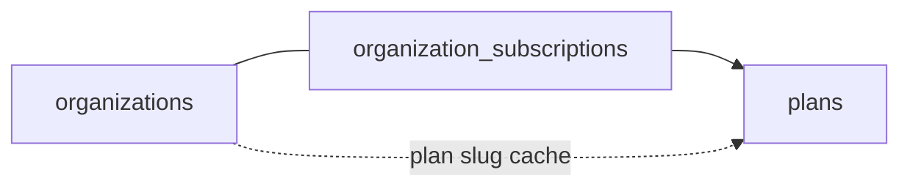
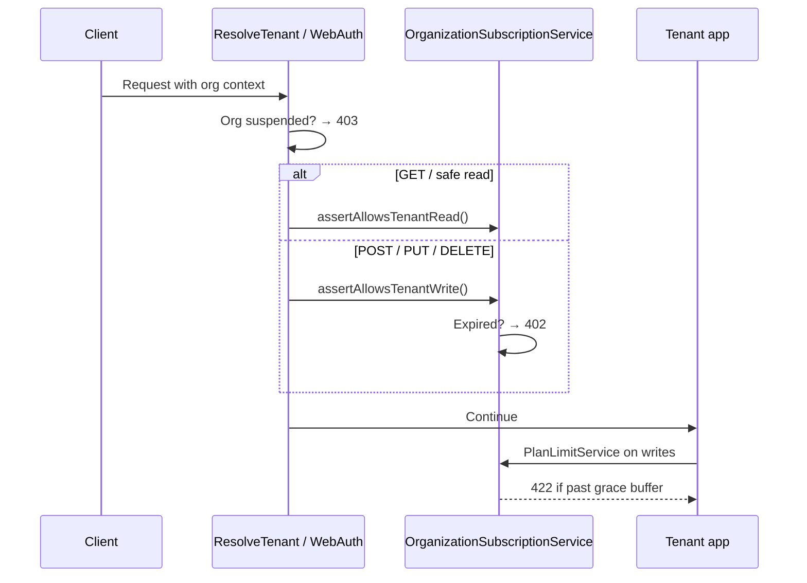

# Subscriptions & Plans Guide

This document describes how **subscription plans**, **usage limits**, and **access enforcement** work in Oneapp.

| Document | Purpose |
|----------|---------|
| **[GETTING-STARTED.md](./GETTING-STARTED.md)** | How to run the project locally or with Docker |
| **This file** | Plans, subscriptions, limits, enforcement, and operations |
| [PRICING_PLAN.md](../PRICING_PLAN.md) | Authoritative pricing spec and seed values |
| [PLATFORM-ADMIN.md](./PLATFORM-ADMIN.md) | Super-admin portal & platform API for managing subscriptions |
| [ARCHITECTURE.md §14](./ARCHITECTURE.md#14-platform-admin-layer) | Condensed platform layer overview |
| [PROJECT_BRIEF_FOR_SUPERADMIN.md](../PROJECT_BRIEF_FOR_SUPERADMIN.md) | Product requirements checklist |

---

## Overview

Each **organization** (tenant) has exactly one row in `organization_subscriptions` that links it to a **plan**. Plans define numeric limits; the subscription row defines billing/access status.



| Concept | Source of truth | Notes |
|---------|-----------------|-------|
| Which plan an org is on | `organization_subscriptions.plan_id` | Changed via Stripe checkout or platform admin |
| Plan limits | `plans.limits` JSON | Enforced on tenant writes + API rate limit |
| Billing/access status | `organization_subscriptions.status` | `trial`, `active`, `expired`, `past_due`, `cancelled` |
| Display plan name | `organizations.plan` | **Cache only** — synced from subscription |

There is **no separate "Trial" plan row**. New organizations get a **14-day Growth trial** on registration. After that, org owners can subscribe from **Settings → Billing** via Stripe Checkout (Starter, Growth, or Business). Platform admins can still override plans manually. Enterprise is contact-sales only.

---

## Database schema

### `plans`

| Column | Type | Purpose |
|--------|------|---------|
| `slug` | string | Unique identifier: `starter`, `growth`, `business`, `enterprise` |
| `name` | string | Display name |
| `price_monthly` | decimal | Monthly price |
| `price_annual` | decimal, nullable | Total annual price (nullable for Enterprise) |
| `is_custom` | boolean | True for Enterprise — hidden from self-serve checkout |
| `grace_buffer_percent` | integer | How far over a limit before hard block (default 10) |
| `sort_order` | integer | Display ordering |
| `limits` | JSON | Usage caps (see below) |
| `is_active` | boolean | Available for assignment |

### `organization_subscriptions`

| Column | Type | Purpose |
|--------|------|---------|
| `organization_id` | FK | One subscription per org (unique) |
| `plan_id` | FK | Current plan |
| `status` | enum | `trial`, `active`, `expired`, `past_due`, `cancelled` |
| `trial_ends_at` | timestamp | When trial access ends |
| `current_period_ends_at` | timestamp | Billing period end |
| `stripe_subscription_id` | string | Stripe subscription reference |
| `billing_interval` | string | `monthly` or `yearly` |
| `past_due_at` | timestamp | When payment first failed (starts dunning grace) |
| `trial_reminder_sent_at` | timestamp | Prevents duplicate trial-ending emails |

### Supporting tables

| Table | Purpose |
|-------|---------|
| `stripe_events` | Idempotent Stripe webhook processing (`event_id` unique) |
| `organization_data_exports` | Async GDPR data export jobs |

### `organizations` (GDPR)

| Column | Purpose |
|--------|---------|
| `deletion_requested_at` | Owner requested account deletion |
| `deletion_scheduled_for` | Hard-delete scheduled after grace period |

### Limit keys (`plans.limits`)

| Key | Enforced on | Description |
|-----|-------------|-------------|
| `max_warehouses` | `POST /api/v1/warehouses` | Max warehouse count |
| `max_users` | `POST /api/v1/users` | Max team members |
| `max_products` | `POST /api/v1/products` | Max products in catalog |
| `max_orders_per_month` | `POST /api/v1/purchase-orders`, `POST /api/v1/sales-orders` | Combined PO + SO count in current calendar month |
| `api_rate_limit_per_minute` | All tenant API routes | Requests per minute per org+user (`null` = no API access) |

`null` in limits JSON means **unlimited** (used on enterprise tier).

---

## Default plans (seeded)

Seeded by `database/seeders/PlanSeeder.php`:

| Plan | Monthly | Annual | Warehouses | Users | Products | Orders/mo | API req/min |
|------|---------|--------|------------|-------|----------|-----------|-------------|
| **starter** | $29 | $288 | 1 | 3 | 200 | 300 | — |
| **growth** | $79 | $780 | 3 | 10 | 2,000 | 2,000 | 60 |
| **business** | $199 | $1,980 | 10 | 25 | ∞ | 10,000 | 300 |
| **enterprise** | — | — | ∞ | ∞ | ∞ | ∞ | ∞ |

All self-serve plans use `grace_buffer_percent = 10`. Enterprise has `is_custom = true`.

```bash
php artisan db:seed --class=PlanSeeder
```

---

## Lifecycle

### 1. Registration (automatic trial)

When a new organization registers via `POST /api/v1/auth/register`:

1. Organization row is created (`status = trial`)
2. `OrganizationSubscriptionService::assignTrialPlan()` creates a subscription:
   - Plan: **Growth** (`config('subscription.trial_plan_slug')`)
   - Status: `trial`
   - `trial_ends_at`: 14 days from registration
3. `organizations.plan` is synced to `growth`

**Key file:** `app/Services/AuthService.php`

### 2. Self-service upgrade (Stripe)

Org owners with `settings.update` can subscribe from **Settings → Billing** (`/settings/billing`):

| Plan | Monthly | Yearly | Stripe env vars |
|------|---------|--------|-----------------|
| Starter | $29 | $288 | `STRIPE_STARTER_PRICE_MONTHLY`, `STRIPE_STARTER_PRICE_YEARLY` |
| Growth | $79 | $780 | `STRIPE_GROWTH_PRICE_MONTHLY`, `STRIPE_GROWTH_PRICE_YEARLY` |
| Business | $199 | $1,980 | `STRIPE_BUSINESS_PRICE_MONTHLY`, `STRIPE_BUSINESS_PRICE_YEARLY` |

**Tenant API**

| Method | Path | Purpose |
|--------|------|---------|
| GET | `/api/v1/billing` | Current subscription + available plans |
| POST | `/api/v1/billing/checkout` | Start Stripe Checkout (`plan_slug` + `interval`) |
| POST | `/api/v1/billing/portal` | Open Stripe Customer Portal |

**Webhook:** `POST /api/stripe/webhook` — verifies Stripe signature on every request; stores processed event IDs in `stripe_events` to skip duplicates. Handles:

| Event | Effect |
|-------|--------|
| `checkout.session.completed` | Activate subscription from Checkout |
| `customer.subscription.updated` | Sync plan/status |
| `customer.subscription.deleted` | Mark subscription `cancelled` |
| `invoice.paid` | Restore `active`, clear `past_due_at` |
| `invoice.payment_failed` | Mark `past_due`, set `past_due_at`, queue dunning email |

When a trial expires, **read** endpoints continue to work but **writes** return **402 Payment Required**. Billing routes remain accessible so the org can pay.

### 3. Trial-ending reminder (scheduled)

Daily command `subscriptions:notify-trial-ending` emails org owners when `trial_ends_at` is within `config('subscription.trial_ending_reminder_days')` (default 3 days). Each subscription is reminded at most once (`trial_reminder_sent_at`).

### 4. Dunning (past due)

When Stripe sends `invoice.payment_failed`:

1. Subscription status → `past_due`, `past_due_at` set (if not already)
2. `PaymentFailedMail` queued to organization email
3. During **past-due grace** (`SUBSCRIPTION_PAST_DUE_GRACE_DAYS`, default 7): reads and writes allowed
4. After grace expires: writes return **402**; reads continue
5. `invoice.paid` restores `active` and clears `past_due_at`

**Cancelled** subscriptions (`customer.subscription.deleted`): reads allowed, writes return **402** (same mechanism as expired trial).

### 5. Trial expiry (scheduled)

Daily command `subscriptions:expire-trials` flips `status = trial` → `expired` when `trial_ends_at` has passed. Converted (paid) orgs are not affected.

### 6. Platform admin assignment

Operators change plans through:

- **Web:** `/platform/organizations/{id}` → **Subscription** section
- **API:** `PATCH /api/platform/v1/organizations/{id}/subscription`

```json
{
  "plan_id": 2,
  "status": "active"
}
```

Optional: `trial_ends_at`, `current_period_ends_at`.

After update, `organizations.plan` cache is synced automatically.

### 7. Organization access status (separate from subscription)

`organizations.status` controls **platform suspension** (independent of subscription):

| Org status | Effect |
|------------|--------|
| `trial` | Normal access (if subscription allows) |
| `active` | Normal access |
| `suspended` | **403** on all tenant API + web — operator-initiated block |

Changed via **Tenant controls** on the org detail page or `PATCH /api/platform/v1/organizations/{id}` with `{ "status": "suspended" }`.

---

## Enforcement

Enforcement runs on **every tenant request** (API and web portal).



### Subscription access rules

| Condition | HTTP | Message (typical) |
|-----------|------|-----------------|
| No subscription row | 403 | No subscription — contact support |
| `status = cancelled` + write request | 402 | Subscription cancelled — choose a plan |
| `status = cancelled` + read request | OK | Read-only access |
| `status = past_due` within grace + write | OK | Full access during grace |
| `status = past_due` past grace + write | 402 | Payment past due — update billing |
| `status = past_due` + read request | OK | Read-only or grace writes |
| `status = expired` + write request | 402 | Trial ended — choose a plan |
| `status = expired` + read request | OK | Read-only access |
| Trial `trial_ends_at` passed | — | Auto-marked `expired` on next request or daily job |
| `status = trial` or `active` (valid dates) | OK | Full access |

**Key files:**

- `app/Services/OrganizationSubscriptionService.php` — read/write access checks, `expireTrialIfNeeded()`
- `app/Http/Middleware/ResolveTenant.php` — API enforcement
- `app/Http/Middleware/WebAuth.php` — Web portal enforcement

### Plan limit rules (graduated response)

When a tenant tries to create a limited resource, `PlanLimitService` checks the current count against the active plan with a **grace buffer**:

| Usage vs. limit | Behavior |
|-----------------|----------|
| Under 90% | Normal |
| 90%–100% | Normal + `meta.plan_warning: "approaching_limit"` |
| 100%–(100 + grace_buffer_percent)% | Allowed + `meta.plan_warning: "over_limit_grace"` |
| Beyond grace buffer | **422** — "Upgrade required" |

Checks are **per resource** — being over on products does not block order creation.

| Action | Service hook |
|--------|--------------|
| Create warehouse | `WarehouseService::create()` |
| Create product | `ProductService::create()` |
| Invite team member | `OrganizationMemberService::store()` |
| Create purchase/sales order | `PurchaseOrderService::create()`, `SalesOrderService::create()` |

**Key files:** `app/Services/PlanLimitService.php`, `app/Http/Middleware/AppendPlanWarningMeta.php`

### API rate limiting

Tenant API routes use the `api-tenant` rate limiter. The per-minute cap comes from the org's active plan `api_rate_limit_per_minute`, falling back to `config('api.rate_limit_per_minute', 120)` when no plan limit is set. Starter has no API access (`null` limit).

**Key file:** `app/Providers/AppServiceProvider.php`

---

## Platform API reference

All routes require `auth:platform`. Base path: `/api/platform/v1`.

| Method | Path | Purpose |
|--------|------|---------|
| GET | `/plans` | List active plans and limits |
| GET | `/organizations/{id}/subscription` | Current subscription |
| PATCH | `/organizations/{id}/subscription` | Assign plan + status |
| PATCH | `/organizations/{id}` | Update org `status` only (suspend/activate) — **not plan** |

---

## Artisan commands

| Command | Purpose |
|---------|---------|
| `php artisan db:seed --class=PlanSeeder` | Seed/update plan tiers and limits |
| `php artisan subscriptions:expire-trials` | Expire past-due trial subscriptions |
| `php artisan subscriptions:notify-trial-ending` | Send trial-ending-soon emails |
| `php artisan organizations:process-deletions` | Hard-delete orgs past deletion grace |
| `php artisan platform:subscriptions:backfill` | Assign trial subscriptions to orgs missing a row |

Scheduled daily via `routes/console.php`: `expire-trials`, `notify-trial-ending`, `process-deletions`.

---

## Key files

| Area | Path |
|------|------|
| Plan model | `app/Models/Plan.php` |
| Subscription model | `app/Models/OrganizationSubscription.php` |
| Subscription status enum | `app/Enums/SubscriptionStatus.php` |
| Core service | `app/Services/OrganizationSubscriptionService.php` |
| Limit enforcement | `app/Services/PlanLimitService.php` |
| Stripe billing | `app/Services/StripeBillingService.php` |
| Stripe event model | `app/Models/StripeEvent.php` |
| Trial expiry command | `app/Console/Commands/ExpireTrialsCommand.php` |
| Trial reminder command | `app/Console/Commands/NotifyTrialEndingCommand.php` |
| Deletion processor | `app/Console/Commands/ProcessOrganizationDeletionsCommand.php` |
| Transactional mail | `app/Mail/*`, `resources/views/mail/*` |
| Access denied exception | `app/Exceptions/SubscriptionAccessDeniedException.php` |
| Payment required exception | `app/Exceptions/SubscriptionPaymentRequiredException.php` |
| Limit exceeded exception | `app/Exceptions/PlanLimitExceededException.php` |
| Plan seeder | `database/seeders/PlanSeeder.php` |
| Backfill command | `app/Console/Commands/BackfillOrganizationSubscriptionsCommand.php` |
| Platform subscription API | `app/Http/Controllers/Api/Platform/V1/PlatformOrganizationSubscriptionController.php` |
| Platform subscription UI | `app/Http/Livewire/Platform/OrganizationShow.php` |
| Tests | `tests/Feature/PricingPlanTest.php`, `tests/Feature/PlatformLayerTest.php`, `tests/Feature/BillingTest.php`, `tests/Feature/PrelaunchReadinessTest.php` |

---

## Testing

```bash
# Pricing plan & subscription tests
php artisan test --filter=PricingPlanTest

# Subscription & limit tests
php artisan test --filter=PlatformLayerTest

# Billing / Stripe tests
php artisan test --filter=BillingTest

# Pre-launch readiness (auth, webhooks, GDPR, sessions, health)
php artisan test --filter=PrelaunchReadiness

# Full suite
php artisan test
```

Coverage includes:

- Seeded plan values match PRICING_PLAN.md
- 14-day Growth trial on registration
- Daily trial expiry command
- Graduated limit warnings and grace buffer blocks
- Expired trial: reads OK, writes 402
- Multi-plan Stripe checkout + webhook idempotency
- Past-due grace period and dunning email
- Cancelled subscription read-only access
- Plan-based API rate limiting

---

## Common operations

### Upgrade a customer from trial to Starter

1. Customer pays via **Settings → Billing**, or
2. Platform admin: `/platform/organizations/{id}` → **Subscription** → Starter + active

### End a trial without suspending the org

Wait for `trial_ends_at` to pass (auto-marked `expired` by daily job or next request). Writes are blocked with 402; reads continue.

### Fully block a tenant

Set **organization status** to **suspended** (Tenant controls section). This is stronger than subscription cancellation and is intended for operator enforcement.

### Give unlimited usage

Assign the **enterprise** plan with status **active**.

---

## Stripe configuration

Add to `.env` (dummy defaults ship in `.env.example`):

```env
STRIPE_KEY=pk_test_...
STRIPE_SECRET=sk_test_...
STRIPE_WEBHOOK_SECRET=whsec_...
STRIPE_STARTER_PRICE_MONTHLY=price_...
STRIPE_STARTER_PRICE_YEARLY=price_...
STRIPE_GROWTH_PRICE_MONTHLY=price_...
STRIPE_GROWTH_PRICE_YEARLY=price_...
STRIPE_BUSINESS_PRICE_MONTHLY=price_...
STRIPE_BUSINESS_PRICE_YEARLY=price_...
SUBSCRIPTION_TRIAL_DAYS=14
SUBSCRIPTION_TRIAL_PLAN_SLUG=growth
SUBSCRIPTION_TRIAL_ENDING_REMINDER_DAYS=3
SUBSCRIPTION_PAST_DUE_GRACE_DAYS=7
ORGANIZATION_DELETION_GRACE_DAYS=30
```

Create matching recurring prices in the Stripe Dashboard for each plan and interval.

---

## Related enums

### `SubscriptionStatus` (`organization_subscriptions.status`)

| Value | Meaning |
|-------|---------|
| `trial` | Trial period — full access until `trial_ends_at` |
| `active` | Paid/active subscription |
| `expired` | Trial ended without payment — read-only access |
| `past_due` | Payment overdue — read always; writes allowed during grace, then 402 |
| `cancelled` | Subscription ended — read-only; writes return 402 |

### `OrganizationStatus` (`organizations.status`)

| Value | Meaning |
|-------|---------|
| `trial` | Org lifecycle label (informational) |
| `active` | Normal operating org |
| `suspended` | Operator block — overrides subscription access |

Both checks apply: an org must be **not suspended** and have a **valid subscription** to use the tenant app.
