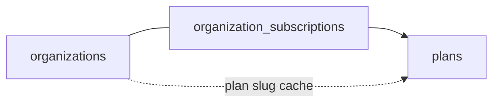
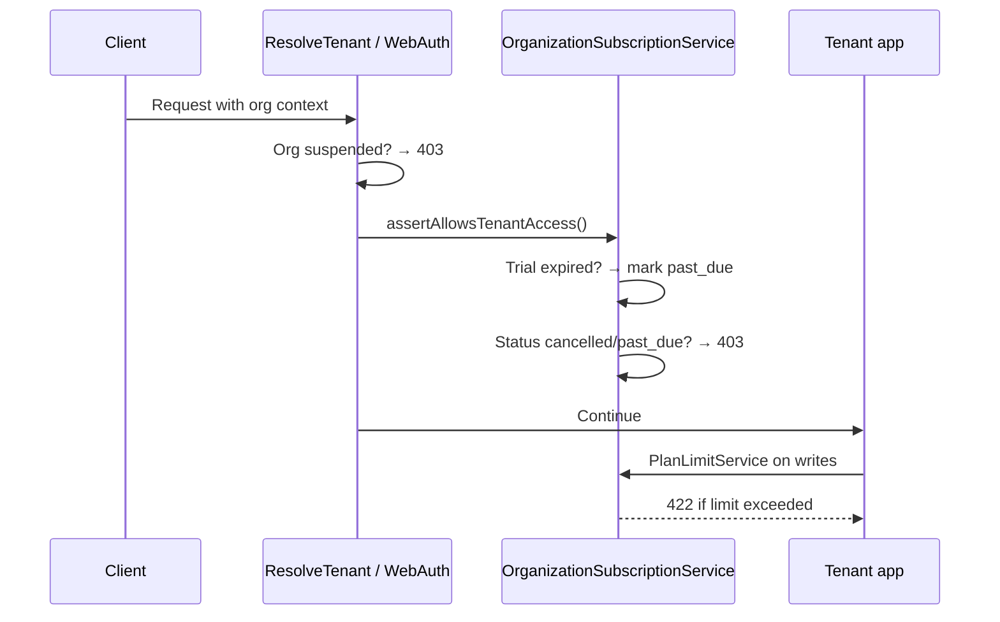

# Subscriptions & Plans Guide

This document describes how **subscription plans**, **usage limits**, and **access enforcement** work in Oneapp.

| Document | Purpose |
|----------|---------|
| **This file** | Plans, subscriptions, limits, enforcement, and operations |
| [PLATFORM-ADMIN.md](./PLATFORM-ADMIN.md) | Super-admin portal & platform API for managing subscriptions |
| [ARCHITECTURE.md §14](./ARCHITECTURE.md#14-platform-admin-layer) | Condensed platform layer overview |
| [PROJECT_BRIEF_FOR_SUPERADMIN.md](../PROJECT_BRIEF_FOR_SUPERADMIN.md) | Product requirements checklist |

---

## Overview

Each **organization** (tenant) has exactly one row in `organization_subscriptions` that links it to a **plan**. Plans define numeric limits; the subscription row defines billing/access status.



| Concept | Source of truth | Notes |
|---------|-----------------|-------|
| Which plan an org is on | `organization_subscriptions.plan_id` | Changed via platform admin only |
| Plan limits | `plans.limits` JSON | Enforced on tenant writes + API rate limit |
| Billing/access status | `organization_subscriptions.status` | `trial`, `active`, `past_due`, `cancelled` |
| Display plan name | `organizations.plan` | **Cache only** — synced from subscription |

There is **no Stripe or self-service billing** yet. Platform operators assign plans and statuses manually through the super-admin portal or API.

---

## Database schema

### `plans`

| Column | Type | Purpose |
|--------|------|---------|
| `slug` | string | Unique identifier: `trial`, `starter`, `pro`, `enterprise` |
| `name` | string | Display name |
| `price` | decimal | Informational price (not charged automatically) |
| `limits` | JSON | Usage caps (see below) |
| `is_active` | boolean | Available for assignment |

### `organization_subscriptions`

| Column | Type | Purpose |
|--------|------|---------|
| `organization_id` | FK | One subscription per org (unique) |
| `plan_id` | FK | Current plan |
| `status` | enum | `trial`, `active`, `past_due`, `cancelled` |
| `trial_ends_at` | timestamp | When trial access ends |
| `current_period_ends_at` | timestamp | Billing period end (manual use today) |

### Limit keys (`plans.limits`)

| Key | Enforced on | Description |
|-----|-------------|-------------|
| `max_warehouses` | `POST /api/v1/warehouses` | Max warehouse count |
| `max_users` | `POST /api/v1/users` | Max team members |
| `max_products` | `POST /api/v1/products` | Max products in catalog |
| `max_orders_per_month` | `POST /api/v1/purchase-orders`, `POST /api/v1/sales-orders` | Combined PO + SO count in current calendar month |
| `api_rate_limit` | All tenant API routes | Requests per minute per org+user |

`null` in limits JSON means **unlimited** (used on enterprise tier).

---

## Default plans (seeded)

Seeded by `database/seeders/PlanSeeder.php`:

| Plan | Price | Warehouses | Users | Products | Orders/mo | API req/min |
|------|-------|------------|-------|----------|-----------|-------------|
| **trial** | $0 | 1 | 3 | 25 | 50 | 60 |
| **starter** | $29 | 2 | 5 | 100 | 200 | 120 |
| **pro** | $79 | 5 | 15 | 500 | 1,000 | 240 |
| **enterprise** | $199 | ∞ | ∞ | ∞ | ∞ | 600 |

```bash
php artisan db:seed --class=PlanSeeder
```

---

## Lifecycle

### 1. Registration (automatic trial)

When a new organization registers via `POST /api/v1/auth/register`:

1. Organization row is created (`status = trial`)
2. `OrganizationSubscriptionService::assignTrialPlan()` creates a subscription:
   - Plan: `trial`
   - Status: `trial`
   - `trial_ends_at`: 14 days from registration
3. `organizations.plan` is synced to `trial`

**Key file:** `app/Services/AuthService.php`

### 2. Platform admin assignment

Operators change plans through:

- **Web:** `/platform/organizations/{id}` → **Subscription** section
- **API:** `PATCH /api/platform/v1/organizations/{id}/subscription`

```json
{
  "plan_id": 2,
  "status": "active"
}
```

Optional: `trial_ends_at`, `current_period_ends_at`.

After update, `organizations.plan` cache is synced automatically.

### 3. Organization access status (separate from subscription)

`organizations.status` controls **platform suspension** (independent of subscription):

| Org status | Effect |
|------------|--------|
| `trial` | Normal access (if subscription allows) |
| `active` | Normal access |
| `suspended` | **403** on all tenant API + web — operator-initiated block |

Changed via **Tenant controls** on the org detail page or `PATCH /api/platform/v1/organizations/{id}` with `{ "status": "suspended" }`.

---

## Enforcement

Enforcement runs on **every tenant request** (API and web portal).



### Subscription access rules

| Condition | HTTP | Message (typical) |
|-----------|------|-----------------|
| No subscription row | 403 | No subscription — contact support |
| `status = cancelled` | 403 | Subscription cancelled |
| `status = past_due` | 403 | Trial/subscription period ended |
| Trial `trial_ends_at` passed | 403 | Auto-marked `past_due`, then blocked |
| `status = trial` or `active` (valid dates) | OK | Access granted |

**Key files:**

- `app/Services/OrganizationSubscriptionService.php` — `assertAllowsTenantAccess()`, `expireTrialIfNeeded()`
- `app/Http/Middleware/ResolveTenant.php` — API enforcement
- `app/Http/Middleware/WebAuth.php` — Web portal enforcement

### Plan limit rules

When a tenant tries to create a limited resource, `PlanLimitService` checks the current count against the active plan:

| Action | Service hook |
|--------|--------------|
| Create warehouse | `WarehouseService::create()` |
| Create product | `ProductService::create()` |
| Invite team member | `OrganizationMemberService::store()` |
| Create purchase/sales order | `PurchaseOrderService::create()`, `SalesOrderService::create()` |

Exceeded limits return **422**:

```json
{
  "message": "Plan limit reached: this organization cannot create more warehouses (limit 1).",
  "errors": []
}
```

**Key file:** `app/Services/PlanLimitService.php`

### API rate limiting

Tenant API routes use the `api-tenant` rate limiter. The per-minute cap comes from the org's active plan `api_rate_limit`, falling back to `config('api.rate_limit_per_minute', 120)` when no plan limit is set.

**Key file:** `app/Providers/AppServiceProvider.php`

---

## Platform API reference

All routes require `auth:platform`. Base path: `/api/platform/v1`.

| Method | Path | Purpose |
|--------|------|---------|
| GET | `/plans` | List active plans and limits |
| GET | `/organizations/{id}/subscription` | Current subscription |
| PATCH | `/organizations/{id}/subscription` | Assign plan + status |
| PATCH | `/organizations/{id}` | Update org `status` only (suspend/activate) — **not plan** |

### Example: upgrade org to Pro

```bash
# 1. Get plan ID
curl -s -H "Authorization: Bearer $PLATFORM_TOKEN" \
  http://localhost:8000/api/platform/v1/plans | jq '.data[] | select(.slug=="pro")'

# 2. Assign subscription
curl -s -X PATCH \
  -H "Authorization: Bearer $PLATFORM_TOKEN" \
  -H "Content-Type: application/json" \
  -d '{"plan_id": 3, "status": "active"}' \
  http://localhost:8000/api/platform/v1/organizations/1/subscription
```

---

## Artisan commands

| Command | Purpose |
|---------|---------|
| `php artisan db:seed --class=PlanSeeder` | Seed/update plan tiers and limits |
| `php artisan platform:subscriptions:backfill` | Assign trial subscriptions to orgs missing a row |

Run backfill after migrating existing databases:

```bash
php artisan migrate
php artisan db:seed --class=PlanSeeder
php artisan platform:subscriptions:backfill
```

---

## Key files

| Area | Path |
|------|------|
| Plan model | `app/Models/Plan.php` |
| Subscription model | `app/Models/OrganizationSubscription.php` |
| Subscription status enum | `app/Enums/SubscriptionStatus.php` |
| Core service | `app/Services/OrganizationSubscriptionService.php` |
| Limit enforcement | `app/Services/PlanLimitService.php` |
| Access denied exception | `app/Exceptions/SubscriptionAccessDeniedException.php` |
| Limit exceeded exception | `app/Exceptions/PlanLimitExceededException.php` |
| Plan seeder | `database/seeders/PlanSeeder.php` |
| Backfill command | `app/Console/Commands/BackfillOrganizationSubscriptionsCommand.php` |
| Platform subscription API | `app/Http/Controllers/Api/Platform/V1/PlatformOrganizationSubscriptionController.php` |
| Platform subscription UI | `app/Http/Livewire/Platform/OrganizationShow.php` |
| Tests | `tests/Feature/PlatformLayerTest.php` |

---

## Testing

```bash
# Subscription & limit tests
php artisan test --filter=PlatformLayerTest

# Full suite
php artisan test
```

Coverage includes:

- Trial warehouse limit (1 max)
- Starter warehouse limit (2 max)
- Cancelled subscription blocks API
- Expired trial → `past_due` + block
- Pro plan assignment syncs `organizations.plan`
- Plan-based API rate limiting

---

## Common operations

### Upgrade a customer from trial to starter

1. Sign in to `/platform/login`
2. Open **Organizations** → select the tenant
3. In **Subscription**, choose **Starter** and set status to **active**
4. Save

### End a trial without suspending the org

Set subscription status to **past_due** or wait for `trial_ends_at` to pass (auto-marked `past_due` on next request).

### Fully block a tenant

Set **organization status** to **suspended** (Tenant controls section). This is stronger than subscription cancellation and is intended for operator enforcement.

### Give unlimited usage

Assign the **enterprise** plan with status **active**.

---

## Out of scope (today)

| Feature | Status |
|---------|--------|
| Stripe / payment webhooks | Not implemented |
| Self-service plan upgrade in tenant UI | Not implemented |
| Automatic downgrade on failed payment | Not implemented |
| Feature flags tied to plan tier | Flags are per-org overrides, independent of plan |
| Limits on categories, suppliers, stock transfers, etc. | Only the four resource types listed above |

---

## Related enums

### `SubscriptionStatus` (`organization_subscriptions.status`)

| Value | Meaning |
|-------|---------|
| `trial` | Trial period — access allowed until `trial_ends_at` |
| `active` | Paid/active subscription |
| `past_due` | Trial expired or payment overdue — access blocked |
| `cancelled` | Subscription ended — access blocked |

### `OrganizationStatus` (`organizations.status`)

| Value | Meaning |
|-------|---------|
| `trial` | Org lifecycle label (informational) |
| `active` | Normal operating org |
| `suspended` | Operator block — overrides subscription access |

Both checks apply: an org must be **not suspended** and have an **active subscription** to use the tenant app.
