# System Architecture & Workflows — Full Reference

This document is the **detailed** architecture and workflow guide for **Oneapp** (Inventory Management SaaS). It expands on the summary in [ARCHITECTURE.md](./ARCHITECTURE.md) with end-to-end flows, layer responsibilities, and operational detail.

| Document | Purpose |
|----------|---------|
| **This file** | Full system design, workflows, and layer breakdown |
| [ARCHITECTURE.md](./ARCHITECTURE.md) | Condensed architecture with diagrams |
| [RBAC-PERMISSIONS.md](./RBAC-PERMISSIONS.md) | Tenant permission catalog, generation, and how to add permissions |
| [SUBSCRIPTIONS-AND-PLANS.md](./SUBSCRIPTIONS-AND-PLANS.md) | Plans, subscriptions, limits, and enforcement |
| [PLATFORM-ADMIN.md](./PLATFORM-ADMIN.md) | Super-admin portal & platform API |
| [PROJECT_BRIEF_FOR_SUPERADMIN.md](../PROJECT_BRIEF_FOR_SUPERADMIN.md) | Platform layer product requirements |

---

## Table of contents

1. [Product overview](#1-product-overview)
2. [Technology stack](#2-technology-stack)
3. [High-level architecture](#3-high-level-architecture)
4. [Project structure](#4-project-structure)
5. [Multi-tenancy](#5-multi-tenancy)
6. [Authentication & session](#6-authentication--session)
7. [Web UI architecture](#7-web-ui-architecture)
8. [REST API architecture](#8-rest-api-architecture)
9. [Authorization (RBAC)](#9-authorization-rbac)
10. [Domain model & database](#10-domain-model--database)
11. [Core business workflows](#11-core-business-workflows)
12. [Stock ledger & inventory](#12-stock-ledger--inventory)
13. [Payments & financial records](#13-payments--financial-records)
14. [Reports & exports](#14-reports--exports)
15. [Settings & team management](#15-settings--team-management)
16. [Notifications & background jobs](#16-notifications--background-jobs)
17. [Platform admin API & portal](#17-platform-admin-api--portal)
18. [Cross-cutting concerns](#18-cross-cutting-concerns)
19. [Deployment & operations](#19-deployment--operations)
20. [Related files index](#20-related-files-index)

---

## 1. Product overview

Oneapp is a **multi-tenant SaaS** for small and mid-sized businesses to manage:

- **Catalog** — products, categories, units
- **Warehouses & stock** — multi-location inventory with a movement ledger
- **Purchasing** — suppliers, purchase orders, goods receipt, payments
- **Sales** — customers, sales orders, fulfillment, delivery, payments, refunds
- **Analytics** — stock valuation, low stock, sales/purchase summaries, CSV exports
- **Administration** — organization profile, team members, roles & permissions
- **Platform operations** — cross-tenant org management, subscriptions, plan enforcement (super-admin layer)

Each **Organization** is an isolated tenant. Users can belong to multiple organizations with different roles in each.

### Design principles

| Principle | Implementation |
|-----------|----------------|
| Single API surface | Web UI and external clients use the same `/api/v1` endpoints |
| Fail-closed tenancy | Without `currentOrganization`, scoped queries return zero rows |
| Ledger-based stock | `quantity_on_hand` changes only via `stock_movements` + observer |
| Policy-first auth | API uses Laravel Policies + Spatie Permission, not inline checks |
| Service layer | Controllers delegate to domain services for business logic |

---

## 2. Technology stack

| Layer | Technology |
|-------|------------|
| Runtime | PHP 8.3 |
| Framework | Laravel 13 |
| Database | PostgreSQL 16 |
| Cache / queue / session | Redis 7 |
| Queue dashboard | Laravel Horizon |
| API authentication | Laravel Passport (OAuth2 password grant) |
| Web UI | Livewire 4, Alpine.js, Tailwind CSS, Vite |
| Permissions | Spatie Laravel Permission (teams = `organization_id`) |
| API documentation | Scramble OpenAPI at `/docs/api` |
| Activity audit | Spatie Activity Log |

---

## 3. High-level architecture

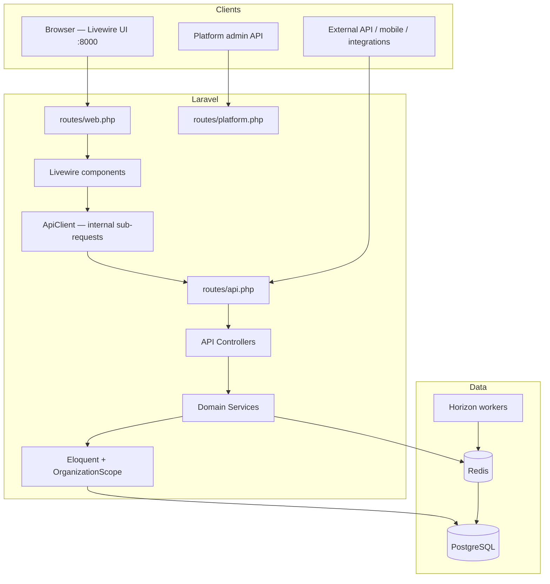

### Request paths

| Client | Entry | Auth | Tenant context |
|--------|-------|------|----------------|
| Web browser | `routes/web.php` | PHP session stores Passport token | Session `organization_id` → ApiClient header |
| REST API | `routes/api.php` | `Authorization: Bearer` | `X-Organization-Id` header |
| Platform admin | `routes/platform.php` | `auth:platform` guard | Cross-tenant (no org scope) |

---

## 4. Project structure

```
app/
├── Console/Commands/          # app:setup, rbac:migrate-organizations, platform:admin:create
├── Enums/                     # Order statuses, stock movement types, subscription status, export status
├── Events/                    # StockLevelChanged, order status events
├── Http/
│   ├── Controllers/
│   │   ├── Api/V1/            # Tenant REST API controllers
│   │   ├── Api/Platform/V1/   # Platform admin controllers
│   │   └── Web/               # Login, register, logout (session)
│   ├── Livewire/              # Web UI pages (thin API clients)
│   │   ├── Platform/          # Super-admin portal pages
│   │   └── Concerns/          # EnsuresPermission, ApiClient helpers, validation
│   ├── Middleware/            # ResolveTenant, WebAuth, PlatformWebAuth, EnforceIdempotency
│   ├── Requests/              # Form request validation per resource
│   └── Resources/             # JSON API transformers
├── Jobs/                      # Horizon: low stock, report export, order notifications
├── Listeners/                 # CheckLowStock
├── Models/                    # Eloquent models + OrganizationScope
├── Notifications/             # LowStock, OrderStatus
├── Observers/                 # StockMovementObserver
├── Permission/                # PermissionCatalog (RBAC source of truth)
├── Policies/                  # Authorization per resource + RolePolicy
├── Providers/                 # AppServiceProvider, Scramble
├── Services/                  # Domain logic (orders, stock, auth, reports, RBAC, platform)
│   └── Web/                   # ApiClient, PlatformApiClient, WebSessionService, PlatformSessionService
├── Support/                   # OrganizationSession, helpers
└── Traits/                    # BelongsToOrganization, LogsModelActivity

database/
├── migrations/                # Schema including Spatie permission tables
└── seeders/                   # RolesAndPermissionsSeeder, PlanSeeder, DemoSeeder

resources/
├── views/
│   ├── layouts/               # app.blade.php (sidebar), auth.blade.php
│   ├── livewire/              # Page templates per module
│   └── components/            # sidebar-nav, settings-nav, app-logo
├── css/app.css
└── js/app.js                  # Alpine stores: toast, confirm, sidebar

routes/
├── web.php                    # Livewire pages + session auth
├── api.php                    # Tenant API v1
└── platform.php               # Platform admin API

tests/
├── Feature/                   # API + web integration tests (Pest)
├── Unit/
└── Concerns/                  # Test helpers (organizations, stock, orders)
```

---

## 5. Multi-tenancy

### Tenant entity

An **Organization** represents one business customer. All operational data carries `organization_id`.

```
User ←── organization_user (pivot: role label) ──→ Organization
                                                      │
                    ┌─────────────────────────────────┼─────────────────────────┐
                    ▼                                 ▼                         ▼
              Products/Warehouses              Purchase/Sales Orders        Roles (per org)
              Stocks/Movements                 Payments/Customers           Permissions
```

### Tenant resolution (API)

Every tenant-scoped API request passes through `ResolveTenant` middleware:

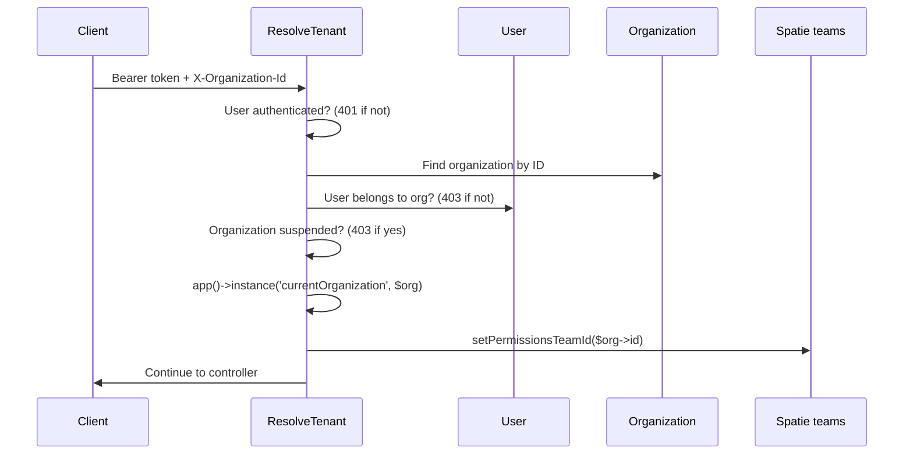

**Key behavior:**

- Missing `X-Organization-Id` → **403** (not 401)
- User not in organization → **403**
- Organization `status = suspended` → **403** (*"This organization has been suspended."*)
- Spatie permission checks are scoped to the organization team
- Web portal (`WebAuth`) also blocks suspended orgs by clearing session

### Data isolation (fail-closed)

Models using `BelongsToOrganization` apply `OrganizationScope`:

- When `currentOrganization` **is bound** → `WHERE organization_id = ?`
- When **not bound** → `WHERE 0 = 1` (returns nothing)

New records auto-fill `organization_id` on create when tenant context exists.

**Key files:** `app/Http/Middleware/ResolveTenant.php`, `app/Traits/BelongsToOrganization.php`, `app/Models/Scopes/OrganizationScope.php`, `app/Permission/OrganizationTeamResolver.php`

---

## 6. Authentication & session

Web UI and REST API share **Laravel Passport** OAuth2 tokens (password grant).

### 6.1 Registration workflow (new tenant)

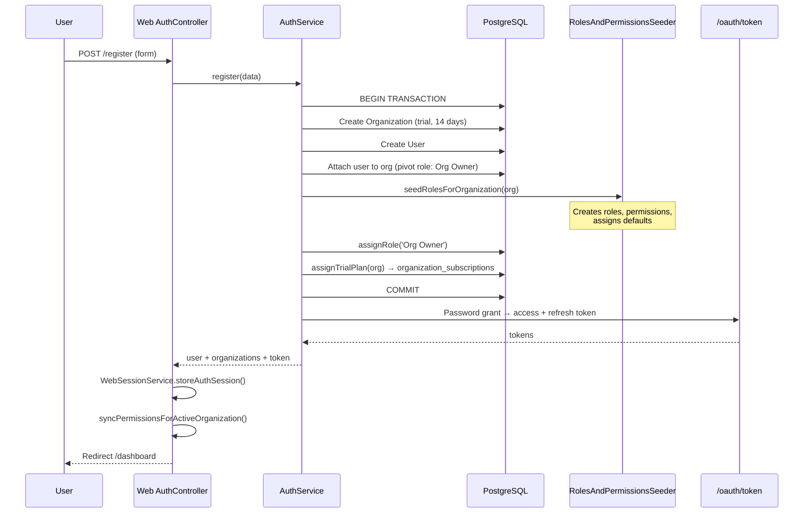

**What gets created on registration:**

| Artifact | Details |
|----------|---------|
| Organization | Name, slug, trial status, 14-day trial |
| Subscription | Trial plan row in `organization_subscriptions`; `organizations.plan` synced as cache |
| User | Owner account |
| Default roles | System Owner, Org Owner, Admin, Manager, Warehouse Staff, Sales Staff, Viewer |
| Permissions | Global catalog from `PermissionCatalog.php` |
| Role assignment | Registering user → **Org Owner** (all permissions by default) |

### 6.2 Login workflow

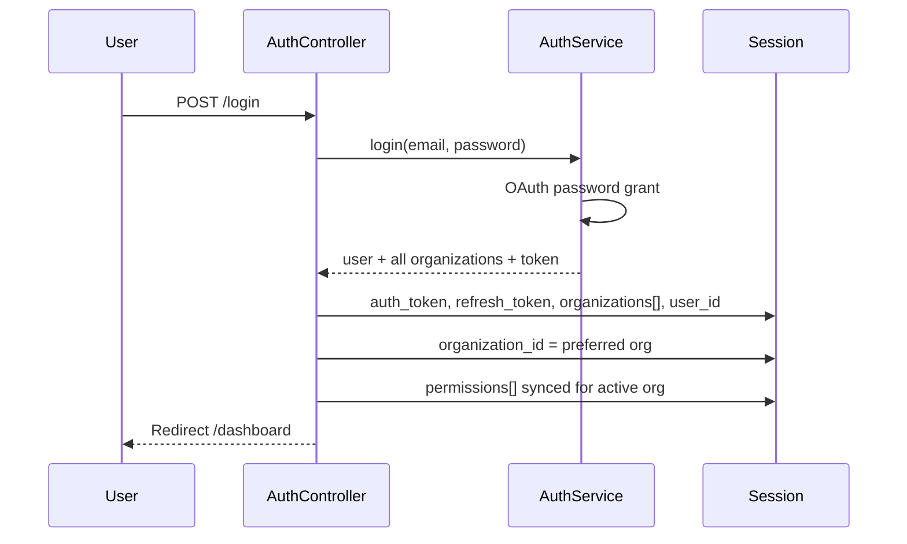

### 6.3 Token refresh (web)

`WebAuth` middleware runs on every protected web route:

1. `WebSessionService::refreshIfNeeded()` — if access token expires within 5 minutes, calls `POST /api/v1/auth/refresh`
2. `normalizeSessionOrganizationsIfNeeded()` — flattens pivot role into session
3. `syncPermissionsForActiveOrganization()` — refreshes `permissions[]` in session

### 6.4 Organization switch

Users with multiple organizations can switch via header dropdown:

```
POST /organization/switch  { organization_id: N }
  → WebSessionService.setActiveOrganization()
  → Session organization_id updated
  → Permissions re-synced
  → Redirect /dashboard
```

### 6.5 Session keys (web)

| Key | Purpose |
|-----|---------|
| `auth_token` | Passport access token |
| `refresh_token` | Passport refresh token |
| `token_expires_at` | ISO8601 expiry for proactive refresh |
| `organization_id` | Active tenant |
| `organizations[]` | List with `id`, `name`, `role` |
| `user_id`, `user_name`, `user_email` | Display + permission lookup |
| `permissions[]` | Flat list for `@canaccess` / `OrganizationSession::can()` |

### 6.6 API auth endpoints

| Method | Path | Auth | Purpose |
|--------|------|------|---------|
| POST | `/api/v1/auth/register` | Public | Create org + owner |
| POST | `/api/v1/auth/login` | Public | Issue tokens |
| POST | `/api/v1/auth/refresh` | Public | Refresh access token |
| GET | `/api/v1/auth/me` | Bearer | Current user |
| POST | `/api/v1/auth/logout` | Bearer | Revoke token |

**Key files:** `app/Services/AuthService.php`, `app/Http/Controllers/Web/AuthController.php`, `app/Services/Web/WebSessionService.php`, `app/Http/Middleware/WebAuth.php`

---

## 7. Web UI architecture

The web UI is a **Livewire frontend over the REST API**. Livewire components do not query Eloquent directly for business data — they call `ApiClient`, which performs internal HTTP sub-requests through the full API stack.

### 7.1 ApiClient bridge

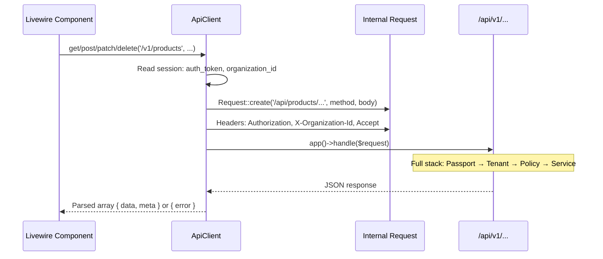

**Important:** After internal handling, ApiClient restores the original HTTP request context so Livewire routing and URL generation remain correct.

### 7.2 Page structure

Each module follows the same pattern:

| Piece | Location | Role |
|-------|----------|------|
| Route | `routes/web.php` | Maps URL → Livewire class |
| Component | `app/Http/Livewire/*.php` | State, API calls, actions |
| View | `resources/views/livewire/**` | Blade template |
| Layout | `layouts/app.blade.php` | Sidebar, header, org switcher, toasts |
| Permission guard | `EnsuresPermission` trait | 403 on mount if missing permission |
| UI gating | `@canaccess('permission')` | Hide buttons/menus |

### 7.3 Web routes map

| URL | Livewire | Permission (page guard) |
|-----|----------|-------------------------|
| `/dashboard` | Dashboard | Any dashboard/report/inventory view |
| `/products` | Products | `inventory.view` |
| `/categories`, `/units` | Categories, Units | `inventory.view` |
| `/warehouses`, `/stocks`, `/stock-movements` | Warehouses, Stocks, StockMovements | `inventory.view` |
| `/suppliers` | Suppliers | `suppliers.view` |
| `/customers` | Customers | `customers.view` |
| `/purchase-orders` | PurchaseOrders | `orders.purchase.view` |
| `/sales-orders` | SalesOrders | `orders.sales.view` |
| `/payments` | Payments | `payments.view` |
| `/reports/*` | Reports | Report-specific permissions |
| `/settings/organization` | OrganizationSettings | `settings.update` |
| `/settings/team` | Users | `settings.manage_users` |
| `/settings/roles` | Roles | `settings.manage_roles` |

Sidebar visibility uses the same permission checks via `OrganizationSession`.

### 7.4 User action example — Create product

```
1. User clicks "Add Product" (@canaccess inventory.create)
2. Livewire openModal() → showModal = true
3. User submits form → Livewire save()
4. ApiClient.post('/v1/products', form data)
5. ProductController → ProductPolicy::create → ProductService
6. Success → toast, closeModal(), loadItems()
7. loadItems() → ApiClient.get('/v1/products') → refresh table
```

**Key files:** `app/Services/Web/ApiClient.php`, `app/Http/Livewire/*`, `resources/views/layouts/app.blade.php`, `resources/js/app.js` (Alpine confirm/toast stores)

---

## 8. REST API architecture

### 8.1 Request pipeline

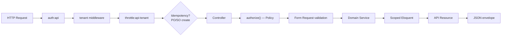

### 8.2 Response envelope

**Success:**
```json
{
  "data": { ... },
  "meta": { "pagination": { ... } }
}
```

**Error:**
```json
{
  "message": "Human-readable summary",
  "errors": { "field": ["Detail"] }
}
```

| HTTP code | Meaning |
|-----------|---------|
| 401 | Missing or invalid Bearer token |
| 403 | Authenticated but not authorized (policy/permission) or wrong org |
| 422 | Validation failed |
| 429 | Rate limit exceeded |

### 8.3 Required headers (tenant routes)

```http
Authorization: Bearer <access_token>
X-Organization-Id: <organization_id>
Content-Type: application/json
Accept: application/json
Idempotency-Key: <uuid>          # Required for POST purchase-orders, POST sales-orders
```

### 8.4 API route map

| Group | Endpoints |
|-------|-----------|
| **Auth** | register, login, refresh, me, logout |
| **Catalog** | CRUD products, categories, units |
| **Warehouse** | CRUD warehouses; GET stocks; GET/POST stock-movements |
| **Parties** | CRUD suppliers, customers |
| **Purchase** | CRUD purchase-orders + send, cancel, receive, pay |
| **Sales** | CRUD sales-orders + confirm, cancel, fulfill, deliver, pay, refund |
| **Payments** | GET index, GET show |
| **Reports** | dashboard, stock-valuation, low-stock, sales/purchase summary, exports |
| **Organization** | GET/PATCH organization profile |
| **Team** | CRUD users (invite, update role, remove) |
| **Roles** | CRUD roles, GET permissions catalog |

Full route definitions: `routes/api.php`

---

## 9. Authorization (RBAC)

Multi-tenant RBAC uses Spatie Permission with **teams** (`organization_id`).

> **Platform operators** are not part of tenant RBAC. They authenticate via the `platform` guard (`platform_admins` table). See [§17](#17-platform-admin-api--portal) and [PLATFORM-ADMIN.md](./PLATFORM-ADMIN.md).

### Authorization layers

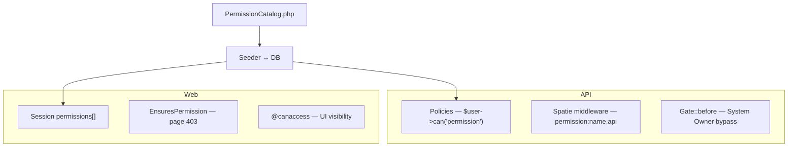

### Default roles (per organization)

| Role | Behavior |
|------|----------|
| **System Owner** | Protected; unrestricted; not auto-assigned on register |
| **Org Owner** | Shop owner; permissions customizable |
| Admin | Full access by default; customizable |
| Manager | Day-to-day operations |
| Warehouse Staff | Receive POs, fulfill SOs |
| Sales Staff | Customers and sales |
| Viewer | Read-only |

For permission list generation and adding new permissions, see **[RBAC-PERMISSIONS.md](./RBAC-PERMISSIONS.md)**.

---

## 10. Domain model & database

### 10.1 Entity relationship (simplified)

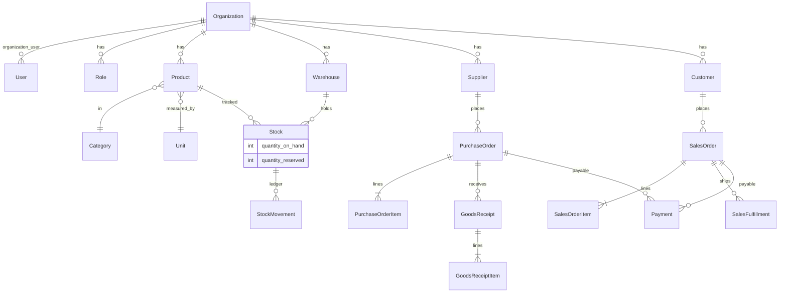

### 10.2 Core tables

| Table | Scope | Purpose |
|-------|-------|---------|
| `organizations` | Global | Tenant records (`status`: trial/active/suspended) |
| `users` | Global | User accounts |
| `organization_user` | Pivot | User ↔ org membership + role label |
| `roles`, `permissions`, pivots | RBAC | Spatie + `organization_id` on roles |
| `platform_admins` | Global | Super-admin identities (separate guard) |
| `plans` | Global | Subscription tiers + limits JSON |
| `organization_subscriptions` | Global | Org ↔ plan, billing status (source of truth) |
| `feature_flags`, `organization_feature_flags` | Global / per org | Feature toggles |
| `support_notes` | Per org | Internal operator notes (platform only) |
| `impersonation_logs` | Global | Impersonation audit trail |
| `products`, `categories`, `units` | Per org | Catalog |
| `warehouses` | Per org | Locations |
| `stocks` | Per org | Current qty per product × warehouse |
| `stock_movements` | Per org | Immutable ledger entries |
| `suppliers`, `customers` | Per org | Trading partners |
| `purchase_orders`, `purchase_order_items` | Per org | Procurement |
| `goods_receipts`, `goods_receipt_items` | Per org | Inbound receiving |
| `sales_orders`, `sales_order_items` | Per org | Sales |
| `sales_fulfillments`, `sales_fulfillment_items` | Per org | Outbound shipping |
| `payments` | Per org | Financial records |
| `idempotency_keys` | Per org | Safe PO/SO creation retries |
| `report_exports` | Per org | Async CSV generation |
| `activity_log` | Mixed | Audit trail |
| `oauth_*` | Global | Passport tokens |

### 10.3 Scoped models

These use `BelongsToOrganization` + global scope:

Product, Category, Unit, Warehouse, Supplier, Customer, Stock, StockMovement, PurchaseOrder, SalesOrder, Payment, GoodsReceipt, SalesFulfillment, IdempotencyKey, ReportExport

---

## 11. Core business workflows

### 11.1 End-to-end tenant journey

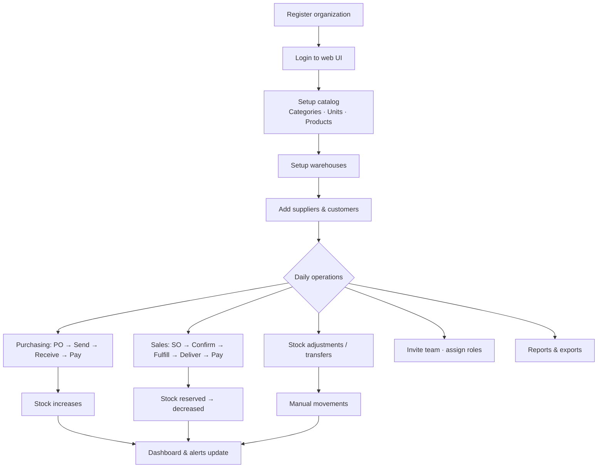

### 11.2 Catalog setup workflow

| Step | Web | API | Stock impact |
|------|-----|-----|--------------|
| Create category | `/categories` | `POST /categories` | None |
| Create unit | `/units` | `POST /units` | None |
| Create product | `/products` | `POST /products` | None (defines SKU, cost, reorder point) |
| Create warehouse | `/warehouses` | `POST /warehouses` | None |
| Initial stock | `/stock-movements/create` | `POST /stock-movements` (adjustment_in) | `quantity_on_hand` ↑ |

---

## 12. Stock ledger & inventory

**Rule:** `stocks.quantity_on_hand` is **never** updated directly. All changes go through `StockService::recordMovement()`.

### 12.1 Movement pipeline

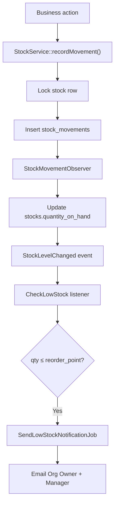

### 12.2 Movement types

| Type | Direction | Source |
|------|-----------|--------|
| `purchase_in` | In (+) | Goods receipt on PO |
| `sale_out` | Out (−) | Sales fulfillment |
| `adjustment_in` / `adjustment_out` | In / Out | Manual API/UI |
| `transfer_in` / `transfer_out` | In / Out | Inter-warehouse transfer |
| `return_in` / `return_out` | In / Out | Sales refund restock |

### 12.3 Reservations (sales)

| Stage | `quantity_on_hand` | `quantity_reserved` |
|-------|--------------------|-----------------------|
| Draft SO | unchanged | 0 |
| Confirm SO | unchanged | ↑ reserved |
| Fulfill SO | ↓ (sale_out) | ↓ released |
| Cancel confirmed SO | unchanged | ↓ released |

### 12.4 Concurrency

- Row-level locks on `stocks` before inserting movements
- Canonical product lock ordering for multi-line operations (prevents deadlocks)
- PostgreSQL-specific concurrency tests in `tests/Feature/*PostgresConcurrency*`

**Key files:** `app/Services/StockService.php`, `app/Observers/StockMovementObserver.php`, `app/Enums/StockMovementType.php`

---

## 13. Payments & financial records

Payments are **financial records** linked to orders — they do not directly change stock.

| Action | Service | When allowed |
|--------|---------|--------------|
| Record PO payment | `PaymentService::recordPurchasePayment()` | PO partially_received or received |
| Record SO payment | `PaymentService::recordSalesPayment()` | SO confirmed, shipped, or delivered |
| Record SO refund | `PaymentService::recordSalesRefund()` | SO shipped/delivered; optional restock |

Payments appear in `/payments` index and detail views.

---

## 14. Reports & exports

### 14.1 Live reports (synchronous)

| Report | API | Permission |
|--------|-----|------------|
| Dashboard aggregates | `GET /reports/dashboard` | Gate: viewAnyDashboard |
| Stock valuation | `GET /reports/stock-valuation` | `reports.view_inventory` |
| Low stock | `GET /reports/low-stock` | `reports.view_inventory` |
| Sales summary | `GET /reports/sales-summary` | `reports.view_sales` |
| Purchase summary | `GET /reports/purchase-summary` | `reports.view_purchases` |

### 14.2 CSV exports (async)

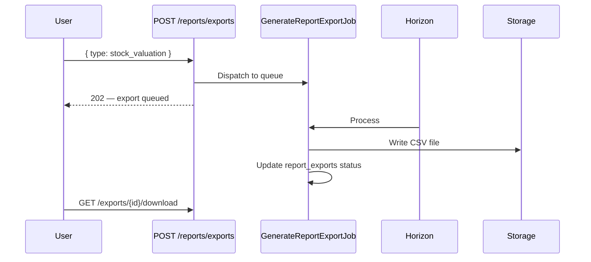

**Key files:** `app/Services/ReportService.php`, `app/Services/ReportExportService.php`, `app/Jobs/GenerateReportExportJob.php`

---

## 15. Settings & team management

### 15.1 Settings navigation

`/settings` redirects to the first tab the user can access:

1. Organization (`settings.update`)
2. Roles & Permissions (`settings.manage_roles`)
3. Team Members (`settings.manage_users`)

### 15.2 Organization profile

```
Web: /settings/organization
API: GET/PATCH /api/v1/organization
Policy: OrganizationPolicy (settings.view / settings.update)
```

Updates: name, email, phone, slug (auto-derived from name).

### 15.3 Team members

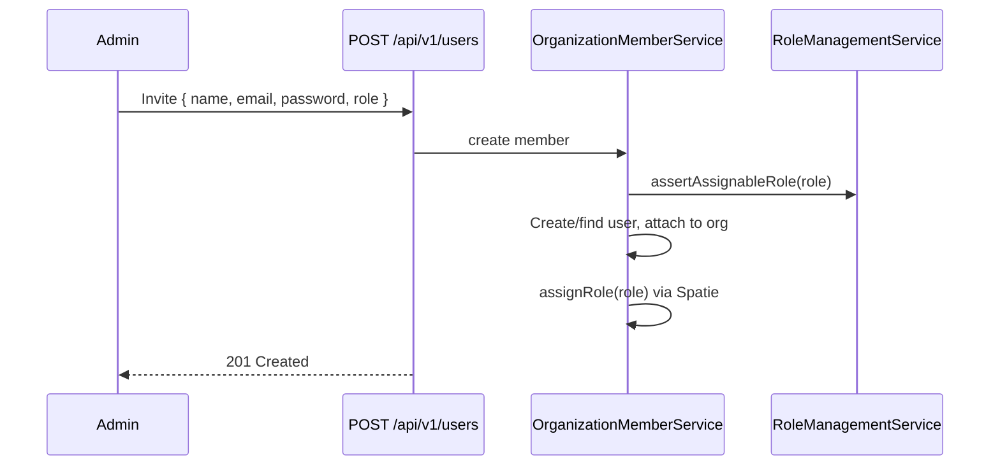

| Action | API |
|--------|-----|
| List members | `GET /users` |
| Invite | `POST /users` |
| Change role | `PUT /users/{id}` |
| Remove | `DELETE /users/{id}` |

Protected roles (System Owner) cannot be assigned to users.

### 15.4 Roles & permissions

```
Web: /settings/roles
API: GET/POST/PATCH/DELETE /roles
     GET /roles/permissions (catalog for UI checkboxes)
```

See [RBAC-PERMISSIONS.md](./RBAC-PERMISSIONS.md) for CRUD rules and safety checks (protected roles, delete when users assigned).

---

## 16. Notifications & background jobs

| Trigger | Job / Notification | Recipients |
|---------|-------------------|------------|
| Stock ≤ reorder point | `SendLowStockNotificationJob` → `LowStockNotification` | Org Owner, Manager |
| PO status change | `SendOrderStatusNotificationJob` → `OrderStatusNotification` | Configured roles |
| SO status change | Same | Configured roles |
| Report export ready | Stored in `report_exports`; user downloads | Requesting user |

Jobs run via **Laravel Horizon** (Redis queue). Start with:

```bash
php artisan horizon
```

**Key files:** `app/Jobs/*`, `app/Listeners/CheckLowStock.php`, `app/Notifications/*`, `config/horizon.php`

---

## 17. Platform admin API & portal

Separate from tenant RBAC — for **platform operators** managing all organizations. Full reference: **[PLATFORM-ADMIN.md](./PLATFORM-ADMIN.md)**.

| Route prefix | Guard | Web UI |
|--------------|-------|--------|
| `/api/platform/v1` | `auth:platform` | **`/platform/*`** Livewire portal |

### Guard isolation

Platform admin tokens must **never** authenticate tenant routes, and tenant tokens must **never** authenticate platform routes. Tested in `tests/Feature/PlatformLayerTest.php`.

### Web portal routes

| URL | Purpose |
|-----|---------|
| `/platform/login` | Platform admin sign-in |
| `/platform/dashboard` | Tenant metrics (total, active, trial, suspended) |
| `/platform/organizations` | Search, filter, paginate org directory |
| `/platform/organizations/{id}` | Status controls, subscription, feature flags, support notes, impersonation |
| `/platform/admins` | Create / remove platform admin accounts |

Uses a **separate session** (`platform_auth_token`) from the tenant app. Demo credentials (local seed): `platform@demo.test` / `password123`.

### Platform API endpoints

| Area | Endpoints |
|------|-----------|
| Auth | `POST /auth/login`, `POST /auth/logout`, `GET /auth/me` |
| Plans | `GET /plans` |
| Organizations | `GET/PATCH /organizations`, `GET/PATCH /organizations/{id}/subscription` |
| Support | `GET/POST /organizations/{id}/support-notes` |
| Feature flags | `GET /organizations/{id}/feature-flags`, `PATCH .../feature-flags/{flagId}` |
| Impersonation | `POST /organizations/{id}/impersonate`, `POST /impersonation/end` |
| Platform admins | `GET/POST /platform-admins`, `DELETE /platform-admins/{id}` |

Portal pages call these via `PlatformApiClient` (internal sub-requests with platform session token).

### Subscriptions & plan limits

- Registration assigns a **trial** subscription (`OrganizationSubscriptionService::assignTrialPlan`)
- `organization_subscriptions` is the source of truth; `organizations.plan` is a synced cache
- `PlanLimitService` enforces limits before tenant writes (warehouses, users, products, orders/month)
- Exceeding a limit returns **422** with a clear message

### Suspension & impersonation

- Setting `status = suspended` blocks all tenant API requests (`ResolveTenant`) and web access (`WebAuth`)
- Impersonation issues a short-lived tenant personal access token; `reason` required; logged in `impersonation_logs`
- `GET /api/v1/auth/me` includes `impersonation` metadata when active

**Key files:** `routes/platform.php`, `routes/web.php` (platform group), `app/Services/Web/PlatformApiClient.php`, `app/Http/Livewire/Platform/*`, `app/Services/OrganizationSubscriptionService.php`, `app/Services/ImpersonationService.php`

---

## 18. Cross-cutting concerns

### 18.1 Idempotency

`POST /purchase-orders` and `POST /sales-orders` require `Idempotency-Key` header.

- Prevents duplicate orders on network retries
- Same key + same body → returns cached response
- Same key + different body → 422 conflict
- ApiClient auto-generates UUID for these routes from Livewire

**Key files:** `app/Services/IdempotencyService.php`, `app/Http/Middleware/EnforceIdempotency.php`

### 18.2 Activity audit

Models using `LogsModelActivity` write to Spatie `activity_log` on create/update/delete — used for purchase orders, sales orders, payments, stock movements, roles.

### 18.3 Rate limiting

`throttle:api-tenant` — per organization + per user limits on tenant API routes. Plan-based limits (`plans.limits.api_rate_limit`) are reserved for future use.

### 18.4 Plan limit errors

`PlanLimitExceededException` → **422** with message describing which limit was hit. Thrown by `PlanLimitService` before warehouse, product, user, or order creation.

### 18.5 Error handling (API)

Centralized in `AppServiceProvider::registerApiExceptionRendering()`:

- `ValidationException` → 422 + field errors
- `PlanLimitExceededException` → 422 + message
- `AuthenticationException` → 401
- `AuthorizationException` → 403
- OAuth errors → appropriate status + message

---

## 19. Deployment & operations

### 19.1 Docker services

| Service | Port | Role |
|---------|------|------|
| app | 8080 | Laravel (`php artisan serve`) |
| postgres | 5433 | Database |
| redis | 6379 | Cache, session, queue |
| horizon | — | Queue worker |

### 19.2 Bootstrap

```bash
# Docker
docker compose up -d --build
docker compose exec app php artisan app:setup --write-env

# Local dev (web on :8000)
composer install && cp .env.example .env
php artisan app:setup --write-env
php artisan serve --host=localhost --port=8000
php artisan horizon
```

`app:setup` runs migrations, seeds roles/permissions and plans, generates Passport keys, creates password-grant client.

```bash
# Create platform super-admin after setup
php artisan platform:admin:create platform@demo.test "Platform Admin" --password=password123
```

### 19.3 Useful commands

| Command | Purpose |
|---------|---------|
| `php artisan app:setup --write-env` | Full bootstrap |
| `php artisan db:seed --class=PlanSeeder` | Seed plans & feature flags |
| `php artisan platform:admin:create {email} {name}` | Bootstrap platform admin |
| `php artisan rbac:migrate-organizations` | Sync RBAC for existing orgs |
| `php artisan passport:ensure-password-client --write-env` | Fix stale OAuth client after fresh seed |
| `php artisan horizon` | Start queue workers |
| `php artisan test` | Run Pest test suite |

### 19.4 URLs

| Environment | Web UI | Platform portal | API |
|-------------|--------|-----------------|-----|
| Local dev | http://localhost:8000 | http://localhost:8000/platform | http://localhost:8000/api/v1 |
| Docker | — | http://localhost:8080/platform | http://localhost:8080/api/v1 |
| Platform API | — | — | `/api/platform/v1` |
| API docs | — | — | `/docs/api` |
| Horizon | — | — | `/horizon` |

Set `APP_URL` in `.env` to match how you access the app.

---

## 20. Related files index

| Area | Primary files |
|------|---------------|
| **Routes** | `routes/web.php`, `routes/api.php`, `routes/platform.php` |
| **Auth** | `app/Services/AuthService.php`, `app/Http/Controllers/Web/AuthController.php` |
| **Platform** | `app/Http/Controllers/Api/Platform/V1/*`, `app/Http/Livewire/Platform/*`, `docs/PLATFORM-ADMIN.md` |
| **Web session** | `app/Services/Web/WebSessionService.php`, `app/Services/Web/PlatformSessionService.php` |
| **API bridge** | `app/Services/Web/ApiClient.php`, `app/Services/Web/PlatformApiClient.php` |
| **Tenancy** | `app/Http/Middleware/ResolveTenant.php`, `app/Traits/BelongsToOrganization.php` |
| **RBAC** | `app/Permission/PermissionCatalog.php`, `app/Services/RoleManagementService.php`, `app/Services/PermissionAuthorizationService.php` |
| **Subscriptions** | `app/Services/OrganizationSubscriptionService.php`, `app/Services/PlanLimitService.php`, `database/seeders/PlanSeeder.php` |
| **Purchase orders** | `app/Services/PurchaseOrderService.php`, `app/Services/GoodsReceiptService.php` |
| **Sales orders** | `app/Services/SalesOrderService.php`, `app/Services/SalesOrderFulfillmentService.php` |
| **Stock** | `app/Services/StockService.php`, `app/Observers/StockMovementObserver.php` |
| **Payments** | `app/Services/PaymentService.php` |
| **Reports** | `app/Services/ReportService.php`, `app/Services/ReportExportService.php` |
| **Policies** | `app/Policies/*` |
| **Livewire UI** | `app/Http/Livewire/*`, `resources/views/livewire/*` |
| **Tests** | `tests/Feature/*` |
| **Docker** | `docker-compose.yml`, `Dockerfile` |

---

## Summary

Oneapp is a **multi-tenant inventory SaaS** built on Laravel 13 where:

1. **Organizations** isolate all business data
2. **Passport OAuth** authenticates both web session and API clients
3. **Livewire** renders the UI by calling the **same REST API** via `ApiClient`
4. **RBAC** (Spatie teams) controls tenant access at API, page, and UI levels
5. **Platform admin layer** (`/platform/*`, `/api/platform/v1`) manages subscriptions, suspension, and cross-tenant ops separately
6. **Stock** changes only through an **immutable movement ledger**
7. **Purchase and sales workflows** drive inbound/outbound inventory and payments
8. **Horizon** processes notifications and report exports asynchronously

For shorter diagrams and quick reference, see [ARCHITECTURE.md](./ARCHITECTURE.md). For permissions specifically, see [RBAC-PERMISSIONS.md](./RBAC-PERMISSIONS.md). For platform operations, see [PLATFORM-ADMIN.md](./PLATFORM-ADMIN.md).
